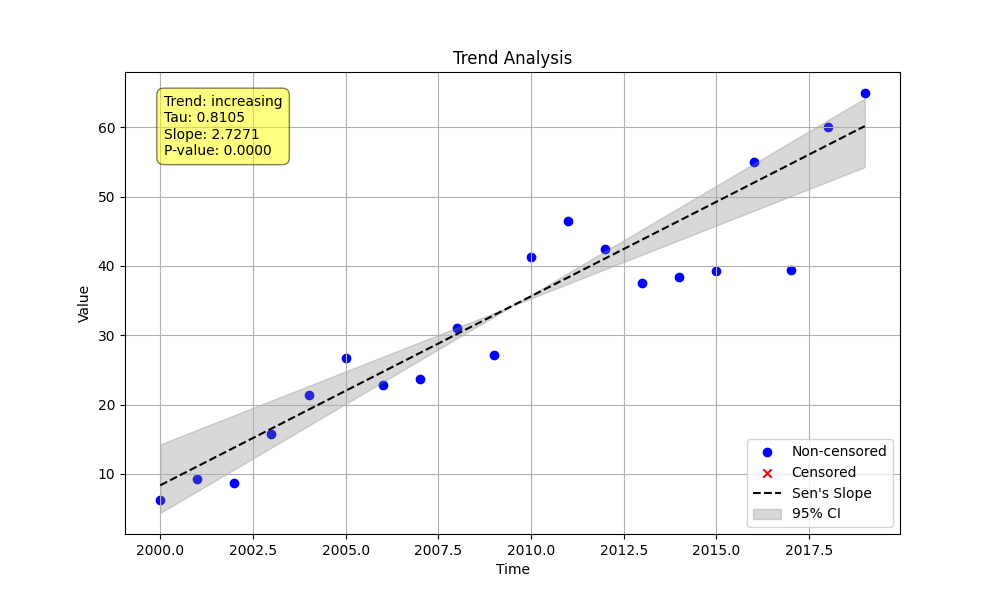

# Example 1: Basic Trend Analysis

This example demonstrates the most common use case for the `MannKenSen` package: performing a standard, non-seasonal trend analysis. We will use the `trend_test` function to analyze a synthetic time series.

## Steps

1.  **Generate Synthetic Data**: We create a simple linear time series with a known slope and add some random noise to make it more realistic.
2.  **Perform Trend Analysis**: We call the `trend_test` function, which now automatically classifies the trend and checks for data quality issues.
3.  **Review the Output**: We print the enhanced results, including the trend classification, the slope with its confidence intervals, and any analysis notes.

## Python Code (`basic_trend.py`)

The full Python script for this example is shown below.

```python
import numpy as np
from MannKenSen import trend_test

def main():
    """
    Generate a simple linear time series with noise and perform a trend analysis.
    """
    # 1. Generate Synthetic Data
    t = np.arange(2000, 2020, dtype=float)
    slope = 2.5
    intercept = 10
    noise = np.random.normal(0, 5, len(t))
    x = slope * (t - t[0]) + intercept + noise

    # 2. Perform Trend Analysis
    plot_path = "Examples/01_Basic_Trend_Analysis/basic_trend_plot.png"
    result = trend_test(x, t, plot_path=plot_path)

    # 3. Print the Results
    print("--- Basic Trend Analysis Results ---")
    print(f"  Classification: {result.classification}")
    print(f"  Trend: {result.trend}")
    print(f"  P-value: {result.p:.4f}")
    print(f"  Slope: {result.slope:.2f} ({result.lower_ci:.2f}, {result.upper_ci:.2f})")
    print(f"  Analysis Notes: {result.analysis_notes if result.analysis_notes else 'None'}")
    print(f"\n  Plot saved to: {plot_path}")

if __name__ == "__main__":
    main()
```

## Results

Running the script produces a comprehensive output. The test correctly identifies a **"Highly Likely Increasing"** trend. The calculated slope is `2.73`, with a 95% confidence interval of `(2.11, 3.15)`, which comfortably contains our true slope of 2.5. No data quality issues were found, so the `Analysis Notes` field is empty.

```
--- Basic Trend Analysis Results ---
  Classification: Highly Likely Increasing
  Trend: increasing
  P-value: 0.0000
  Slope: 2.73 (2.11, 3.15)
  Analysis Notes: None

  Plot saved to: Examples/01_Basic_Trend_Analysis/basic_trend_plot.png
```

### Generated Plot

The plot saved by the script provides a clear visualization of the data, the calculated Sen's slope trend line, and the 95% confidence intervals.


