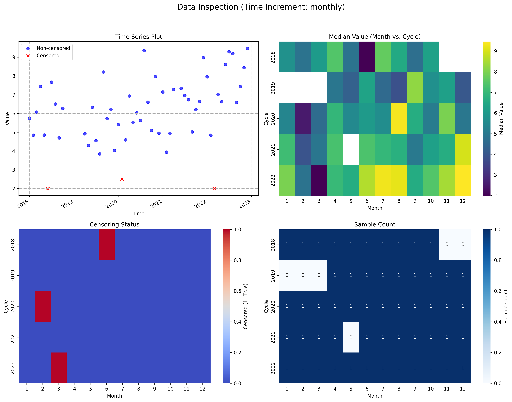

# Example 1: Getting Started - Inspecting Your Data

The first and most important step in any trend analysis is to thoroughly inspect your data. The `MannKenSen.inspect_trend_data` function is designed for this purpose. It provides a quick statistical and visual overview of your time series, helping you identify potential issues like missing data, censored values, and irregular sampling.

## Script: `run_example.py`
The script performs the following actions:
1.  Generates a synthetic 5-year monthly dataset with an upward trend.
2.  Intentionally introduces missing data (`NaN`) and left-censored (`<`) values to simulate a real-world dataset.
3.  Calls `mks.prepare_censored_data` to process the raw data.
4.  Calls `mks.inspect_trend_data` with `plot=True` to generate a summary and a set of diagnostic plots.
5.  Dynamically generates this `README.md` file, embedding the captured output below.

## Results

### Statistical Summary
The `inspect_trend_data` function prints a high-level summary of the dataset's properties. This includes the time range, number of records, percentage of missing and censored data, and the number of unique censoring levels.

```text

```

### Visual Inspection (`inspection_plots.png`)
The function also generates a 2x2 grid of plots for a quick visual diagnosis:
-   **Time Series Plot:** Shows the data over time, with censored values marked.
-   **Value Matrix:** A heatmap showing the distribution of values by year and month.
-   **Censoring Matrix:** A heatmap indicating where censored data occurs.
-   **Sample Count Matrix:** A heatmap showing the number of samples per period, which is useful for identifying irregular sampling.



**Conclusion:** Before performing any trend tests, always inspect your data. This initial step can reveal critical issues that might otherwise lead to incorrect or misleading trend results.
