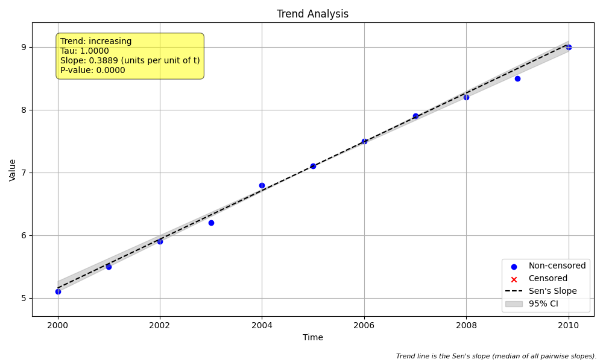

# Example 2: Basic Non-Seasonal Trend Test (Numeric Time)

## The "Why": The Fundamental Trend Test
This example demonstrates the core function of the package: `mk.trend_test`.
It answers the most basic question: **"Is there a statistically significant upward or downward trend in my data?"**

We use the **Mann-Kendall test** for significance and **Sen's Slope** for magnitude because they are "non-parametric." This means:
1.  They don't assume your data follows a bell curve (normal distribution).
2.  They are robust to outliers (one crazy high value won't ruin the result).
3.  They handle missing data gracefully.

## The "How": Code Walkthrough

We analyze a simple dataset where time is represented by numeric years (integers).

### Step 1: Python Code
```python
import numpy as np
import pandas as pd
import MannKS as mk

# 1. Generate Synthetic Data
# We create a simple dataset with 10 yearly observations.
# The time vector 't' is just a sequence of integers (years).
# The value vector 'x' has a clear upward trend.
t = np.arange(2000, 2011)  # Years 2000 to 2010
x = np.array([5.1, 5.5, 5.9, 6.2, 6.8, 7.1, 7.5, 7.9, 8.2, 8.5, 9.0])

print(f"Time (t): {t}")
print(f"Values (x): {x}")

# 2. Run the Trend Test
# The `trend_test` function is the core of the package. It performs two key statistical tasks:
#   A. Mann-Kendall Test: Checks *if* there is a trend (Significance).
#      - It compares every pair of data points to see if they increase or decrease.
#   B. Sen's Slope Estimator: Calculates *how strong* the trend is (Magnitude).
#      - It finds the median of all pairwise slopes.
# We pass 'plot_path' to automatically generate a visualization of these results.
print("\nRunning Mann-Kendall Trend Test...")
result = mk.trend_test(x, t, plot_path='trend_plot.png')

# 3. Inspect the Results
# The function returns a namedtuple with all statistical metrics.
# Key fields include:
#   - result.trend: A basic description ('increasing', 'decreasing', 'no trend').
#   - result.classification: A more nuanced category (e.g., 'Likely Increasing') based on confidence.
#   - result.p: The p-value (significance).
#   - result.slope: The magnitude of change per unit time.
print("\n--- Trend Test Results ---")
print(f"Basic Trend: {result.trend} (Confidence: {result.C:.1%})")
print(f"Classification: {result.classification}")
print(f"Kendall's S: {result.s}")
print(f"p-value: {result.p:.4f}")
print(f"Sen's Slope: {result.slope:.4f}")
print(f"Confidence Interval: [{result.lower_ci:.4f}, {result.upper_ci:.4f}]")
```

### Step 2: Text Output
```text
Time (t): [2000 2001 2002 2003 2004 2005 2006 2007 2008 2009 2010]
Values (x): [5.1 5.5 5.9 6.2 6.8 7.1 7.5 7.9 8.2 8.5 9. ]

Running Mann-Kendall Trend Test...

--- Trend Test Results ---
Basic Trend: increasing (Confidence: 100.0%)
Classification: Highly Likely Increasing
Kendall's S: 55.0
p-value: 0.0000
Sen's Slope: 0.3889
Confidence Interval: [0.3667, 0.4000]

```

## Interpreting the Results

### 1. Statistical Results
*   **Basic Trend (Increasing)**: The test detected an upward trend.
*   **Classification (Highly Likely Increasing)**: The package assigns a descriptive category based on the confidence level (`result.C`).
    *   **Increasing/Decreasing**: High confidence (≥ 90% or 95% depending on `alpha`).
    *   **Likely Increasing/Decreasing**: Moderate confidence (e.g., 85-90%).
    *   **Stable/No Trend**: Low confidence.
*   **Confidence (result.C) (100.0%)**: This is derived from the p-value (`1 - p/2` for increasing trends). It means we are very certain this isn't just random noise.
*   **Kendall's S (55.0)**: This is the raw score. It implies that when comparing all possible pairs of data points, 55 more pairs were increasing than decreasing. A positive number indicates growth.
*   **p-value (0.0000)**: The probability that this trend happened by random chance is virtually zero. Standard practice considers $p < 0.05$ as significant.
*   **Sen's Slope (0.3889)**: The median rate of change. Since our time unit is "years", this means the value increases by roughly **0.39 units per year**.

### 2. Visual Results (`trend_plot.png`)
The function automatically generated this plot:



*   **Blue Dots**: The actual data points.
*   **Solid Line**: The Sen's Slope trend line. Notice it passes through the "center of gravity" of the data but doesn't necessarily hit the mean.
*   **Shaded Area**: The 90% confidence interval (default `alpha=0.1`). If the trend is significant, the edges of this zone usually won't cross zero (flat).

## Key Takeaway
For simple numeric time series (years, index numbers), `mk.trend_test(x, t)` is all you need. It provides the "Yes/No" (significance), the "How Much" (slope), and a user-friendly classification.
