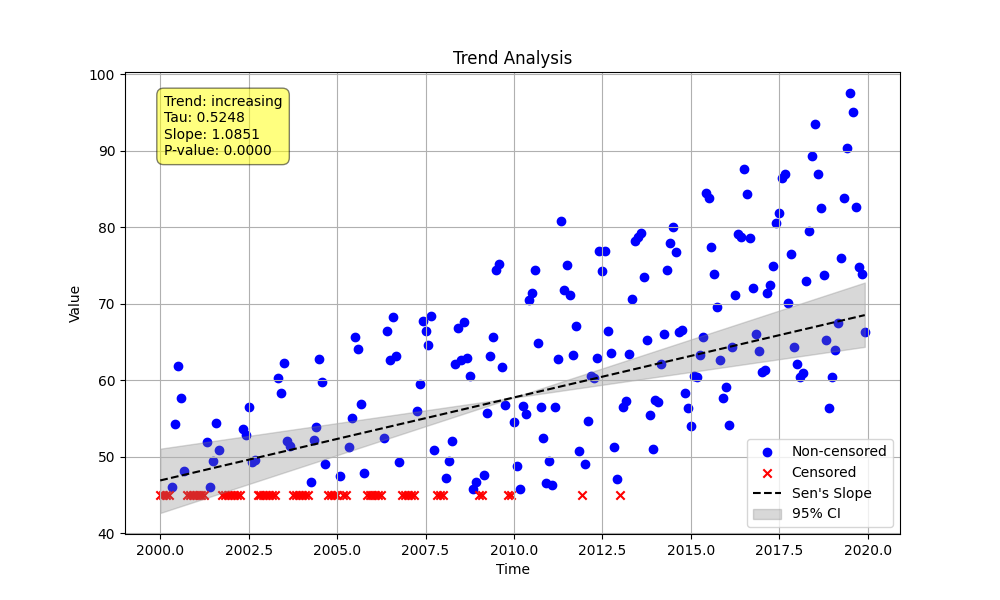

# Example 2: Seasonal Trend with Censored Data

This example demonstrates a more advanced use case involving both seasonality and censored data. We will generate a time series that has a clear seasonal pattern, introduce left-censored data (values below a detection limit), and then use the `prepare_censored_data` and `seasonal_trend_test` functions to perform the analysis.

A key feature of this example is the comparison between two different methods for handling censored data in the Sen's slope calculation, highlighting how methodological choices can impact the results.

## Steps

1.  **Generate Synthetic Data**: We create a time series with a repeating 12-month seasonal pattern and a steady increasing linear trend (the "true" slope is **2.0**). Random noise is added to make the data more realistic.
2.  **Introduce Censoring**: We simulate a detection limit by converting all numeric values below `45` into censored strings (e.g., `"<45"`).
3.  **Pre-process Data**: The mixed array of numbers and strings is passed to the `prepare_censored_data` utility.
4.  **Perform Trend Analysis (Two Methods)**: We run `seasonal_trend_test` twice:
    *   First, with the default `sens_slope_method='nan'`, which is a statistically neutral approach. A plot is saved for this result.
    *   Second, with `sens_slope_method='lwp'`, which mimics the behavior of the LWP-TRENDS R script for compatibility.
5.  **Review and Compare the Output**: We print the results from both methods to analyze their differences.

## Python Code (`censored_seasonal.py`)

The full Python script for this example is shown below. Note the call to `np.random.seed(42)` which ensures this example is fully reproducible.

```python
import numpy as np
import pandas as pd
from MannKenSen import prepare_censored_data, seasonal_trend_test

def main():
    """
    Generate seasonal data with a trend, introduce censoring, and perform
    a seasonal trend analysis.
    """
    # 1. Generate Synthetic Data
    n_years = 20
    t = np.linspace(2000, 2000 + n_years, n_years * 12, endpoint=False)
    seasonal_pattern = np.tile([5, 8, 12, 18, 25, 30, 32, 30, 25, 18, 10, 6], n_years)
    slope_per_year = 2.0
    linear_trend = slope_per_year * (t - t[0])
    np.random.seed(42) # Set seed for reproducibility
    noise = np.random.normal(0, 4, len(t))
    x_raw_numeric = 20 + seasonal_pattern + linear_trend + noise

    # 2. Introduce Censoring
    detection_limit = 45
    x_mixed = [f"<{detection_limit}" if val < detection_limit else val for val in x_raw_numeric]

    # 3. Pre-process the Censored Data
    x_prepared = prepare_censored_data(x_mixed)

    # 4. Perform Seasonal Trend Analysis with both methods
    plot_path = "Examples/02_Censored_Seasonal_Trend/censored_seasonal_plot.png"

    # Method 1: 'nan' (Default, statistically neutral)
    result_nan = seasonal_trend_test(x=x_prepared,
                                     t=t,
                                     period=1,
                                     plot_path=plot_path,
                                     sens_slope_method='nan')

    # Method 2: 'lwp' (LWP-TRENDS R script compatibility)
    result_lwp = seasonal_trend_test(x=x_prepared,
                                     t=t,
                                     period=1,
                                     plot_path=None, # Don't overwrite plot
                                     sens_slope_method='lwp')

    # 5. Print the Results for Comparison
    print("--- Censored Seasonal Trend Analysis Results ---")
    print("\nThis example compares two methods for calculating Sen's slope with")
    print("censored data. The underlying 'true' slope of the generated data is 2.0.")

    print("\n--- Method 1: sens_slope_method='nan' (Default) ---")
    print("This method is statistically neutral, excluding ambiguous censored slopes.")
    print(f"  Classification: {result_nan.classification}")
    print(f"  Trend: {result_nan.trend}")
    print(f"  P-value: {result_nan.p:.4f}")
    print(f"  Slope: {result_nan.slope:.2f} ({result_nan.lower_ci:.2f}, {result_nan.upper_ci:.2f})")
    print(f"  Analysis Notes: {result_nan.analysis_notes if result_nan.analysis_notes else 'None'}")

    print("\n--- Method 2: sens_slope_method='lwp' (LWP-TRENDS compatibility) ---")
    print("This method sets ambiguous censored slopes to 0, biasing the result towards zero.")
    print(f"  Classification: {result_lwp.classification}")
    print(f"  Trend: {result_lwp.trend}")
    print(f"  P-value: {result_lwp.p:.4f}")
    print(f"  Slope: {result_lwp.slope:.2f} ({result_lwp.lower_ci:.2f}, {result_lwp.upper_ci:.2f})")
    print(f"  Analysis Notes: {result_lwp.analysis_notes if result_lwp.analysis_notes else 'None'}")

    print(f"\nPlot for the default ('nan') method saved to: {plot_path}")

if __name__ == "__main__":
    main()
```

## Results and Interpretation

The script produces the following output, which we will analyze in detail.

```
--- Censored Seasonal Trend Analysis Results ---

This example compares two methods for calculating Sen's slope with
censored data. The underlying 'true' slope of the generated data is 2.0.

--- Method 1: sens_slope_method='nan' (Default) ---
This method is statistically neutral, excluding ambiguous censored slopes.
  Classification: Highly Likely Increasing
  Trend: increasing
  P-value: 0.0000
  Slope: 1.20 (0.76, 1.62)
  Analysis Notes: None

--- Method 2: sens_slope_method='lwp' (LWP-TRENDS compatibility) ---
This method sets ambiguous censored slopes to 0, biasing the result towards zero.
  Classification: Highly Likely Increasing
  Trend: increasing
  P-value: 0.0000
  Slope: 0.00 (0.00, 0.00)
  Analysis Notes: ['WARNING: Sen slope influenced by left-censored values.']

Plot for the default ('nan') method saved to: Examples/02_Censored_Seasonal_Trend/censored_seasonal_plot.png
```

### Why is the Estimated Slope (1.20) Different from the True Slope (2.0)?

Even with the recommended `nan` method, the estimated slope of `1.20` is noticeably lower than the `2.0` we used to generate the data. This is an expected and important outcome of working with heavily censored data.
-   **Information Loss**: The censoring process removes information. The test knows that many values are `<45`, but it does not know *how far* below 45 they are. This loss of information makes it difficult to precisely estimate the magnitude of the trend.
-   **Robustness vs. Precision**: The Mann-Kendall test and Sen's slope are robust methods, meaning they are very good at detecting the *presence and direction* of a trend even with outliers or non-normal data. In this case, both methods correctly and confidently identify a **"Highly Likely Increasing"** trend. However, this robustness can come at the cost of precision when a large portion of the data is censored.

### Why Do the Two Methods Give Such Different Results?

This example perfectly illustrates the impact of the `sens_slope_method` parameter.
-   **`nan` (Default)**: This method calculates the slope between all pairs of points where the result is unambiguous. Slopes between, for example, two left-censored points (`<45` and `<45`) are ambiguous and are ignored (treated as `NaN`). The final slope of `1.20` is the median of all the valid, unambiguous slopes.
-   **`lwp` (Compatibility)**: This method handles ambiguous slopes by setting them to `0`. In this dataset, the heavy censoring creates a very large number of ambiguous pairs. When all of these are replaced with `0`, they overwhelm the valid slopes in the dataset, and the median of all slopes becomes `0.00`. This demonstrates how this heuristic can strongly bias the slope estimate towards zero and should be used with caution.

### Generated Plot

The plot visualizes the data and the trend calculated using the default (`nan`) method. Note how the censored data points (the red 'x's) are clustered in the earlier years and during seasonal lows, consistent with the data generation process.


