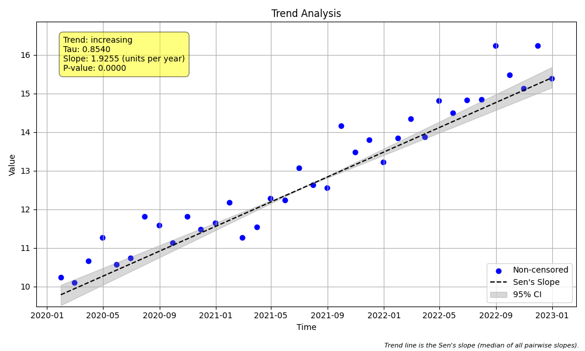

# Example 3: Non-Seasonal Trend Test with Timestamps & Slope Scaling

## The "Why": Real-World Dates and Readable Units
In Example 2, we used simple integers (2000, 2001...) as time. But in the real world, your data usually comes with precise dates (e.g., `2023-10-15 08:30:00`).

When you perform a trend test on `datetime` objects, the math typically converts them to **seconds** (Unix timestamps). This creates a problem:
*   A slope of "10 mg/L per year" becomes "0.000000317 mg/L per second".
*   This number is hard to read and easy to misinterpret.

This example teaches you how to:
1.  Pass raw `datetime` objects directly to the test.
2.  Use the `slope_scaling` parameter to get results in human-friendly units (e.g., **per year**).

## The "How": Code Walkthrough

We simulate a dataset of monthly water quality samples over 3 years.

### Step 1: Python Code
```python
import numpy as np
import pandas as pd
import MannKS as mk

# 1. Generate Real-World Data (Datetime Objects)
# In the real world, data doesn't always come nicely indexed as "Year 1, Year 2".
# It usually comes with specific dates. Here we create 3 years of monthly data.
# We use pandas to generate a DatetimeIndex.
dates = pd.date_range(start='2020-01-01', end='2022-12-31', freq='ME') # 36 months
t = dates

# We simulate a concentration that increases by approx 2.0 mg/L per year.
# 2.0 / 12 months = ~0.166 per month.
# We add some random noise to make it realistic.
np.random.seed(42) # For reproducible results
noise = np.random.normal(0, 0.5, size=len(t))
base_trend = np.linspace(10, 16, len(t)) # Increases from 10 to 16 (6 units over 3 years = 2/year)
x = base_trend + noise

# Create a DataFrame just for display clarity
df = pd.DataFrame({'Date': t, 'Concentration': x})
print("First 5 rows of data:")
print(df.head())
print("...")

# 2. Run the Trend Test with Slope Scaling
# When you pass datetime objects to `t`, the math happens in "Unix timestamps" (seconds).
# This means the raw slope would be in "mg/L per second", which is a tiny, unreadable number (e.g., 0.000000063).
#
# To address this, we use the `slope_scaling` parameter.
# Setting slope_scaling='year' automatically multiplies the result to show "mg/L per year".
# Valid options include: 'year', 'month', 'day', 'hour', 'minute', 'second'.
print("\nRunning Trend Test with slope_scaling='year'...")
result = mk.trend_test(x, t, slope_scaling='year', plot_path='trend_plot.png')

# 3. Inspect the Results
print("\n--- Trend Test Results ---")
print(f"Basic Trend: {result.trend}")
print(f"Classification: {result.classification}")
print(f"p-value: {result.p:.4f}")
print(f"Sen's Slope: {result.slope:.4f} (mg/L per year)") # Note the unit!
print(f"Confidence Interval: [{result.lower_ci:.4f}, {result.upper_ci:.4f}]")

# Just to demonstrate, let's look at the raw unscaled slope (per second) which is also returned
print(f"\n(For comparison) Raw Slope: {result.slope_per_second:.10f} (units/second)")
```

### Step 2: Text Output
```text
First 5 rows of data:
        Date  Concentration
0 2020-01-31      10.248357
1 2020-02-29      10.102296
2 2020-03-31      10.666701
3 2020-04-30      11.275801
4 2020-05-31      10.568638
...

Running Trend Test with slope_scaling='year'...

--- Trend Test Results ---
Basic Trend: increasing
Classification: Highly Likely Increasing
p-value: 0.0000
Sen's Slope: 1.9255 (mg/L per year)
Confidence Interval: [1.7517, 2.1133]

(For comparison) Raw Slope: 0.0000000610 (units/second)

```

## Interpreting the Results

### 1. The Power of `slope_scaling`
Look at the difference in the output:
*   **Scaled Slope**: `1.9255` (mg/L per year)
*   **Raw Slope**: `0.0000000610` (mg/L per second)

The `slope_scaling='year'` parameter saves you from doing manual conversion math and potential errors. It simply multiplies the raw slope by the number of seconds in a year (31,557,600).

### 2. Statistical Results
*   **p-value (0.0000)**: Highly significant. We are confident there is a trend.
*   **Sen's Slope (1.9255)**: Our synthetic data was designed to increase by 2.0 per year. The test recovered this value very accurately (1.9255), despite the added noise.
*   **Confidence Interval [1.75, 2.11]**: We are 90% confident (default alpha) that the true rate of change is between 1.75 and 2.11 mg/L per year.

### 3. Visual Results (`trend_plot.png`)
The plot x-axis now correctly handles dates:



*   **X-Axis**: Shows actual dates (Years), not just integers.
*   **Trend Line**: The slope of this line corresponds to the scaled slope (approx 2 units rise for every 1 unit of "Year").

## Key Takeaway
When working with real dates:
1.  Ensure your time vector `t` is a sequence of `pandas` timestamps or Python `datetime` objects.
2.  Always use `slope_scaling='year'` (or 'day', 'month') to ensure your Sen's Slope and Confidence Intervals are reported in meaningful units.
