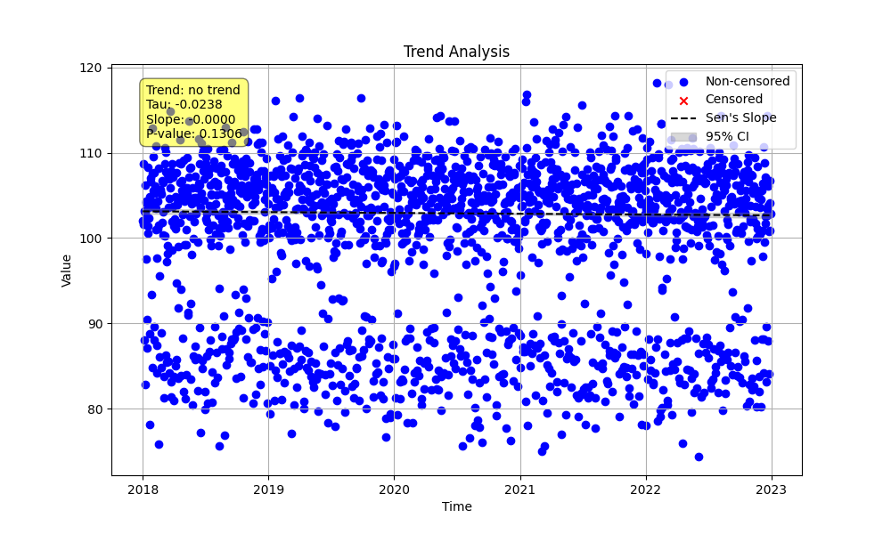

# Example 3: Checking for Seasonality

A common workflow in trend analysis is to first determine if a seasonal pattern exists in your data before deciding to use a seasonal trend test. This example demonstrates how to use the `check_seasonality` function to statistically verify a seasonal pattern and then proceed with `seasonal_trend_test`.

We will simulate daily data with a clear weekly pattern (e.g., lower values on weekends).

## Steps

1.  **Generate Synthetic Data**: We create five years of daily data. A strong weekly pattern is added by assigning different values for weekdays versus weekends.
2.  **Check for Seasonality**: We use the `check_seasonality` function to test the hypothesis that there is a significant difference between the days of the week. We specify `season_type='day_of_week'` and the corresponding `period=7`.
3.  **Perform Seasonal Trend Analysis**: Based on the confirmation of seasonality, we proceed with the `seasonal_trend_test` using the same seasonal parameters. For this example, we did not add a long-term trend, so we expect a result of "no trend".
4.  **Review the Output**: We print and examine the results from both functions.

## Python Code (`weekly_seasonality.py`)

The full Python script for this example is shown below.

```python
import numpy as np
import pandas as pd
from MannKenSen import check_seasonality, seasonal_trend_test

def main():
    """
    Generate daily data with a weekly pattern and demonstrate how to use
    `check_seasonality` to detect this pattern before trend analysis.
    """
    # 1. Generate Synthetic Data with a Weekly Pattern
    n_years = 5
    t = pd.to_datetime(pd.date_range(start='2018-01-01', periods=365 * n_years, freq='D'))

    # Create a strong weekly pattern (lower values on weekends)
    day_of_week = t.dayofweek  # Monday=0, Sunday=6
    weekly_pattern = np.array([-15 if day in (5, 6) else 5 for day in day_of_week])

    # Add some noise but no long-term trend for this example
    noise = np.random.normal(0, 4, len(t))
    x = 100 + weekly_pattern + noise

    # 2. Check for Seasonality
    # We hypothesize a 'day_of_week' pattern, so we set the `season_type`
    # and provide the corresponding `period=7`.
    print("--- Checking for Weekly Seasonality ---")
    seasonality_result = check_seasonality(x, t, season_type='day_of_week', period=7)

    print(f"Seasonality detected: {seasonality_result.is_seasonal}")
    print(f"P-value of Kruskal-Wallis test: {seasonality_result.p_value:.4f}")
    if seasonality_result.is_seasonal:
        print("\nThe low p-value confirms a statistically significant difference between the days of the week.")

    # 3. Optional: Analyze the trend
    # Since we confirmed seasonality but didn't add a trend, we expect a 'no trend' result.
    print("\n--- Seasonal Trend Analysis (expecting no trend) ---")
    plot_path = "Examples/03_Weekly_Seasonality_Check/weekly_seasonality_plot.png"
    trend_result = seasonal_trend_test(x, t, season_type='day_of_week', period=7, plot_path=plot_path)

    print(f"  Trend Result: {trend_result.trend}")
    print(f"  Plot saved to: {plot_path}")

if __name__ == "__main__":
    main()
```

## Results

Running the script produces the following output.

### Seasonality Check

The `check_seasonality` function returns `is_seasonal: True` with a very low p-value, confirming our hypothesis that a significant weekly pattern exists in the data.

```
--- Checking for Weekly Seasonality ---
Seasonality detected: True
P-value of Kruskal-Wallis test: 0.0000

The low p-value confirms a statistically significant difference between the days of the week.
```

### Seasonal Trend Analysis

The `seasonal_trend_test` correctly identifies that there is "no trend" in the data over time, which aligns with how we generated the data.

```
--- Seasonal Trend Analysis (expecting no trend) ---
  Trend Result: no trend
  Plot saved to: Examples/03_Weekly_Seasonality_Check/weekly_seasonality_plot.png
```

### Generated Plot

The plot shows the daily data points, which clearly exhibit a repeating weekly pattern. The calculated trend line is nearly flat, visually confirming the "no trend" result.


