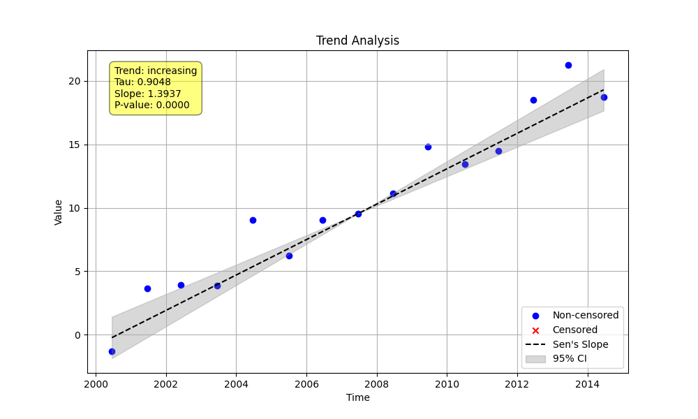

# Example 4: Aggregating Time Series Data

In many real-world datasets, you may have more than one sample for a given season (e.g., two water quality samples were taken in January 2010). The `seasonal_trend_test` function provides an `agg_method` parameter to handle these situations.

This example demonstrates the difference between analyzing all data points (`agg_method='none'`) and aggregating them (`agg_method='median'`).

## Steps

1.  **Generate Synthetic Data**: We create a time series with a clear linear trend and add several extra data points to simulate multiple observations within the same season. A random seed is set for reproducibility.
2.  **Analyze Without Aggregation**: We run `seasonal_trend_test` with `agg_method='none'` and `period=12` to correctly handle the monthly data.
3.  **Analyze With Aggregation**: We run the test again with `agg_method='median'` and `period=12`. A plot is saved for this case.
4.  **Compare the Results**: We print the results from both methods to show how the statistics (especially the S-statistic) differ.

## Python Code (`aggregation.py`)

The full Python script for this example is shown below.

```python
import numpy as np
import pandas as pd
from MannKenSen import seasonal_trend_test

def main():
    """
    Demonstrate the effect of the `agg_method` parameter in `seasonal_trend_test`
    when multiple observations exist within the same season.
    """
    # 1. Generate Synthetic Data with Duplicates
    np.random.seed(42) # Set seed for reproducibility
    n_years = 15
    base_time = np.linspace(2000, 2000 + n_years, n_years * 12, endpoint=False)
    base_x = 1.5 * (base_time - base_time[0]) + np.random.normal(0, 5, len(base_time))

    extra_time = np.array([2002.1, 2005.5, 2005.55, 2010.8])
    extra_x = 1.5 * (extra_time - base_time[0]) + np.random.normal(0, 5, len(extra_time))

    t = np.sort(np.concatenate([base_time, extra_time]))
    x = np.concatenate([base_x, extra_x])[np.argsort(np.concatenate([base_time, extra_time]))]

    # 2. Perform Trend Analysis with Different Aggregation Methods
    print("--- Running Analysis with Different Aggregation Methods ---")

    # Method 1: No Aggregation ('none')
    result_none = seasonal_trend_test(x, t, period=12, agg_method='none')
    print("\nResult with agg_method='none':")
    print(f"  Classification: {result_none.classification}")
    print(f"  Slope: {result_none.slope:.2f} ({result_none.lower_ci:.2f}, {result_none.upper_ci:.2f})")
    print(f"  S-statistic: {result_none.s}")
    print(f"  Analysis Notes: {result_none.analysis_notes if result_none.analysis_notes else 'None'}")


    # Method 2: Median Aggregation ('median')
    result_median = seasonal_trend_test(x, t, period=12, agg_method='median')
    print("\nResult with agg_method='median':")
    print(f"  Classification: {result_median.classification}")
    print(f"  Slope: {result_median.slope:.2f} ({result_median.lower_ci:.2f}, {result_median.upper_ci:.2f})")
    print(f"  S-statistic: {result_median.s}")
    print(f"  Analysis Notes: {result_median.analysis_notes if result_median.analysis_notes else 'None'}")


    # 3. Save a Plot for the Median Aggregation Case
    plot_path = "Examples/04_Aggregation_Example/aggregation_plot.png"
    seasonal_trend_test(x, t, period=12, agg_method='median', plot_path=plot_path)
    print(f"\nPlot for the 'median' aggregation method saved to: {plot_path}")

if __name__ == "__main__":
    main()
```

## Results

Running the script produces the following output. The results show a stark contrast between the two methods when applied correctly to seasonal data.

```
--- Running Analysis with Different Aggregation Methods ---

Result with agg_method='none':
  Classification: Highly Likely Increasing
  Slope: 1.71 (1.42, 1.93)
  S-statistic: 583.0
  Analysis Notes: None

Result with agg_method='median':
  Classification: No Trend
  Slope: 2.02 (nan, nan)
  S-statistic: 4.0
  Analysis Notes: ['< 3 non-NA values in Season', 'minimum season size (1) below minimum (5)']

Plot for the 'median' aggregation method saved to: Examples/04_Aggregation_Example/aggregation_plot.png
```

### Interpretation

-   **`agg_method='none'`**: When we don't aggregate (`'none'`), the test deseasonalizes the data by comparing all February points to all other February points, and so on for all months. Because there is a strong underlying trend, the result is a clear **"Highly Likely Increasing"** trend with a large S-statistic. This is the correct approach for this dataset.

-   **`agg_method='median'`**: When we aggregate using the `'median'`, the function first groups all data points by their season-cycle (e.g., all points from Feb 2000, Feb 2001, etc.). In our synthetic data, most season-cycles only have one data point. The function then calculates the median for each group. For groups with only one point, the median is just the point itself. For the few with duplicates, it's the median of those few points. This process results in a new, much smaller time series. The `Analysis Notes` correctly warn us that the seasons have too few values to conduct a meaningful trend test, and the result is **"No Trend"**. This demonstrates that aggregation should be used carefully, as it can significantly reduce the statistical power of the test if not appropriate for the data.

### Generated Plot (`agg_method='median'`)

The plot below is for the `'median'` aggregation. While all the original data points are shown, the trend line is calculated based on the aggregated (median) values. The lack of a clear trend in the aggregated data is reflected in the nearly flat trend line.


