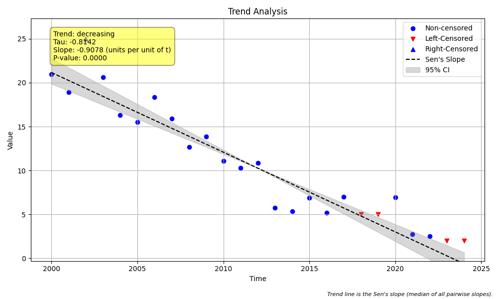

# Example 4: Handling Basic Censored Data

## Goal
Explain the essential workflow for performing trend analysis on data containing censored values (values below or above a detection limit, e.g., `< 5`).

## Introduction
Environmental data often contains "non-detects" or censored values. Standard statistical methods (like linear regression) cannot handle these strings directly, and substituting them with zero or half the detection limit can introduce significant bias.

The Mann-Kendall test is non-parametric and rank-based, making it naturally well-suited for censored data. However, the data must first be parsed into a format the algorithm understands.

This example demonstrates:
1.  **Parsing** mixed numeric and string data using `prepare_censored_data`.
2.  **Running** the Mann-Kendall test on the processed data.
3.  **Visualizing** the results with censored values clearly marked.

## Step 1: The Data
We generate a synthetic dataset representing a decreasing trend. Note the mixed format: standard numbers (e.g., `18.54`) and censored strings (e.g., `< 10.0`). We also include a right-censored value (`> 25`) to show versatility.

## Step 2: Preprocessing
The `prepare_censored_data` function is the bridge between your raw data and the analysis functions. It parses the strings and returns a DataFrame with three key columns:
*   `value`: The numeric portion (e.g., `10.0` for `< 10.0`).
*   `censored`: A boolean flag (`True` if censored).
*   `cen_type`: The type of censoring (`'lt'` for left, `'gt'` for right, `'not'` for uncensored).

## Step 3: Analysis
We pass the processed DataFrame to `trend_test`. By default, the test uses the `'robust'` method for handling censored data, which correctly handles ranks without needing to substitute values.

## Python Code and Results

```python
import pandas as pd
import numpy as np
import MannKS as mk

# 1. Generate synthetic data with censored values
# (See run_example.py for the full data generation function)
df = create_synthetic_data()

print("--- Raw Input Data (First 5 Rows) ---")
print(df.head())
print()

# 2. Preprocess the data
# The 'RawValue' column contains strings like '< 10.0'
processed_df = mk.prepare_censored_data(df['RawValue'])

print("--- Processed Data (First 5 Rows) ---")
print(processed_df.head())
print()

# 3. Run the Trend Test
# We pass the processed DataFrame as 'x' and the time column as 't'.
result = mk.trend_test(
    x=processed_df,
    t=df['Year'],
    plot_path='trend_plot.png' # Save the plot
)

print("--- Trend Test Results ---")
print(f"Trend: {result.trend}")
print(f"P-value: {result.p:.5f}")
print(f"Sen's Slope: {result.slope:.4f}")
print(f"Significance: {result.h}")
```

### Output

```text
--- Raw Input Data (First 5 Rows) ---
   Year RawValue
0  2000    20.99
1  2001    18.92
2  2002     > 25
3  2003    20.65
4  2004    16.33

--- Processed Data (First 5 Rows) ---
   value  censored cen_type
0  20.99     False      not
1  18.92     False      not
2  25.00      True       gt
3  20.65     False      not
4  16.33     False      not

--- Trend Test Results ---
Trend: decreasing
P-value: 0.00000
Sen's Slope: -0.9078
Significance: True

```

## Visualizing the Results
The generated plot visualizes the censored data points.
*   **Solid circles** represent uncensored data.
*   **Open triangles** represent censored data (pointing down for `<` and up for `>`).
*   The **Trend Line** (Sen's slope) and **Confidence Intervals** show the estimated direction of change.



## Interpretation
*   **Data Handling**: The package automatically identified and handled the censored values. You didn't need to manually substitute them with 0 or MDL/2.
*   **Trend Detection**: Despite the missing exact values for the non-detects, the test correctly identified a **decreasing** trend.
*   **Sen's Slope**: The slope of **-0.9078** (compared to the synthetic trend of -0.8) demonstrates the robustness of the estimator even with heavy censoring.
