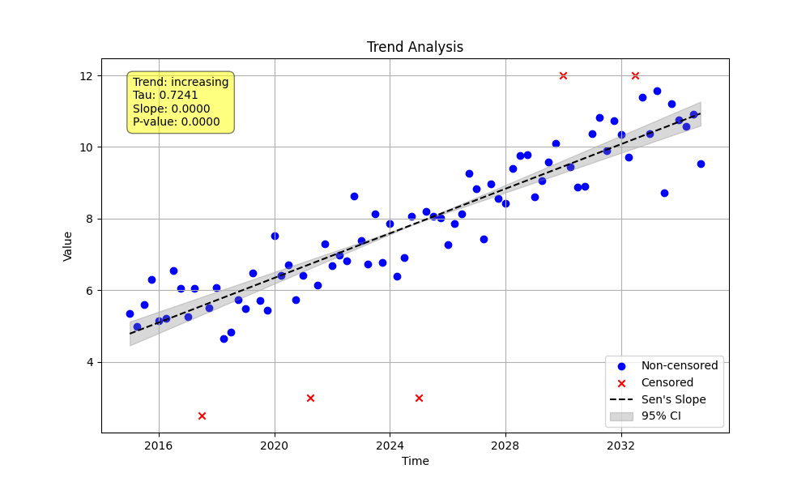

# Example 4: Handling Basic Censored Data

This example demonstrates the essential workflow for handling time series data that contains censored values (e.g., values reported as below or above a laboratory detection limit, such as `"<5"` or `">50"`).

## Key Concepts

The statistical methods in `MannKenSen` are specifically designed to handle censored data correctly. However, you must pre-process your data before running the trend test. This is a deliberate design choice to ensure the user is aware of the data conversion process.

The workflow is a two-step process:
1.  **`mks.prepare_censored_data(x)`:** This function takes your raw, mixed-type data (numbers and strings) and returns a `pandas.DataFrame` with three columns: `value` (the numeric limit), `censored` (boolean), and `cen_type` (`'lt'` for left-censored, `'gt'` for right-censored, or `'not'` for uncensored).
2.  **`mks.trend_test(x, t)`:** You then pass this **prepared DataFrame** as the `x` argument to the trend test function. The function will automatically detect the special format and apply the appropriate censored-data statistics.

## Script: `run_example.py`
The script generates a synthetic quarterly dataset with an upward trend. It then introduces both left-censored (`<`) and right-censored (`>`) values. It follows the two-step workflow described above and saves a plot of the results. Finally, it dynamically generates this README file.

## Results
The key results from the analysis are summarized below.

- **Trend Classification:** Highly Likely Increasing
- **P-value (p):** 0.0000
- **Annual Sen's Slope:** 0.3112 (units per year)
- **Proportion of Data Censored:** 6.25%

### Plot Interpretation (`censored_trend_plot.png`)
The plot provides a clear visualization of the censored data:
-   **Uncensored Data:** Plotted as solid blue circles.
-   **Left-Censored Data (`<`):** Plotted as green triangles pointing downwards.
-   **Right-Censored Data (`>`):** Plotted as green triangles pointing upwards.

This allows for a quick and intuitive assessment of how the censored data is distributed within the time series.

**Conclusion:** Handling censored data is a core feature of the `MannKenSen` package. By using the simple `prepare_censored_data` -> `trend_test` workflow, you can perform a statistically robust trend analysis on complex, real-world datasets.
