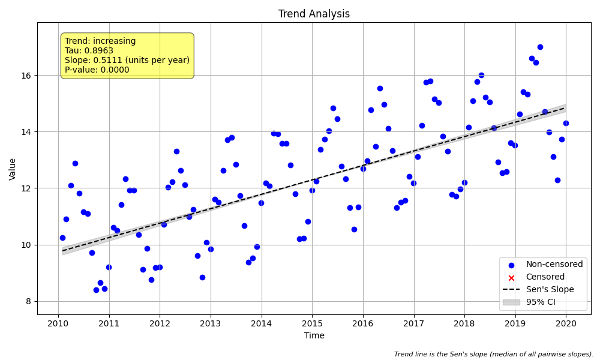

# Example 5: Basic Seasonal Trend Test & Seasonality Check

## The "Why": Seasonality Masks Trends
In environmental data (water quality, temperature, biology), values often fluctuate naturally throughout the year. For example, temperature is always higher in summer than winter. If we just plotted all the data points and drew a line, the seasonal "wobble" could obscure a subtle long-term trend, or worse, create a false one if our sampling isn't perfectly balanced.

**Seasonal Trend Analysis** solves this by comparing "apples to apples":
*   It compares January 2010 to January 2011 (not January 2010 to July 2010).
*   It effectively removes the seasonal cycle to reveal the underlying long-term direction.

## Best Practice: Consistent Aggregation
Before running the test, we often aggregate data (e.g., take the median of all samples in a month) to handle duplicates or irregular sampling.
**Crucial Rule:** If you aggregate data for your trend test, you must use the **exact same aggregation** for your seasonality check. If you check for seasonality on raw data but run the trend test on monthly medians, your results may contradict each other.

## The "How": Code Walkthrough

### Step 1: Python Code
```python
import numpy as np
import pandas as pd
import MannKS as mk
import matplotlib.pyplot as plt

# 1. Generate Synthetic Monthly Data
# We create 10 years of monthly data (120 points).
start_date = "2010-01-01"
t = pd.date_range(start=start_date, periods=120, freq='ME') # 'ME' is Month End

# Create a trend: A steady increase of 0.5 units per year
years = (t - t[0]).days / 365.25
trend = 0.5 * years

# Create seasonality: A sine wave with a 1-year period
# Peak in summer, trough in winter
seasonality = 2.0 * np.sin(2 * np.pi * years)

# Add random noise
np.random.seed(42)
noise = np.random.normal(0, 0.5, len(t))

x = 10 + trend + seasonality + noise

print("Data Head:")
print(pd.DataFrame({'Date': t, 'Value': x}).head())

# 2. Check for Seasonality
# Before running a seasonal trend test, it's good practice to verify if seasonality exists.
# We use the Kruskal-Wallis test via `check_seasonality`.
# CRITICAL: We use `agg_method='median'` to ensure we are testing the same
# aggregated data that `seasonal_trend_test` will use. This ensures consistency.
print("\n--- Checking for Seasonality ---")
seasonality_result = mk.check_seasonality(
    x, t,
    period=12,
    season_type='month',
    agg_method='median', # Consistency is key!
    agg_period='month'   # Required when aggregating
)

print(f"Is Seasonal? {seasonality_result.is_seasonal}")
print(f"p-value: {seasonality_result.p_value:.4f}")
if seasonality_result.is_seasonal:
    print("Result: Significant seasonality detected. Seasonal Trend Test is appropriate.")
else:
    print("Result: No significant seasonality. Simple Trend Test might be sufficient.")


# 3. Run the Seasonal Trend Test
# Since we found seasonality, we use `seasonal_trend_test`.
# This performs a Mann-Kendall test on each season separately (Jan vs Jan, Feb vs Feb)
# and combines the results. This removes the seasonal signal from the trend detection.
print("\n--- Running Seasonal Trend Test ---")
result = mk.seasonal_trend_test(
    x, t,
    period=12,
    season_type='month',
    agg_method='median', # Must match the check above!
    slope_scaling='year', # Result in units per year
    plot_path='seasonal_plot.png'
)

print(f"Trend: {result.trend}")
print(f"Classification: {result.classification}")
print(f"p-value: {result.p:.4f}")
print(f"Sen's Slope: {result.slope:.4f} units/year")
print(f"Confidence Interval: [{result.lower_ci:.4f}, {result.upper_ci:.4f}]")
```

### Step 2: Text Output
```text
Data Head:
        Date      Value
0 2010-01-31  10.248357
1 2010-02-28  10.895714
2 2010-03-31  12.103512
3 2010-04-30  12.881767
4 2010-05-31  11.808560

--- Checking for Seasonality ---
Is Seasonal? True
p-value: 0.0000
Result: Significant seasonality detected. Seasonal Trend Test is appropriate.

--- Running Seasonal Trend Test ---
Trend: increasing
Classification: Highly Likely Increasing
p-value: 0.0000
Sen's Slope: 0.5111 units/year
Confidence Interval: [0.4850, 0.5389]

```

## Interpreting the Results

### 1. Seasonality Check (`mk.check_seasonality`)
*   **Is Seasonal? (True)**: The Kruskal-Wallis test confirms that values differ significantly between months (e.g., July is consistently higher than December).
*   **p-value (0.0000)**: Extremely strong evidence of seasonality.
*   **Conclusion**: Since seasonality is present, using `mk.trend_test` (non-seasonal) would be inappropriate. We *must* use `mk.seasonal_trend_test`.

### 2. Seasonal Trend Test (`mk.seasonal_trend_test`)
*   **Trend (Increasing)**: After accounting for the seasonal "wobble", the underlying trend is upward.
*   **Sen's Slope (0.5111 units/year)**: This is very close to the "true" trend of 0.5 we added to the synthetic data. This shows the method correctly recovered the trend despite the strong seasonal noise.
*   **Confidence Interval**: The range `[0.4850, 0.5389]` includes the true value (0.5), validating the accuracy.

### 3. Visual Results (`seasonal_plot.png`)
The function generated this plot:



*   **Colored Dots**: Data points are color-coded by season (Month). You can clearly see the wave pattern (seasonality).
*   **Black Line**: The overall Sen's Slope trend line. Note how it cuts through the middle of the seasonal wave, capturing the long-term rise.
