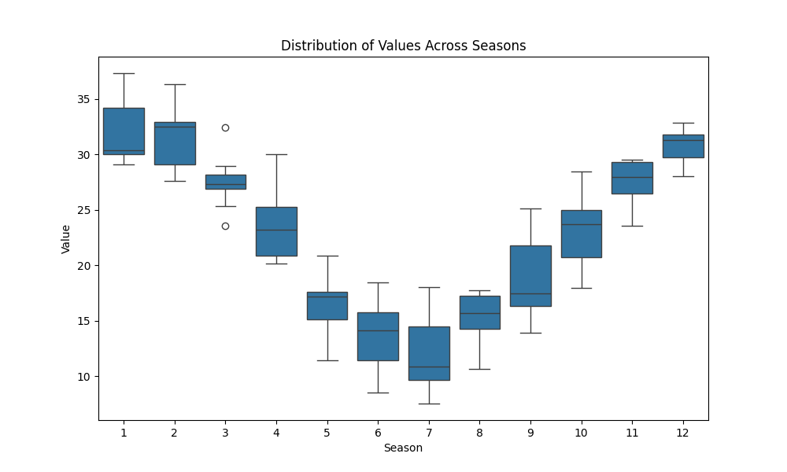
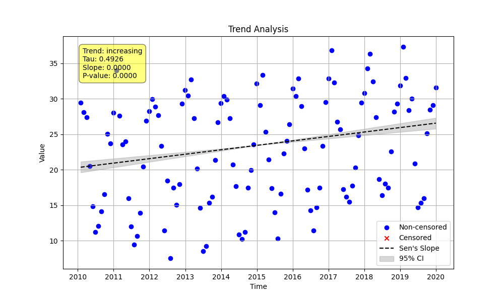

# Example 5: Basic Seasonal Trend Test

This example demonstrates the standard workflow for analyzing time series data that has a seasonal pattern. Strong seasonality can mask or create spurious long-term trends, so it's essential to use a seasonal test to correctly identify the underlying trend.

The workflow involves three key steps:
1.  **Check for Seasonality:** Statistically determine if a seasonal pattern exists.
2.  **Visualize Seasonality:** Use a box plot to visually confirm the pattern.
3.  **Perform Seasonal Test:** If seasonality is present, use the `seasonal_trend_test` to find the long-term trend.

## Script: `run_example.py`
The script generates 10 years of synthetic monthly data containing a strong seasonal cycle (high in winter, low in summer) and a slight, underlying increasing trend. It then performs the three steps outlined above and dynamically generates this README with the captured results.

## Results

### 1. Seasonality Check
The `check_seasonality` function uses the Kruskal-Wallis H-test to check for significant differences between seasons. A low p-value indicates that a seasonal pattern is present.

- **Is Seasonal?:** True
- **P-value:** 8.45e-18
- **H-statistic:** 106.67

The very low p-value confirms that the data is seasonal.

### 2. Seasonal Distribution Plot (`seasonal_distribution_plot.png`)
This box plot visualizes the data distribution for each month, clearly showing the cosine pattern that was generated in the synthetic data.

### 3. Seasonal Trend Test
Since seasonality was confirmed, we use `seasonal_trend_test`. This function analyzes the trend for each season (month) individually before combining them, which correctly isolates the long-term trend from the seasonal cycle.

- **Trend Classification:** Highly Likely Increasing
- **P-value (p):** 3.86e-14
- **Annual Sen's Slope:** 0.5479 (units per year)
- **Kendall's Tau:** 0.5444

### Plot Interpretation (`seasonal_trend_plot.png`)
The final trend plot shows the raw data points with the calculated seasonal Sen's slope and its confidence intervals overlaid, confirming the slight increasing trend.

**Conclusion:** This workflow—confirm, visualize, and then test for seasonal trend—is a robust method for analyzing seasonal time series data and correctly identifying long-term trends.
