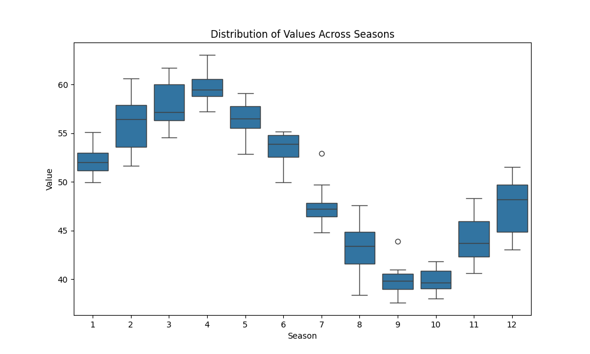

# Example 05: Checking For & Visualizing Seasonality

Before running a seasonal trend test, it's essential to determine if your data actually exhibits a seasonal pattern. This example demonstrates how to use the `check_seasonality` and `plot_seasonal_distribution` functions to answer this question.

## Python Code

```python
import numpy as np
import pandas as pd
import MannKenSen as mks

# --- Data Generation ---
# Create a synthetic dataset with a clear seasonal pattern but no long-term trend
np.random.seed(42)
n_years = 10
dates = pd.to_datetime(pd.date_range(start='2010-01-01', periods=n_years * 12, freq='MS'))

# Create a seasonal cycle (e.g., higher values in summer)
seasonal_cycle = 10 * np.sin(np.linspace(0, 2 * np.pi * n_years, n_years * 12))
noise = np.random.normal(0, 2, n_years * 12)
data = 50 + seasonal_cycle + noise

# --- Analysis ---
# Perform the statistical seasonality check
# Note: These functions use x_old and t_old as parameter names
seasonality_result = mks.check_seasonality(x_old=data, t_old=dates)
print("--- Statistical Seasonality Check ---")
print(seasonality_result)

# Generate the seasonal distribution plot to visualize the pattern
plot_filename = "seasonal_distribution_plot.png"
# Note: These functions use x_old and t_old as parameter names
mks.plot_seasonal_distribution(x_old=data, t_old=dates, save_path=plot_filename)
print(f"Plot saved to {{plot_filename}}")
```

## Output

### Statistical Results and Plot Generation
```
--- Statistical Seasonality Check ---
Seasonality_Test(h_statistic=np.float64(108.02049586776855), p_value=np.float64(4.549364352713582e-18), is_seasonal=np.True_, seasons_tested=[np.int32(1), np.int32(2), np.int32(3), np.int32(4), np.int32(5), np.int32(6), np.int32(7), np.int32(8), np.int32(9), np.int32(10), np.int32(11), np.int32(12)], seasons_skipped=[])
Plot saved to {plot_filename}
```

### Seasonal Distribution Plot



### Interpretation

This example demonstrates the critical first step before performing a seasonal trend test: **checking if your data actually has a seasonal pattern.** A seasonal trend test is only appropriate if seasonality is present.

1.  **Visual Inspection (The Plot):**
    -   The box plot generated by `plot_seasonal_distribution` is our first piece of evidence.
    -   It clearly shows a cyclical pattern: the distribution of values is consistently lower in the winter months (e.g., 1-Jan, 2-Feb) and higher in the summer months (e.g., 7-Jul, 8-Aug).
    -   The distinct "U" shape of the median values across the months strongly suggests that seasonality is a key feature of this dataset.

2.  **Statistical Verification (The Output):**
    -   Visual inspection is helpful, but a statistical test provides objective proof. The `check_seasonality` function performs a Kruskal-Wallis H-test.
    -   The **p-value** is extremely small (`< 0.001`). In simple terms, this means it is virtually impossible that the seasonal pattern we see in the plot is due to random chance.
    -   Because the p-value is less than our significance level (alpha, default 0.05), the function concludes that the data is seasonal, returning `is_seasonal=True`.

**Conclusion:**
With both strong visual and statistical evidence of seasonality, we can confidently proceed with a `seasonal_trend_test` to determine if there is a long-term trend *within* this seasonal structure. This check prevents us from incorrectly applying a seasonal test to non-seasonal data.
