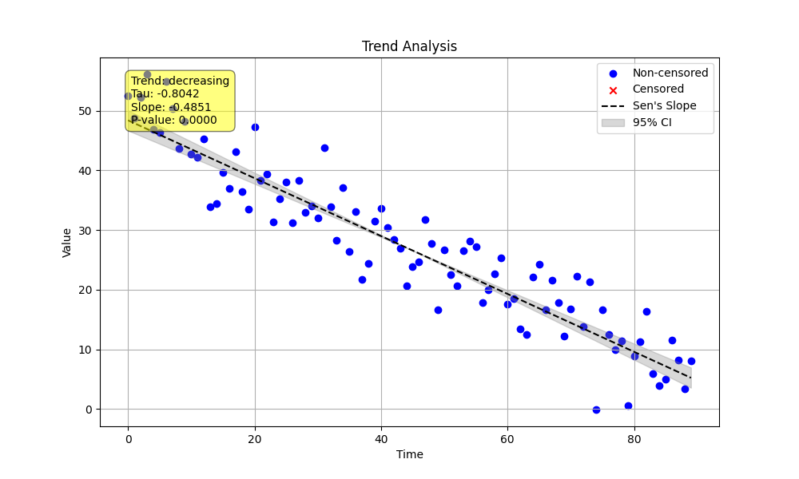

# Example 05: Basic Decreasing Trend Analysis

This example demonstrates how to use the `MannKenSen` package to detect a simple, statistically significant decreasing trend.

## Process

1.  **Generate Data**: We create a synthetic dataset representing 90 daily measurements. The data is built with a known linear trend (`slope = -0.5/day`) and some random noise to simulate a real-world scenario.
2.  **Run Test**: We pass the data and a corresponding numeric time vector (`0, 1, 2, ...`) to the `MannKenSen.trend_test` function. Using a simple integer time series makes the resulting Sen's slope directly interpretable in terms of "per day".
3.  **Save Plot**: The `plot_path` argument is used to save the visualization of the trend analysis directly to a file.

## Python Script (`decreasing_trend.py`)

```python
import numpy as np
import pandas as pd
import MannKenSen
import matplotlib.pyplot as plt

# 1. Generate Synthetic Data
# Create a date range for 3 months with daily frequency
dates = pd.date_range(start='2023-01-01', periods=90, freq='D')

# Define a decreasing trend
true_slope = -0.5
intercept = 50
trend_component = true_slope * np.arange(len(dates))

# Add some random noise to make it more realistic
np.random.seed(42)  # for reproducibility
noise = np.random.normal(0, 5, len(dates))

# Combine components to create the final data series
data_values = intercept + trend_component + noise

# Create a numeric time vector (days) for a clearer slope interpretation
time_vector = np.arange(len(dates))

# 2. Perform Trend Analysis
# The plot_path will save the trend plot to a file
result = MannKenSen.trend_test(
    data_values,
    t=time_vector,
    plot_path='Examples/05_Decreasing_Trend/decreasing_trend_plot.png'
)

# 3. Print the Results
# The output will clearly show a significant decreasing trend
print("Trend Analysis Results:")
print(f"  Classification: {result.classification}")
print(f"  Trend Exists: {result.h}")
print(f"  P-value: {result.p:.4f}")
print(f"  Sen's Slope: {result.slope:.4f}")
print(f"  Confidence Interval: {result.lower_ci:.4f} to {result.upper_ci:.4f}")

# The plot is automatically saved, but we can show it interactively if needed
# plt.show()
```

## Results

The script produces the following output, confirming that the analysis correctly identifies the strong decreasing trend. The estimated Sen's slope of -0.4851 is very close to the true slope of -0.5.

```
Trend Analysis Results:
  Classification: Highly Likely Decreasing
  Trend Exists: True
  P-value: 0.0000
  Sen's Slope: -0.4851
  Confidence Interval: -0.5225 to -0.4465
```

## Plot

The generated plot visually confirms the decreasing trend, showing the data points, the Sen's slope line, and the confidence intervals.


