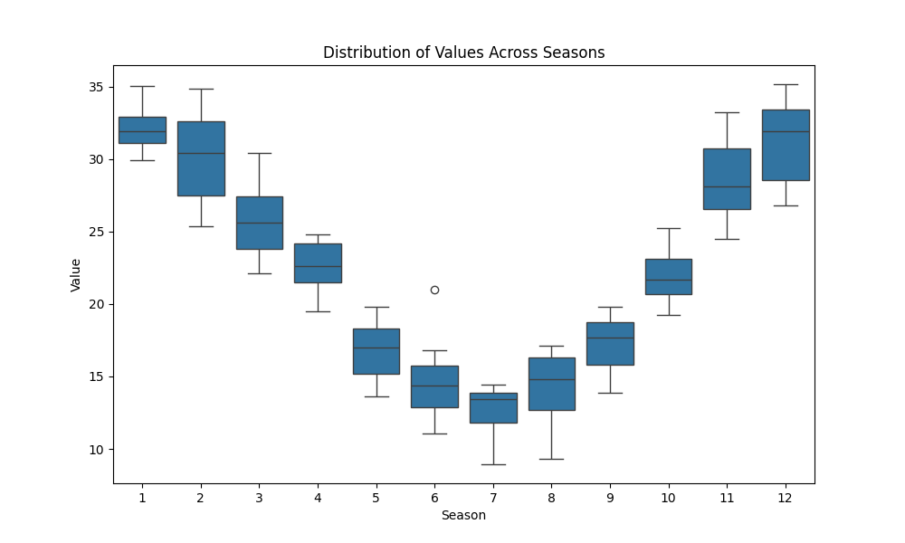

# Example 5: Basic Seasonal Trend Test

This example demonstrates the standard workflow for analyzing time series data that has a seasonal pattern. Strong seasonality can mask or create spurious long-term trends, so it's essential to use a seasonal test to correctly identify the underlying trend.

The workflow involves three key steps:
1.  **Check for Seasonality:** Statistically determine if a seasonal pattern exists.
2.  **Visualize Seasonality:** Use a box plot to visually confirm the pattern.
3.  **Perform Seasonal Test:** If seasonality is present, use the `seasonal_trend_test` to find the long-term trend.

## The Python Script

The script generates 10 years of synthetic monthly data containing a strong seasonal cycle (high in winter, low in summer) and a slight, underlying increasing trend. It then performs the three steps outlined above.

```python

import numpy as np
import pandas as pd
import MannKenSen as mks
import os

# 1. Generate Synthetic Seasonal Data
np.random.seed(42)
dates = pd.date_range(start='2010-01-01', end='2019-12-31', freq='ME')
n = len(dates)

# Create a strong seasonal cycle (high in winter, low in summer)
seasonal_pattern = 10 * np.cos(2 * np.pi * (dates.month - 1) / 12) + 20
# Create a slight, underlying increasing trend
trend = np.linspace(0, 5, n)
# Combine with noise
values = seasonal_pattern + np.random.normal(0, 2, n) + trend

# --- The 3-Step Seasonal Analysis Workflow ---
dist_plot_file = 'seasonal_distribution_plot.png'
trend_plot_file = 'seasonal_trend_plot.png'

# 2. Step 1: Statistically Check for Seasonality
print("--- 1. Seasonality Check ---")
seasonality_result = mks.check_seasonality(x=values, t=dates, season_type='month')
print(f"Is Seasonal?: {seasonality_result.is_seasonal} (p={seasonality_result.p_value:.2e})")

# 3. Step 2: Visualize Seasonal Distribution
print("\n--- 2. Visualizing Seasonality ---")
print(f"Generating seasonal distribution plot: {dist_plot_file}")
mks.plot_seasonal_distribution(
    x=values, t=dates, season_type='month', plot_path=dist_plot_file
)

# 4. Step 3: Perform Seasonal Trend Test
print("\n--- 3. Seasonal Trend Test ---")
seasonal_trend_result = mks.seasonal_trend_test(
    x=values, t=dates, season_type='month', plot_path=trend_plot_file
)
print(seasonal_trend_result)

```

## Command Output

Running the script produces the following output, showing the results from each step of the workflow.

```
--- 1. Seasonality Check ---
Is Seasonal?: True (p=8.45e-18)

--- 2. Visualizing Seasonality ---
Generating seasonal distribution plot: seasonal_distribution_plot.png

--- 3. Seasonal Trend Test ---
Seasonal_Mann_Kendall_Test(trend='increasing', h=np.True_, p=np.float64(3.863576125695545e-14), z=np.float64(7.565227469591821), Tau=np.float64(0.5444444444444443), s=np.float64(294.0), var_s=np.float64(1500.0), slope=np.float64(1.7361335363493853e-08), intercept=np.float64(-2.7169548590507127), lower_ci=np.float64(1.4211324970509843e-08), upper_ci=np.float64(2.1049717731158045e-08), C=0.9999999999999807, Cd=1.9317880628477724e-14, classification='Highly Likely Increasing', analysis_notes=[], sen_probability=np.float64(1.822539831101796e-14), sen_probability_max=np.float64(1.822539831101796e-14), sen_probability_min=np.float64(1.822539831101796e-14), prop_censored=np.float64(0.0), prop_unique=1.0, n_censor_levels=0)
```

## Interpretation of Results

### 1. Seasonality Check
The `check_seasonality` function uses the Kruskal-Wallis H-test. The very low p-value (`p < 0.01`) confirms that the data is statistically seasonal.

### 2. Seasonal Distribution Plot
This box plot visualizes the data distribution for each month, clearly showing the cosine pattern that was generated in the synthetic data. This visual check confirms the statistical result.



### 3. Seasonal Trend Test
Since seasonality was confirmed, we use `seasonal_trend_test`. This function analyzes the trend for each season (month) individually before combining them. This correctly isolates the long-term trend from the seasonal cycle, identifying the underlying **'Highly Likely Increasing'** trend.

The final trend plot shows the raw data points with the calculated seasonal Sen's slope and its confidence intervals overlaid, confirming the slight increasing trend.


**Conclusion:** This workflow—confirm, visualize, and then test for seasonal trend—is a robust method for analyzing seasonal time series data and correctly identifying long-term trends.
