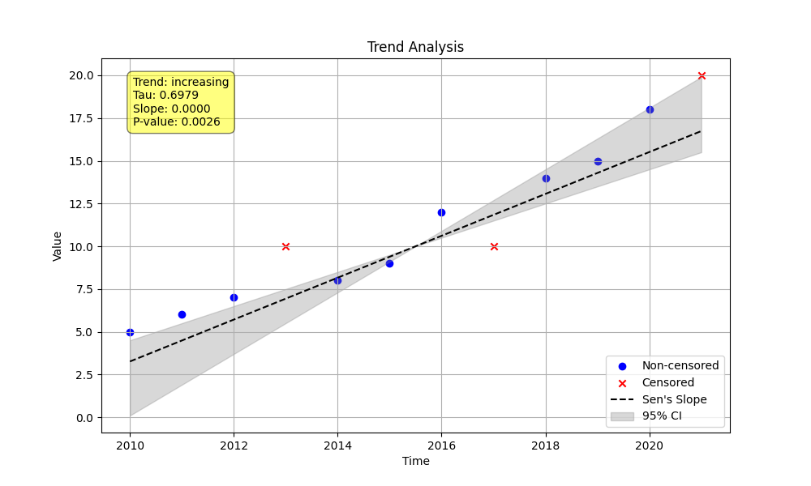

# Example 6: Deep Dive into Censored Data Options

This example compares the two methods for handling right-censored data in the Mann-Kendall test: `'robust'` (the default) and `'lwp'`. The choice of method can significantly impact the test's sensitivity and results, particularly when uncensored values are close to or exceed the censoring limit.

## Key Concepts

When the Mann-Kendall test compares pairs of data points, it needs to decide if the pair represents an increase (+1), a decrease (-1), or a tie (0). This becomes complex with right-censored data (e.g., `>10`).

-   **`mk_test_method='robust'` (Default):** This is a statistically conservative approach. When comparing an uncensored value to a right-censored value, the result is considered ambiguous if the uncensored value is greater than the detection limit. For example, comparing `12` vs. `>10` is ambiguous because `>10` could be `11` (a decrease) or `13` (an increase). In this case, the comparison contributes `0` to the S-statistic.

-   **`mk_test_method='lwp'`:** This method emulates the heuristic used in the LWP-TRENDS R script. It effectively treats all right-censored values as being slightly higher than the maximum observed uncensored value. This makes the test less conservative and can sometimes result in a stronger trend signal, as ambiguous comparisons are resolved in favor of a trend.

## Script: `run_example.py`
The script generates a small dataset with a clear increasing trend and two right-censored data points. Crucially, it includes an uncensored value (`12`) that is higher than one of the censored detection limits (`>10`), creating the exact scenario where the two methods will differ.

It then runs the `MannKenSen.trend_test` twice: once with the default `'robust'` method and once with the `'lwp'` method, saving the output and a plot for each.

## Results

After running the script, you will get two plots and a text file with the detailed output.

### Robust Method (`mk_test_method='robust'`)
-   **`robust_method_plot.png`**:
    

### LWP Method (`mk_test_method='lwp'`)
-   **`lwp_method_plot.png`**:
    

### Output Analysis (`censored_options_output.txt`)

By comparing the S-statistic, z-score, and p-value in the output file, you can see the direct impact of the chosen method. The `'robust'` method, by treating the ambiguous `12` vs. `>10` comparison as a `0`, produces a slightly weaker trend signal (lower `s` and `z` score, higher `p-value`) than the `'lwp'` method.

**Conclusion:** The `'robust'` method is generally recommended for its statistical conservatism. However, the `'lwp'` method is available for users who need to replicate results from the LWP-TRENDS R script.
