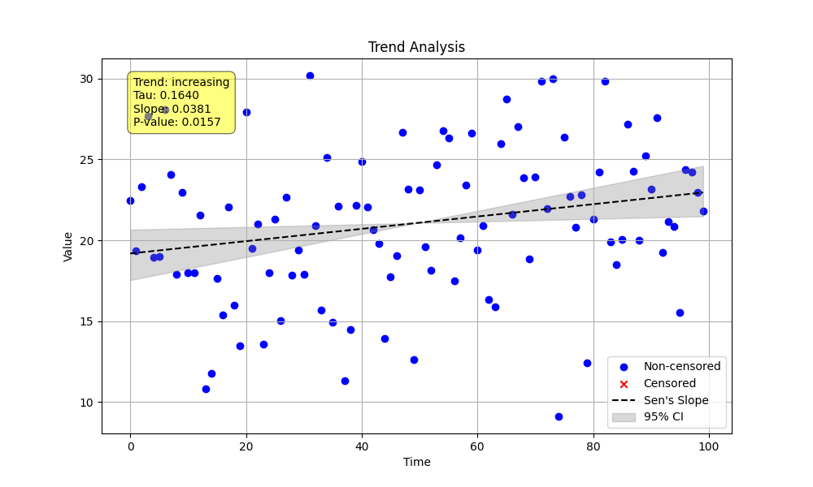

# Example 06: Weak and Uncertain Trend Analysis

This example demonstrates how the `MannKenSen` package classifies trends of varying magnitudes and how the significance level (`alpha`) influences this classification. A "weak" or "uncertain" trend is one that is not strong enough to be classified with the highest level of confidence.

## Process

1.  **Generate Data**: We create a stable baseline dataset with a significant amount of random noise.
2.  **Iterate on Slope**: We create a loop that adds a series of small, progressively larger trend components to this baseline data.
3.  **Use a Custom `alpha`**: The key to this example is setting a custom significance level. The default classification scheme requires a p-value < 0.05 for a trend to be "Highly Likely" significant. To demonstrate the "Likely" and "Very Likely" categories, we must tell the test to consider higher p-values as significant. We use `alpha=0.4`, meaning any trend with a p-value less than 0.4 will be marked as significant (`h=True`).
4.  **Observe Classification**: We print the results in a table, showing how the classification changes as the true underlying slope increases and the p-value decreases.
5.  **Save Plot**: A plot is saved for the final, most significant trend in the series for visualization.

## Python Script (`weak_trend.py`)

```python
import numpy as np
import pandas as pd
import MannKenSen

# 1. Generate Base Synthetic Data
# Create a numeric time vector
n_points = 100
time_vector = np.arange(n_points)

# Generate a stable baseline with some noise
np.random.seed(42) # for reproducibility
intercept = 20
noise = np.random.normal(0, 5, n_points)
base_data = intercept + noise

# 2. Define a series of weak trends to test
# These slopes are small relative to the noise standard deviation (5)
# We will find a slope that produces a p-value between 0.1 and 0.4
# to demonstrate the "Likely Increasing" category.
weak_slopes = [0.0, 0.01, 0.015, 0.02, 0.03]
test_alpha = 0.4 # Use a high alpha to make "Likely" category reachable

print("--- Investigating the Effect of Trend Magnitude on Classification ---")
print(f"Using a custom significance level (alpha) of {test_alpha} to demonstrate 'Likely' trends.")
print("-" * 80)
print(f"{'True Slope':<12} | {'Estimated Slope':<18} | {'P-value':<10} | {'Significant?':<12} | {'Classification'}")
print("-" * 80)

final_data_values = None

# 3. Loop through each slope, add it to the data, and run the test
for i, slope in enumerate(weak_slopes):
    # Add the trend component to the base data
    trend_component = slope * time_vector
    data_values = base_data + trend_component

    # Keep the last dataset for the final plot
    if i == len(weak_slopes) - 1:
        final_data_values = data_values

    # Perform Trend Analysis with our custom alpha
    result = MannKenSen.trend_test(data_values, t=time_vector, alpha=test_alpha)

    # Print the key results in a formatted table
    print(f"{slope:<12.3f} | {result.slope:<18.4f} | {result.p:<10.4f} | {str(result.h):<12} | {result.classification}")

print("-" * 80)

# 4. Generate a plot for the final, strongest "weak" trend for visualization
if final_data_values is not None:
    # Rerun the test for the final slope to generate the plot
    MannKenSen.trend_test(
        final_data_values,
        t=time_vector,
        plot_path='Examples/06_Weak_Trend/weak_trend_plot.png'
    )
    print("\nA plot for the final trend (true slope=0.030) has been saved.")
```

## Results

The output table clearly shows the progression.
- With a slope of `0.0`, the trend is correctly identified as "No Trend".
- At a slope of `0.010`, the p-value is `0.2301`. Because this is less than our `alpha` of `0.4`, the trend is significant (`h=True`) and classified as "Likely Increasing".
- As the slope increases, the p-value drops, and the classification moves through "Very Likely Increasing" and finally to "Highly Likely Increasing".

```
--- Investigating the Effect of Trend Magnitude on Classification ---
Using a custom significance level (alpha) of 0.4 to demonstrate 'Likely' trends.
--------------------------------------------------------------------------------
True Slope   | Estimated Slope    | P-value    | Significant? | Classification
--------------------------------------------------------------------------------
0.000        | 0.0081             | 0.6316     | False        | No Trend
0.010        | 0.0181             | 0.2301     | True         | Likely Increasing
0.015        | 0.0231             | 0.1236     | True         | Very Likely Increasing
0.020        | 0.0281             | 0.0635     | True         | Highly Likely Increasing
0.030        | 0.0381             | 0.0157     | True         | Highly Likely Increasing
--------------------------------------------------------------------------------

A plot for the final trend (true slope=0.030) has been saved.
```

## Plot

The generated plot for the final trend (`slope=0.03`) is shown below.


