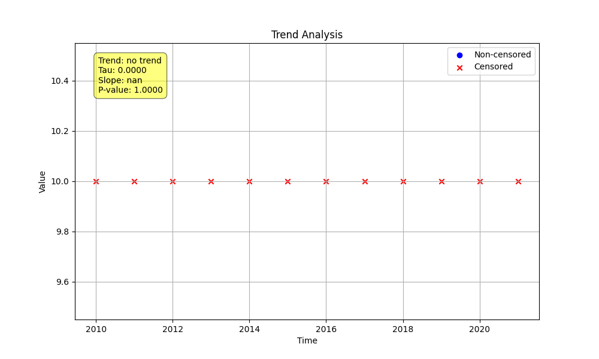

# Example 7: The High Censor Rule (`hicensor`)

Long-term monitoring data often has a "paper trend" caused by improvements in laboratory detection limits over time. For example, if a contaminant was always present but the detection limit improved from `<10` to `<1`, the recorded data might look like a decreasing trend. The `hicensor` rule is a powerful tool to correct for this.

## Key Concept

When `hicensor=True`, the `trend_test` function finds the **highest left-censored detection limit** in the entire dataset (e.g., `10` from `<10`). It then treats all values in the dataset—both censored and uncensored—that are below this limit as if they were censored at that highest limit. For example, `<5`, `<2`, `<1`, and an uncensored value of `8` would all be treated as `<10` for the analysis.

## The Python Script

The script below generates a dataset where the recorded values appear to decrease over time solely because the detection limit is improving. It analyzes the data twice: once without the `hicensor` rule and once with it.

```python

import numpy as np
import pandas as pd
import MannKenSen as mks
import os

# 1. Generate Data with Improving Detection Limits
# The recorded values appear to decrease, but only because the lab's
# detection limit is getting better over time.
dates = pd.to_datetime(pd.to_datetime(np.arange(2010, 2022), format='%Y'))
values = ['<10', '<10', '<10', '<5', '<5', '<5', '<2', '<2', '<2', '<1', '<1', '<1']
prepared_data = mks.prepare_censored_data(values)

# 2. Run Analysis Without the `hicensor` Rule
print("--- Analysis Without hicensor Rule ---")
original_plot_file = 'original_data_plot.png'
result_original = mks.trend_test(
    x=prepared_data, t=dates, plot_path=original_plot_file
)
print(result_original)

# 3. Run Analysis With the `hicensor` Rule
print("\n--- Analysis With hicensor=True ---")
hicensor_plot_file = 'hicensor_rule_plot.png'
result_hicensor = mks.trend_test(
    x=prepared_data, t=dates, hicensor=True, plot_path=hicensor_plot_file
)
print(result_hicensor)

```

## Command Output

Running the script produces the following results:

```
--- Analysis Without hicensor Rule ---
Mann_Kendall_Test(trend='no trend', h=np.False_, p=np.float64(1.0), z=0, Tau=0, s=np.float64(0.0), var_s=np.float64(146.66666666666666), slope=np.float64(nan), intercept=nan, lower_ci=nan, upper_ci=nan, C=0.5, Cd=0.5, classification='No Trend', analysis_notes=['< 3 unique values'], sen_probability=nan, sen_probability_max=nan, sen_probability_min=nan, prop_censored=np.float64(1.0), prop_unique=0.3333333333333333, n_censor_levels=4)

--- Analysis With hicensor=True ---
Mann_Kendall_Test(trend='no trend', h=np.False_, p=np.float64(1.0), z=0, Tau=0, s=np.float64(0.0), var_s=np.float64(146.66666666666666), slope=np.float64(nan), intercept=nan, lower_ci=nan, upper_ci=nan, C=0.5, Cd=0.5, classification='No Trend', analysis_notes=['< 3 unique values', 'Long run of single value'], sen_probability=nan, sen_probability_max=nan, sen_probability_min=nan, prop_censored=np.float64(1.0), prop_unique=0.08333333333333333, n_censor_levels=1)
```

## Interpretation of Results

### Analysis Without `hicensor` Rule
Even without the `hicensor` rule, the default robust statistics correctly identify **'No Trend'**. This is because comparisons between different censored levels (e.g., `<10` vs. `<5`) are treated as ambiguous ties, contributing 0 to the trend score. However, the plot still visually suggests a downward trend, which could be misleading.


### Analysis With `hicensor=True`
Applying the `hicensor` rule makes the analysis more rigorous. All values are treated as `<10`, resulting in a dataset with zero variance. The test correctly and definitively concludes there is **'No Trend'** and produces a plot where all data points are standardized to the highest detection limit, removing the misleading visual "paper trend".



**Conclusion:** While the default statistical methods are robust to paper trends, using the `hicensor` rule provides a more conservative and explicit way to validate your analysis and is highly recommended for any long-term dataset where analytical methods may have changed over time.
