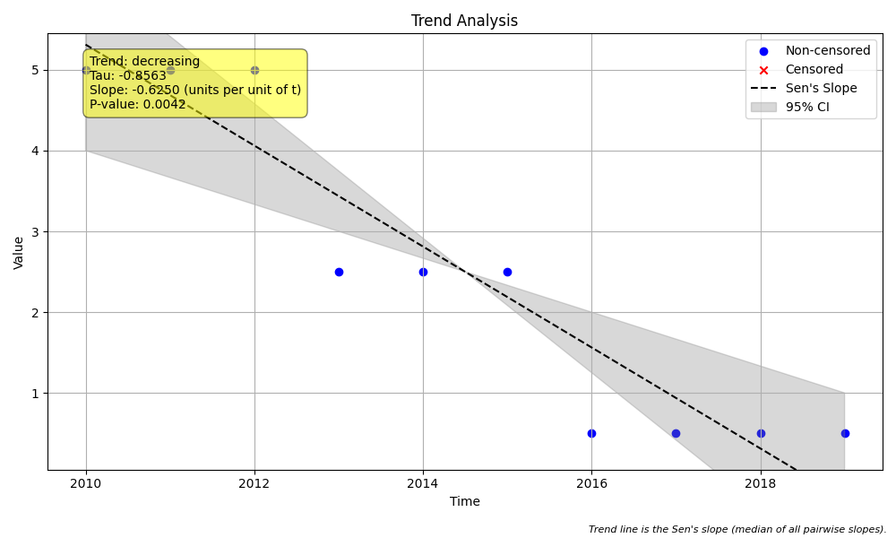
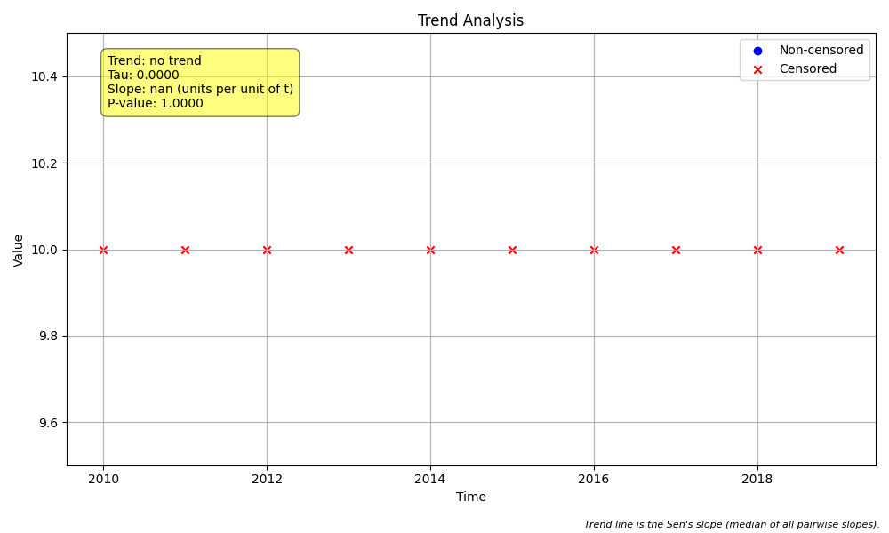

# Example 7: The High Censor Rule (`hicensor`)

## The "Why": The Trap of Improving Technology
In environmental monitoring, analytical methods often improve over time. A contaminant that was undetectable 10 years ago (reported as `< 10`) might now be detectable at much lower levels (reported as `< 1` or `0.5`).

This creates a dangerous trap: if you analyze the data naively (e.g., by substituting `< X` with `0.5 * X`), you will see a decreasing trend that is purely an artifact of the improved technology.

The **High Censor Rule (`hicensor`)** is a strategy to neutralize this bias. It standardizes the dataset by treating all historical data as if it were collected using the *worst* (highest) detection limit.

## The "How": Code Walkthrough

We simulate a dataset where the true concentration is stable, but the reporting limit drops from 10 to 5 to 1 over a decade.

### Step 1: Python Code
```python
import numpy as np
import pandas as pd
import MannKS as mk
import matplotlib.pyplot as plt

# 1. Generate Synthetic Data
# We simulate 10 years of data (2010-2019) where the underlying "true" value
# is relatively stable around 0.5.
# However, the detection limit (censoring level) IMPROVES (decreases) over time.
years = np.arange(2010, 2020)

# Define changing detection limits
detection_limits = np.array([10.0]*3 + [5.0]*3 + [1.0]*4)
# [10, 10, 10, 5, 5, 5, 1, 1, 1, 1]

# Create the observed data strings
raw_values = [f"< {lim}" for lim in detection_limits]

print("Raw Data (simulating improving technology):")
for y, v in zip(years, raw_values):
    print(f"  {y}: {v}")

# 2. Test 1: Naive Substitution (The Common Mistake)
# Many analysts incorrectly replace censored values with 1/2 the detection limit.
# Let's see what happens if we do that.
print("\n--- Test 1: Naive Substitution (1/2 DL) ---")
naive_values = [lim * 0.5 for lim in detection_limits]
# [5.0, 5.0, 5.0, 2.5, 2.5, 2.5, 0.5, 0.5, 0.5, 0.5]

result_naive = mk.trend_test(naive_values, years, plot_path='naive_plot.png')
print(f"Trend: {result_naive.trend}")
print(f"Sen's Slope: {result_naive.slope:.4f}")
print("Interpretation: FALSE POSITIVE. The test found a decreasing trend because we")
print("substituted values based on the changing detection limit.")

# 3. Test 2: Standard Robust Analysis (hicensor=False)
# The package's default robust method handles censored data by treating
# cross-limit comparisons (e.g. <10 vs <5) as ambiguous.
print("\n--- Test 2: Standard Robust Analysis (hicensor=False) ---")
data = mk.prepare_censored_data(raw_values)
result_robust = mk.trend_test(data, years, hicensor=False)
print(f"Trend: {result_robust.trend}")
print(f"Sen's Slope: {result_robust.slope:.4f}")
print("Interpretation: CORRECT. The robust method ignores ambiguous pairs, finding no trend.")

# 4. Test 3: The High Censor Rule (hicensor=True)
# The 'hicensor' rule is a stricter approach. It artificially censors ALL data
# at the highest detection limit found in the dataset (< 10).
# This converts our dataset into a series of identical '< 10' values.
print("\n--- Test 3: High Censor Rule (hicensor=True) ---")
result_hicensor = mk.trend_test(data, years, hicensor=True, plot_path='hicensor_plot.png')
print(f"Trend: {result_hicensor.trend}")
print(f"Sen's Slope: {result_hicensor.slope:.4f}")
print(f"Analysis Notes: {result_hicensor.analysis_notes}")
print("Interpretation: CORRECT & CONSERVATIVE. By unifying the censoring level,")
print("we remove any doubt that the trend might be an artifact.")
```

### Step 2: Text Output
```text
Raw Data (simulating improving technology):
  2010: < 10.0
  2011: < 10.0
  2012: < 10.0
  2013: < 5.0
  2014: < 5.0
  2015: < 5.0
  2016: < 1.0
  2017: < 1.0
  2018: < 1.0
  2019: < 1.0

--- Test 1: Naive Substitution (1/2 DL) ---
Trend: decreasing
Sen's Slope: -0.6250
Interpretation: FALSE POSITIVE. The test found a decreasing trend because we
substituted values based on the changing detection limit.

--- Test 2: Standard Robust Analysis (hicensor=False) ---
Trend: indeterminate
Sen's Slope: nan
Interpretation: CORRECT. The robust method ignores ambiguous pairs, finding no trend.

--- Test 3: High Censor Rule (hicensor=True) ---
Trend: indeterminate
Sen's Slope: nan
Analysis Notes: ['< 3 unique values', 'Long run of single value']
Interpretation: CORRECT & CONSERVATIVE. By unifying the censoring level,
we remove any doubt that the trend might be an artifact.

```

## Interpreting the Results

### 1. Naive Substitution (The Trap)
*   **Result**: Decreasing Trend.
*   **Why**: Replacing `< 10` with `5.0` and `< 1` with `0.5` creates a clear downward slope. This is a **False Positive**.
*   **The Plot**:


### 2. Standard Robust Analysis
*   **Result**: No Trend.
*   **Why**: The package's default `mk_test_method='robust'` correctly identifies that we cannot compare `< 10` with `< 5`. It treats these pairs as "ambiguous" (ties), preventing the false trend.

### 3. High Censor Rule (`hicensor=True`)
*   **Result**: No Trend.
*   **Why**: The `hicensor` rule converted all data points to `< 10`. The dataset became a flat line of identical censored values.
*   **The Plot**:

*(Note: With `hicensor=True`, the data is effectively flat. The plot shows the data points at the consistent `< 10` level.)*

## Key Takeaway
If your data has changing detection limits, be very careful with substitution methods. The `MannKS` package handles this robustly by default, but `hicensor=True` provides an extra layer of safety by harmonizing the censoring levels across the entire time series.
