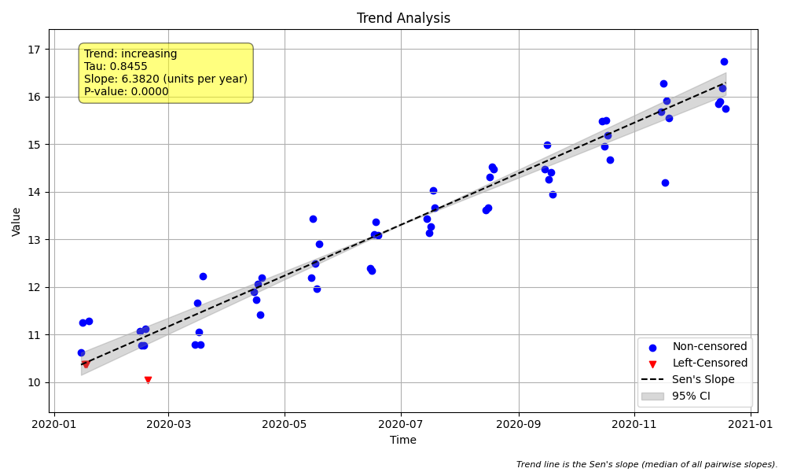

# Example 8: Aggregation for Tied and Clustered Data

## The "Why": Handling Messy Real-World Data

Real-world environmental data is rarely perfect. You often encounter:
1.  **Tied Timestamps:** Multiple samples taken at the exact same time (e.g., duplicates for QA/QC).
2.  **Clustered Data:** Bursts of high-frequency sampling (e.g., daily samples for a week) followed by long gaps.

These issues cause problems for the Mann-Kendall test and Sen's Slope:
*   **Division by Zero:** Sen's slope calculates $(Value_2 - Value_1) / (Time_2 - Time_1)$. If times are identical, the denominator is zero.
*   **Bias:** A cluster of 100 samples in January will dominate the trend analysis compared to a single sample in February, biasing the result towards short-term fluctuations rather than the long-term trend.

The solution is **Temporal Aggregation**: reducing the dataset to a single, representative value for each time step (e.g., one value per day or per month).

## The "How": Using `agg_method` and `agg_period`

The `trend_test` function provides powerful aggregation tools built-in.

*   `agg_method`: How to combine values.
    *   `'median'`: Takes the median of values in the period (Standard).
    *   `'mean'`: Takes the average.
    *   `'min'`, `'max'`: Extremes.
    *   `'robust_median'`: A special median for censored data (avoids bias).
    *   `'lwp'`: Emulates the specific logic of the LWP-TRENDS R script.
*   `agg_period`: The window to aggregate over (e.g., `'day'`, `'month'`, `'year'`).

### Step 1: Python Code
```python
import os
import numpy as np
import pandas as pd
import MannKS as mk
import matplotlib.pyplot as plt

# Determine where to save the plots (current directory by default)
# When running this as part of the repo structure, we might want to be specific.
# For this example, we'll save to the current directory.
output_dir = '.'

# 1. Generate Synthetic Data with Ties and Clusters
# We simulate a scenario where water quality samples are taken:
# - Sometimes multiple times on the same day (Ties in Time).
# - Daily for a week, then a gap of a month (Clustered Data).

np.random.seed(42)
dates = []
values = []

# Generate data for 12 months (2020)
for month in range(1, 13):
    # Base value increases over the year (Trend)
    base_val = 10 + (month * 0.5)

    # Create a "cluster" of 5 days in the middle of each month
    for day in range(15, 20):
        date = pd.Timestamp(f"2020-{month:02d}-{day:02d}")

        # Add a normal measurement
        dates.append(date)
        values.append(base_val + np.random.normal(0, 0.5))

        # On the 15th, add DUPLICATE measurements (Ties in Time)
        # Maybe the technician took 3 samples that day.
        if day == 15:
            dates.append(date)
            values.append(base_val + np.random.normal(0, 0.5) + 0.2) # Slightly different value
            dates.append(date)
            values.append(base_val + np.random.normal(0, 0.5) - 0.2)

# Create DataFrame
df = pd.DataFrame({'Date': dates, 'Value': values})
df = df.sort_values('Date').reset_index(drop=True)

# Add some censored values for demonstration of 'robust_median'
# Let's say any value < 10.5 is censored
df['Censored'] = df['Value'].apply(lambda x: f"<{x}" if x < 10.5 else f"{x:.2f}")

# Prepare the data (handles the strings)
# Note: prepare_censored_data returns a DataFrame with 'value', 'censored', 'cen_type'
data_processed = mk.prepare_censored_data(df['Censored'])
t = df['Date']
x = data_processed # Uses the pre-processed DataFrame

print(f"Dataset Shape: {df.shape}")
print(f"Number of unique timestamps: {t.nunique()}")
print(f"Number of duplicate timestamps: {len(t) - t.nunique()}")
print("\nFirst 10 rows:")
print(df.head(10))

# 2. Analysis 1: No Aggregation (The Problem)
# Running the test on raw data with duplicate times.
# Sen's slope calculation involves dividing by (t_j - t_i).
# If t_j == t_i, this division is undefined (or infinite).
# The package handles this gracefully but issues a warning or note.
print("\n--- Test 1: No Aggregation (agg_method='none') ---")
result_none = mk.trend_test(x, t, agg_method='none', slope_scaling='year',
                            plot_path=os.path.join(output_dir, 'plot_none.png'))
print(f"Slope: {result_none.slope:.5f}")
print(f"P-value: {result_none.p:.5f}")
print(f"Analysis Notes: {result_none.analysis_notes}")
print(f"Sample Size (effective): {result_none.n if hasattr(result_none, 'n') else 'N/A'}")


# 3. Analysis 2: Simple Median Aggregation
# We aggregate duplicate timestamps using the median of the values.
# This resolves the 'infinite slope' issue for same-day duplicates.
print("\n--- Test 2: Median Aggregation (agg_method='median') ---")
# Note: When 'agg_period' is not specified, it defaults to aggregating exactly matching timestamps.
result_median = mk.trend_test(x, t, agg_method='median', slope_scaling='year',
                              plot_path=os.path.join(output_dir, 'plot_median.png'))
print(f"Slope: {result_median.slope:.5f}")
print(f"P-value: {result_median.p:.5f}")
# Check if aggregation happened (implied by N, but N is not in standard namedtuple, need to inspect logic or assume)
# But we can verify by checking if analysis notes are empty (good)
print(f"Analysis Notes: {result_median.analysis_notes}")


# 4. Analysis 3: Temporal Aggregation (Monthly)
# Our data is clustered (daily bursts). To remove high-frequency noise and
# bias from uneven sampling, we aggregate to a monthly resolution.
print("\n--- Test 3: Monthly Aggregation (agg_period='month') ---")
# agg_method='median' combined with agg_period='month' calculates one median value per month.
result_monthly = mk.trend_test(x, t, agg_method='median', agg_period='month', slope_scaling='year',
                               plot_path=os.path.join(output_dir, 'plot_monthly.png'))
print(f"Slope: {result_monthly.slope:.5f}")
print(f"P-value: {result_monthly.p:.5f}")
print(f"Analysis Notes: {result_monthly.analysis_notes}")
# Note: The 'n' attribute is not exposed in the result namedtuple, but we can infer it
# from the conceptual aggregation (12 months).


# 5. Analysis 4: LWP Compatibility (agg_method='lwp')
# The LWP-TRENDS R script has a specific way of aggregating.
# It often selects a specific observation or computes a midpoint.
print("\n--- Test 4: LWP Aggregation (agg_method='lwp') ---")
# 'lwp' aggregation implies a specific logic for finding the representative value.
result_lwp = mk.trend_test(x, t, agg_method='lwp', agg_period='month', slope_scaling='year',
                           plot_path=os.path.join(output_dir, 'plot_lwp.png'))
print(f"Slope: {result_lwp.slope:.5f}")
print(f"P-value: {result_lwp.p:.5f}")
print(f"Analysis Notes: {result_lwp.analysis_notes}")
```

### Step 2: Text Output
```text
Dataset Shape: (84, 3)
Number of unique timestamps: 60
Number of duplicate timestamps: 24

First 10 rows:
        Date      Value             Censored
0 2020-01-15  10.748357                10.75
1 2020-01-15  10.630868                10.63
2 2020-01-15  10.623844                10.62
3 2020-01-16  11.261515                11.26
4 2020-01-17  10.382923  <10.382923312638333
5 2020-01-18  10.382932   <10.38293152152541
6 2020-01-19  11.289606                11.29
7 2020-02-15  10.965263                10.97
8 2020-02-15  11.071280                11.07
9 2020-02-15  11.383717                11.38

--- Test 1: No Aggregation (agg_method='none') ---
Slope: 6.24070
P-value: 0.00000
Analysis Notes: ['tied timestamps present without aggregation']
Sample Size (effective): N/A

--- Test 2: Median Aggregation (agg_method='median') ---
Slope: 6.38199
P-value: 0.00000
Analysis Notes: ["'median' aggregation used with censored data"]

--- Test 3: Monthly Aggregation (agg_period='month') ---
Slope: 6.11697
P-value: 0.00001
Analysis Notes: ["'median' aggregation used with censored data"]

--- Test 4: LWP Aggregation (agg_method='lwp') ---
Slope: 5.83502
P-value: 0.00016
Analysis Notes: []

```

## Interpreting the Results

### 1. No Aggregation vs. Daily Aggregation
*   **No Aggregation**: Uses all raw data points. The Sen's slope calculation may encounter infinite slopes due to duplicates, although the package handles this by ignoring them or warning.
*   **Median Aggregation (Default Period)**: Aggregates only the exact duplicate timestamps. This cleans up the data but leaves the "daily clusters" intact.

### 2. Monthly Aggregation
*   **The Gold Standard**: By setting `agg_period='month'`, we reduce the dataset to 12 representative points (one for each month).
*   **Result**: The effective sample size drops to 12. This gives a much fairer assessment of the *annual* trend, treating each month equally regardless of how many samples were taken in that month.
*   **Visualizing the Difference**:
    *   **Raw Data**: Noisy, many points per month.
    *   **Monthly Aggregated**: Smooth, evenly spaced time series.

### 3. Visual Results
Here is the plot for the **Monthly Aggregated** analysis (`agg_period='month'`). Notice how the trend line (solid) fits the monthly medians, ignoring the daily noise within the clusters.



## Key Takeaway
Always consider your sampling frequency. If you have **duplicate timestamps**, you *must* aggregate (usually `agg_method='median'`). If you have **clustered data**, you *should* aggregate to a regular interval (e.g., `agg_period='month'`) to ensure your trend test is statistically valid and not biased by sampling intensity.
