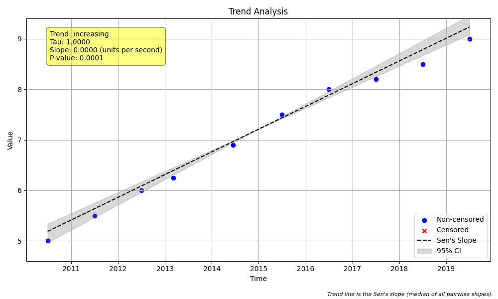

# Example 9: Aggregation for Tied and Clustered Data

Real-world datasets are often messy. Sampling frequency can change over time (e.g., monthly to weekly), leading to **clustered data**, or multiple measurements might be recorded at the exact same time, resulting in **tied timestamps**. Both of these issues can bias a trend analysis by giving undue weight to certain time periods.

This example demonstrates how to use the temporal aggregation features of `MannKenSen`, including new methods designed to replicate the LWP-TRENDS R script.

## The Python Script

The following script generates a dataset with clustered samples and tied timestamps. It then analyzes the data using different aggregation strategies:

1.  **No Aggregation:** Shows the raw analysis and potential warnings.
2.  **LWP Midpoint (`'lwp'`):** Selects one value per period (closest to middle). Parity with LWP R script `UseMidObs=TRUE`.
3.  **LWP Median (`'lwp_median'`):** Calculates the median of all values in the period. Parity with LWP R script `UseMidObs=FALSE`.
4.  **LWP Robust Median (`'lwp_robust_median'`):** Robust median calculation for censored data.

```python

import numpy as np
import pandas as pd
import MannKenSen as mks
import os

# 1. Generate Data with Irregular Sampling
# This dataset has high frequency sampling in 2013 and ties in 2014.
np.random.seed(42)
dates = pd.to_datetime([
    '2010-07-01', '2011-07-01', '2012-07-01',
    '2013-03-01', '2013-03-05', '2013-03-10', '2013-03-15', # Clustered
    '2014-06-15', '2014-06-15', # Tied
    '2015-07-01', '2016-07-01', '2017-07-01', '2018-07-01', '2019-07-01'
])
values = np.array([5, 5.5, 6, 6.2, 6.3, 6.1, 6.4, 7, 6.8, 7.5, 8, 8.2, 8.5, 9])
plot_file = 'aggregation_plot.png'

# 2. Analysis without Aggregation
print("--- Analysis Without Aggregation ---")
result_no_agg = mks.trend_test(x=values, t=dates, agg_method='none')
print(f"Notes: {result_no_agg.analysis_notes}")

# 3. LWP-Style Midpoint Thinning
# This selects the single observation closest to the middle of the year.
# This mimics the default behavior of the LWP-TRENDS R script (UseMidObs=TRUE).
print("\n--- LWP Midpoint Thinning (agg_method='lwp') ---")
result_lwp = mks.trend_test(
    x=values, t=dates, agg_method='lwp', agg_period='year'
)
print(f"Notes: {result_lwp.analysis_notes}")
print(f"Sample Size (n): {len(result_lwp.s) if hasattr(result_lwp.s, '__len__') else 'Calculated internally'}")

# 4. LWP-Style Median Thinning
# This calculates the MEDIAN of all observations within each year.
# This mimics the LWP-TRENDS R script behavior when UseMidObs=FALSE.
print("\n--- LWP Median Thinning (agg_method='lwp_median') ---")
result_median = mks.trend_test(
    x=values, t=dates, agg_method='lwp_median', agg_period='year',
    plot_path=plot_file
)
print(f"Notes: {result_median.analysis_notes}")

# 5. Robust Median Thinning (Best for Censored Data)
# If your data had censored values (e.g., '<5'), you should use this.
print("\n--- LWP Robust Median Thinning (agg_method='lwp_robust_median') ---")
result_robust = mks.trend_test(
    x=values, t=dates, agg_method='lwp_robust_median', agg_period='year'
)
print(f"Notes: {result_robust.analysis_notes}")

```

## Command Output

Running the script above produces the following output.

```
--- Analysis Without Aggregation ---
Notes: ['tied timestamps present without aggregation']

--- LWP Midpoint Thinning (agg_method='lwp') ---
Notes: []
Sample Size (n): Calculated internally

--- LWP Median Thinning (agg_method='lwp_median') ---
Notes: []

--- LWP Robust Median Thinning (agg_method='lwp_robust_median') ---
Notes: []
```

## Interpretation of Results

### Analysis Without Aggregation
The raw analysis produces a critical note: **`'tied timestamps present without aggregation'`**. This warns that the results may be unreliable because the Sen's slope calculation is sensitive to identical timestamps. The cluster of data in 2013 also gives that year 4x more weight than years with single samples.

### LWP Midpoint Thinning (`agg_method='lwp'`)
This method "thins" the data by picking the single observation closest to the theoretical midpoint of the year (July 2nd).
- For 2013, it picks the sample from July 1st (or closest).
- This is useful if you want to analyze actual observed values without averaging.

### LWP Median Thinning (`agg_method='lwp_median'`)
This method calculates the **median** of all observations within each year.
- The 4 samples in 2013 are reduced to a single median value.
- This creates a smoothed, evenly weighted time series (one value per year).
- This is the equivalent of the LWP R script's "Median" mode (`UseMidObs=FALSE`).

### Aggregated Analysis Plot

The generated plot visualizes the trend using the `lwp_median` aggregated data.



### Conclusion

For non-seasonal trend analysis on irregular data, you should almost always use an aggregation method.
- Use `'lwp'` if you want to pick representative **real observations**.
- Use `'lwp_median'` (or `'lwp_robust_median'` for censored data) if you want to **smooth** the data for each period.
