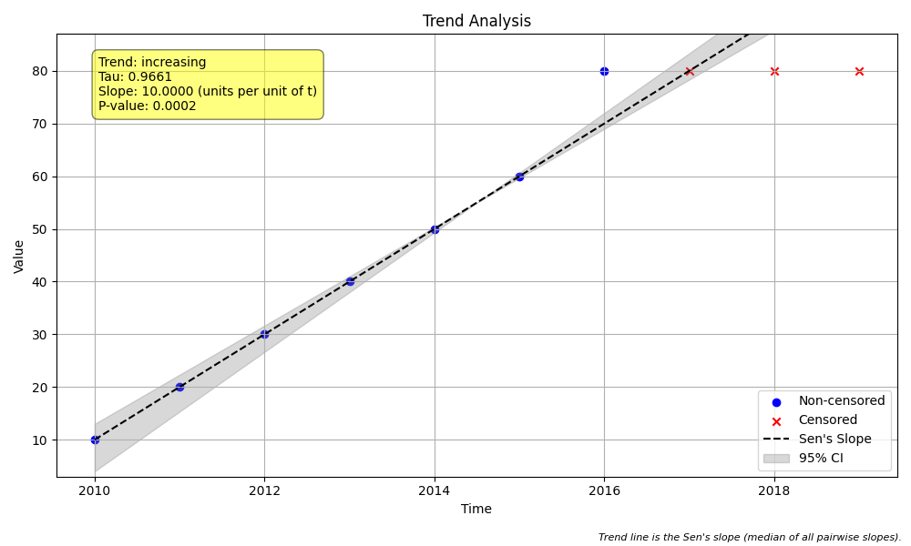

# Example 9: Comparing Right-Censored Data Methods

## The Problem with "Upper Limits" (Right-Censoring)

In environmental monitoring, we usually deal with **Left-Censored** data (values below a detection limit, e.g., `<0.1`). However, sometimes we encounter **Right-Censored** data (values above an upper limit, e.g., `>80`).

This happens when:
*   An instrument becomes saturated.
*   A value exceeds the calibrated range.
*   "Too numerous to count" (e.g., bacteria).

Determining a trend when the highest values are unknown (just "greater than X") is tricky. This package offers two ways to handle this, controlled by the `mk_test_method` parameter.

## The Methods

### 1. `mk_test_method='robust'` (Default)
*   **How it works:** Uses a standard non-parametric ranking approach (adapted from the NADA package).
*   **Behavior:** It is highly conservative. It does not assume that `>80` is necessarily significantly larger than `80` in a way that contributes to the trend score, often treating them as tied or ambiguous.
*   **Consequence:** It may **underestimate** an increasing trend because it "plays it safe" with the unknown high values.

### 2. `mk_test_method='lwp'`
*   **How it works:** Implements a heuristic from the LWP-TRENDS R script.
*   **Behavior:** It finds the maximum right-censored value in the dataset (e.g., 80) and replaces all instances of `>80` with a slightly higher numeric value (e.g., `80.1`). It then treats these as **uncensored** real numbers.
*   **Consequence:** It forces the test to recognize these points as the highest values in the series, typically resulting in a stronger trend signal (higher S-statistic).

## The "How": Code Walkthrough

We simulate a dataset that hits a ceiling of 80.

### Step 1: Python Code
```python
import numpy as np
import pandas as pd
import MannKS as mk

# 1. Generate Synthetic Data
# Scenario: A monitoring station measures a chemical concentration that is steadily increasing.
# However, the measurement instrument has an upper limit of 80.
# Once the concentration exceeds 80, it is recorded as '>80' (Right-Censored).
t = np.arange(2010, 2020)
# Data: Steady increase, then hitting the "ceiling"
raw_values = [10, 20, 30, 40, 50, 60, 80, '>80', '>80', '>80']

print("Raw Data:")
print(raw_values)

# 2. Pre-process the Data
# Since we have strings ('>80'), we must convert them to a DataFrame
# that the package can understand (numeric values + censored flags).
data = mk.prepare_censored_data(raw_values)

# 3. Method A: The Default "Robust" Method
# This method uses a standard rank-based approach (adapted from NADA for left-censoring).
# It is "conservative" regarding right-censored data.
print("\n--- Running Test with Method: 'robust' (Default) ---")
result_robust = mk.trend_test(
    data,
    t,
    mk_test_method='robust',
    plot_path='robust_plot.png'
)

print(f"Trend: {result_robust.trend} ({result_robust.classification})")
print(f"S-statistic: {result_robust.s}")
print(f"p-value: {result_robust.p:.4f}")

# 4. Method B: The "LWP" Method
# This method uses a heuristic from the LWP-TRENDS R script.
# It replaces right-censored values with a number slightly larger than the maximum
# observed right-censored value (e.g., >80 becomes 80.1) and treats them as uncensored.
# This forces the test to recognize that these values are indeed "higher".
print("\n--- Running Test with Method: 'lwp' ---")
result_lwp = mk.trend_test(
    data,
    t,
    mk_test_method='lwp',
    plot_path='lwp_plot.png'
)

print(f"Trend: {result_lwp.trend} ({result_lwp.classification})")
print(f"S-statistic: {result_lwp.s}")
print(f"p-value: {result_lwp.p:.4f}")
```

### Step 2: Text Output
```text
Raw Data:
[10, 20, 30, 40, 50, 60, 80, '>80', '>80', '>80']

--- Running Test with Method: 'robust' (Default) ---
Trend: increasing (Highly Likely Increasing)
S-statistic: 18.0
p-value: 0.0955

--- Running Test with Method: 'lwp' ---
Trend: increasing (Highly Likely Increasing)
S-statistic: 42.0
p-value: 0.0002

```

## Interpreting the Results

### The Difference in "S"

*   **Robust Method (S = 18.0)**:
    *   The test sees the clear increase from 10 to 60.
    *   However, the transition involving censored values (like 80 to `>80`) is treated conservatively. In this implementation, standard rank comparisons for right-censored data can be ambiguous or even negatively ranked against uncensored values if the statistical assumptions (often designed for left-censoring) are not perfectly aligned with right-censored logic.
    *   **Result**: The trend is barely significant (p=0.0955), effectively treating the "ceiling" data as noise or ambiguity rather than a clear continuation of the trend.

*   **LWP Method (S = 42.0)**:
    *   The method converts all `>80` values to `80.1`.
    *   The trend from 10...60 to 80 to 80.1 is strictly increasing, adding maximum positive score for those pairs.
    *   The three `80.1` values are tied with each other (contributing 0 to the score), which is why S is 42 instead of the theoretical maximum of 45 (for n=10 unique values).
    *   **Result**: A highly significant increasing trend (p=0.0002), which correctly reflects the physical reality that the concentration was rising and then "maxed out".

### Visual Comparison

| Robust Method | LWP Method |
| :---: | :---: |
|  |  |

*Note: The trend lines (Sen's Slope) may look identical because `mk_test_method` only affects the significance test (p-value and S), not the slope calculation. The slope is determined by `sens_slope_method`.*

## Recommendation
*   **Use `'robust'`** if you want to be statistically conservative and stick to standard non-parametric ranking rules, accepting that right-censored data might not contribute strongly to an increasing trend.
*   **Use `'lwp'`** if you are confident that your right-censored values represent a true "exceedance" of the limit (e.g. saturation) and you want the trend test to credit that increase. This is often the preferred choice for handling instrumental upper limits.
