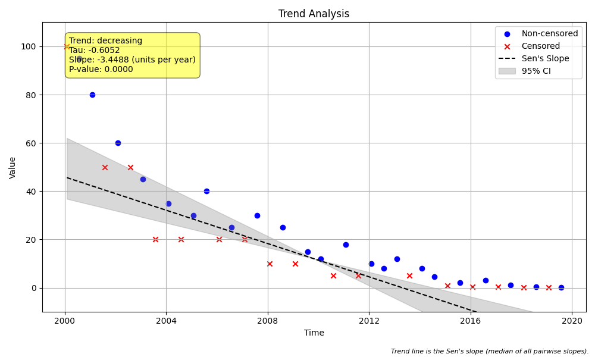

# Example 10: Handling Data with Multiple Censoring Levels

## The "Why": Real-World Data is Messy
In long-term environmental monitoring, measurement technology often evolves.
*   **1990s:** You might report values as `< 50`.
*   **2000s:** Better equipment allows reporting `< 10`.
*   **Today:** Precision instruments report `< 0.1`.

This creates a dataset with **multiple censoring levels**. A naive analysis might treat `< 50` as `25` (half) and `< 0.1` as `0.05`. This can artificially create a "decreasing trend" just because the detection limit got lower, not because the pollutant concentration actually dropped.

The **Mann-Kendall test** handles this robustly. It doesn't use the values directly; it compares their *ranks*.
*   Is `30` less than `< 50`? **Uncertain** (could be 49, could be 0).
*   Is `< 0.1` less than `< 50`? **Yes**, definitely.
*   Is `> 100` greater than `95`? **Yes**.

This example shows how the package handles a dataset containing a mix of high detection limits, low detection limits, and even right-censored ("greater than") data.

## The "How": Code Walkthrough

We simulate a 20-year dataset where the pollution levels are decreasing, but the detection limits are also changing.

### Step 1: Python Code
```python
import numpy as np
import pandas as pd
import MannKS as mk

# 1. Generate Synthetic Data with Multiple Censoring Levels
# Imagine a dataset of chemical concentrations over 10 years.
# Over time, laboratory equipment improves, lowering the detection limit.
# However, sometimes high concentrations exceed the upper limit of the old equipment.

# 20 years of semi-annual data (40 points)
# Note: Using '6ME' (MonthEnd) requires pandas >= 2.1.0.
# If you are using an older version, use '6M'.
try:
    dates = pd.date_range(start='2000-01-01', periods=40, freq='6ME')
except ValueError:
    dates = pd.date_range(start='2000-01-01', periods=40, freq='6M')

# We manually construct a list of values to represent this scenario
# Note the mix of numeric values, "less than" censoring, and "greater than" censoring.
raw_data = [
    # Early years (2000-2005): High detection limits, limited range
    '> 100', '95', '80', '< 50', '60', '< 50', '45', '< 20', '35', '< 20',
    '30', '40', '< 20', '25', '< 20',
    # Middle years (2006-2012): Better equipment, lower detection limits
    '30', '< 10', '25', '< 10', '15', '12', '< 5', '18', '< 5', '10',
    '8', '12', '< 5',
    # Recent years (2013-2019): Modern equipment, very low detection limits
    '8', '4.5', '< 1', '2.1', '< 0.5', '3.0', '< 0.5', '1.2', '< 0.1', '0.5',
    '< 0.1', '0.2'
]

# Ensure lengths match
if len(raw_data) < len(dates):
    # Pad with some low values if needed
    raw_data.extend(['< 0.1'] * (len(dates) - len(raw_data)))
elif len(raw_data) > len(dates):
    raw_data = raw_data[:len(dates)]

df = pd.DataFrame({'Date': dates, 'Concentration': raw_data})

print("--- Raw Data Sample ---")
print(df.head())
print("...")
print(df.tail())

# 2. Preprocess the Data
# The package cannot read strings like '< 50' directly.
# We must use `prepare_censored_data` to parse them into numeric values and flags.
print("\nPreprocessing data...")
processed_data = mk.prepare_censored_data(df['Concentration'])

# Inspect the processed DataFrame.
# Notice 'value' contains the number, 'censored' is boolean, and 'cen_type' is '<' or '>'.
print("\n--- Processed Data ---")
print(processed_data.head())

# 3. Run the Trend Test
# We pass the PROCESSED DataFrame as `x`.
# The function detects it's a DataFrame and uses the 'value', 'censored', and 'cen_type' columns.
# We also use `slope_scaling='year'` to get the result in "units per year".
print("\nRunning Mann-Kendall Trend Test...")
result = mk.trend_test(
    x=processed_data,
    t=df['Date'],
    slope_scaling='year',
    plot_path='multi_censor_trend.png'
)

# 4. Inspect the Results
print("\n--- Trend Test Results ---")
print(f"Basic Trend: {result.trend}")
print(f"Classification: {result.classification} (Confidence: {result.C:.1%})")
print(f"Kendall's S: {result.s}")
print(f"p-value: {result.p:.4f}")
print(f"Sen's Slope: {result.slope:.4f} {result.slope_units}")
print(f"Confidence Interval: [{result.lower_ci:.4f}, {result.upper_ci:.4f}]")
print(f"Proportion Censored: {result.prop_censored:.1%}")
print(f"Number of Censor Levels: {result.n_censor_levels}")
```

### Step 2: Text Output
```text
--- Raw Data Sample ---
        Date Concentration
0 2000-01-31         > 100
1 2000-07-31            95
2 2001-01-31            80
3 2001-07-31          < 50
4 2002-01-31            60
...
         Date Concentration
35 2017-07-31           1.2
36 2018-01-31         < 0.1
37 2018-07-31           0.5
38 2019-01-31         < 0.1
39 2019-07-31           0.2

Preprocessing data...

--- Processed Data ---
   value  censored cen_type
0  100.0      True       gt
1   95.0     False      not
2   80.0     False      not
3   50.0      True       lt
4   60.0     False      not

Running Mann-Kendall Trend Test...

--- Trend Test Results ---
Basic Trend: decreasing
Classification: Highly Likely Decreasing (Confidence: 100.0%)
Kendall's S: -373.0
p-value: 0.0000
Sen's Slope: -3.4488 units per year
Confidence Interval: [-5.1318, -2.5446]
Proportion Censored: 42.5%
Number of Censor Levels: 8

```

## Interpreting the Results

### 1. Statistical Results
*   **Classification (Highly Likely Decreasing)**: Despite the messy data, the test identified a highly likely decreasing trend.
*   **Kendall's S (-373.0)**: A strongly negative score indicates that as time goes on, values tend to get lower.
*   **Proportion Censored (42.5%)**: A significant portion of the data is censored. Standard regression would fail here.
*   **Number of Censor Levels (8)**: We successfully handled 8 different thresholds.

### 2. Visual Results (`multi_censor_trend.png`)
The plot visualizes this complexity:



*   **Red Triangles (Left-Censored)**: These point *down*, indicating the value is somewhere below that mark (e.g., `< 50`). Notice how the "ceiling" of these triangles drops over time as technology improves.
*   **Blue Triangles (Right-Censored)**: These point *up*, indicating values above a limit (e.g., `> 100`).
*   **Blue Dots**: The actual measured values.
*   **Trend Line**: The solid line shows the estimated rate of decrease, pivoting through the "middle" of this complex cloud of data.

## Key Takeaway
The `MannKS` package is designed for this reality. You don't need to throw away censored data or use arbitrary substitution rules (like "replace with 1/2 DL").
1.  Use `mk.prepare_censored_data()` to parse your strings.
2.  Pass the result to `mk.trend_test()`.
3.  Trust the non-parametric statistics to handle the ambiguity correctly.
