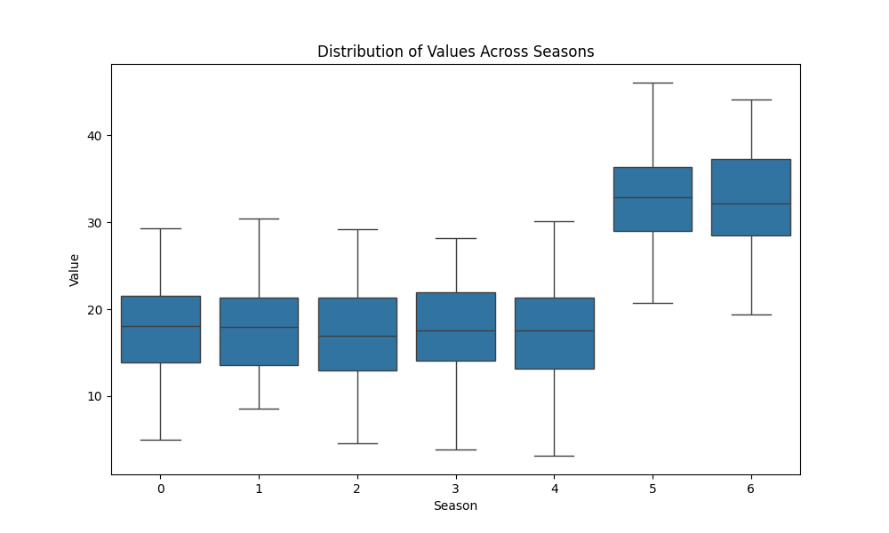
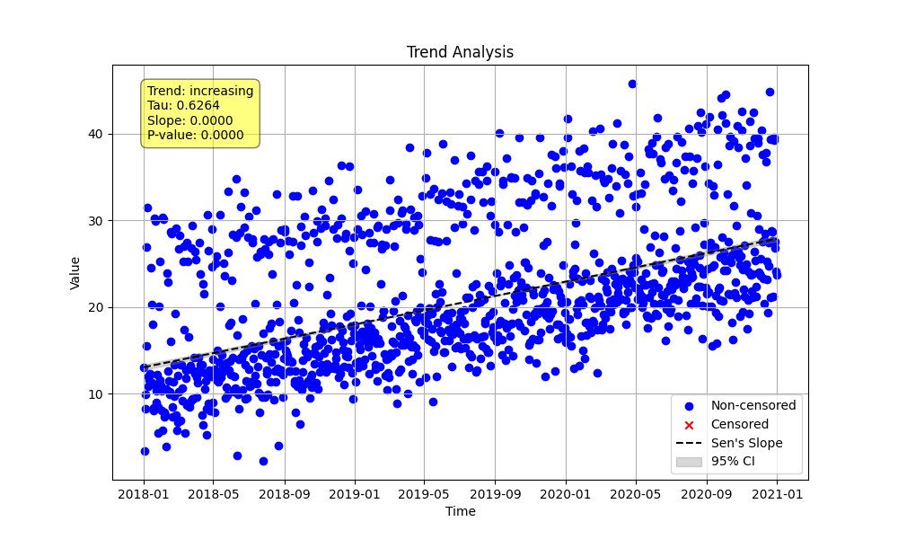

# Example 11: Advanced Seasonality (Non-Monthly Data)

This example demonstrates the flexibility of `MannKenSen`'s seasonal analysis for non-monthly data, such as a weekly (`day_of_week`) pattern.

## Key Concepts
Seasonal analysis is not limited to monthly data. The `season_type` parameter in `seasonal_trend_test` and `plot_seasonal_distribution` allows analysis of any sub-annual pattern (e.g., weekly, quarterly) by correctly grouping the data. For `day_of_week`, the `period` must be set to `7`.

## The Python Script
The script generates a 3-year daily dataset with a strong weekly cycle (higher values on weekends) and an underlying increasing trend. It then visualizes the weekly pattern and performs a seasonal trend test using `season_type='day_of_week'`.

```python

import numpy as np
import pandas as pd
import MannKenSen as mks
import os

# 1. Generate Data with a Weekly Cycle
np.random.seed(42)
dates = pd.date_range(start='2018-01-01', end='2020-12-31', freq='D')
n = len(dates)

# Create a strong weekly cycle (higher values on weekends)
seasonal_pattern = np.where(dates.dayofweek.isin([5, 6]), 25, 10)
# Create an underlying increasing trend
trend = np.linspace(0, 15, n)
# Combine with noise
values = seasonal_pattern + np.random.normal(0, 3, n) + trend

# 2. Visualize the Seasonal Distribution
dist_plot_file = 'seasonal_distribution_plot.png'
mks.plot_seasonal_distribution(
    x_old=values, t_old=dates, season_type='day_of_week', period=7, save_path=dist_plot_file
)

# 3. Perform the Seasonal Trend Test
print("--- Seasonal Trend Test Result ---")
trend_plot_file = 'seasonal_trend_plot.png'
seasonal_trend_result = mks.seasonal_trend_test(
    x=values, t=dates, season_type='day_of_week', period=7, plot_path=trend_plot_file
)
print(seasonal_trend_result)

```

## Command Output
Running the script produces the following result:

```
--- Seasonal Trend Test Result ---
Seasonal_Mann_Kendall_Test(trend='increasing', h=np.True_, p=np.float64(0.0), z=np.float64(31.888694382879816), Tau=np.float64(0.6493536960142633), s=np.float64(55360.0), var_s=np.float64(3013720.6666666665), slope=np.float64(1.6474392740505109e-07), intercept=np.float64(-236.72927867851075), lower_ci=np.float64(1.581599613023775e-07), upper_ci=np.float64(1.7098895556685943e-07), C=1.0, Cd=0.0, classification='Highly Likely Increasing', analysis_notes=[], sen_probability=np.float64(1.8951204388068064e-223), sen_probability_max=np.float64(1.8951204388068064e-223), sen_probability_min=np.float64(1.8951204388068064e-223), prop_censored=np.float64(0.0), prop_unique=1.0, n_censor_levels=0)
```

## Interpretation of Results
The test successfully isolates the long-term increasing trend from the strong weekly cycle, resulting in a **'Highly Likely Increasing'** classification.

### Seasonal Distribution Plot
This plot clearly shows the weekly cycle, with higher values for day 5 (Saturday) and 6 (Sunday), confirming the seasonal pattern in the data.



### Seasonal Trend Plot
The trend plot shows the overall time series and correctly identifies the underlying increasing trend, separate from the weekly noise.



**Conclusion:** The `season_type` parameter makes `seasonal_trend_test` a versatile tool for analyzing time series data with various cyclical patterns.
