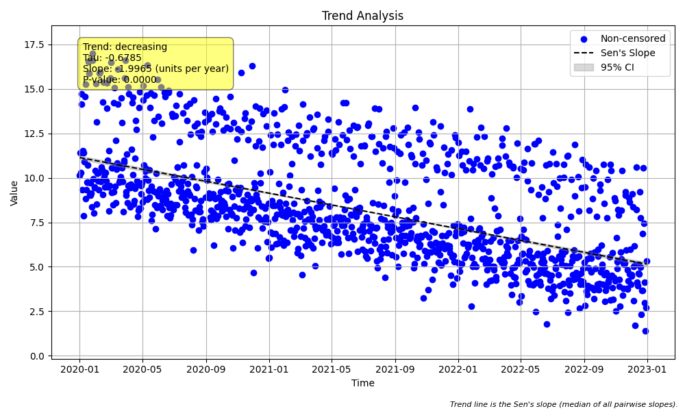

# Example 11: Advanced Seasonality (Non-Monthly Data)

## The "Why": Beyond Monthly Data
While "seasonality" often refers to months of the year, the concept applies to any repeating cycle.
*   **Weekly Cycles**: Traffic, electricity usage, or water consumption might be consistently lower on weekends.
*   **Daily Cycles**: Temperature or dissolved oxygen might rise during the day and fall at night.
*   **Quarterly Cycles**: Financial or business reporting data.

The `MannKS` package can handle any of these by adjusting the `season_type` and `period` parameters.

## The Scenario: Weekly Patterns
In this example, we analyze daily data over 3 years. The data has:
1.  **Weekly Seasonality**: Values are consistently higher on weekends (Saturday/Sunday).
2.  **Downward Trend**: A long-term decrease in values.

If we ignored the weekly pattern, the high variance between weekdays and weekends might obscure the trend or inflate the variance. By using a seasonal test grouped by "Day of Week", we isolate the trend effectively.

## The "How": Code Walkthrough

### Step 1: Python Code
```python
import numpy as np
import pandas as pd
import MannKS as mk
import matplotlib.pyplot as plt

# 1. Generate Synthetic Daily Data with Weekly Seasonality
# We create 3 years of daily data.
start_date = "2020-01-01"
# Create daily data for 3 years (approx 1095 days)
t = pd.date_range(start=start_date, periods=3*365, freq='D')

# Create a weekly seasonal pattern
# Monday (0) to Sunday (6).
# Let's say values are higher on weekends (Sat=5, Sun=6).
day_of_week = t.dayofweek
weekly_seasonality = np.zeros(len(t))
# Base value 10, add 5 on weekends, 0 on weekdays
weekly_seasonality[day_of_week >= 5] = 5
weekly_seasonality[day_of_week < 5] = 0

# Create a subtle downward trend
# Decrease by 2 units per year
years_elapsed = (t - t[0]).days / 365.25
trend = -2.0 * years_elapsed

# Add random noise
np.random.seed(999)
noise = np.random.normal(0, 1.0, len(t))

x = 10 + weekly_seasonality + trend + noise

print("Data Head:")
print(pd.DataFrame({'Date': t, 'Value': x, 'DayOfWeek': day_of_week}).head(10))

# 2. Visualize Seasonal Distribution
# It's hard to see weekly patterns in a 3-year line plot.
# Boxplots grouped by "Day of Week" are perfect for this.
print("\nGenerating Seasonal Distribution Plot...")
mk.plot_seasonal_distribution(
    x, t,
    period=7,                # 7 days in a week
    season_type='day_of_week', # Tell the package to use day of week
    plot_path='distribution_plot.png'
)
print("Saved 'distribution_plot.png'. Check this plot to confirm higher values on weekends.")

# 3. Check for Seasonality
# We suspect a weekly pattern, so we test for it.
print("\n--- Checking for Seasonality (Weekly) ---")
seasonality_result = mk.check_seasonality(
    x, t,
    period=7,
    season_type='day_of_week'
)

print(f"Is Seasonal? {seasonality_result.is_seasonal}")
print(f"p-value: {seasonality_result.p_value:.4f}")

# 4. Run Seasonal Trend Test
# Since we have a weekly pattern, we must use `seasonal_trend_test`.
# This will compare Mondays to Mondays, Tuesdays to Tuesdays, etc.
print("\n--- Running Seasonal Trend Test ---")

result = mk.seasonal_trend_test(
    x, t,
    period=7,
    season_type='day_of_week',
    slope_scaling='year',
    plot_path='trend_plot.png'
)

print(f"Trend: {result.trend}")
print(f"Classification: {result.classification}")
print(f"p-value: {result.p:.4f}")
print(f"Sen's Slope: {result.slope:.4f} units/year")
print(f"Confidence Interval: [{result.lower_ci:.4f}, {result.upper_ci:.4f}]")
```

### Step 2: Text Output
```text
Data Head:
        Date      Value  DayOfWeek
0 2020-01-01  10.127158          2
1 2020-01-02  11.396415          3
2 2020-01-03  10.303864          4
3 2020-01-04  14.125124          5
4 2020-01-05  14.711963          6
5 2020-01-06   9.323721          0
6 2020-01-07  11.533413          1
7 2020-01-08   7.870300          2
8 2020-01-09  11.412522          3
9 2020-01-10  10.896012          4

Generating Seasonal Distribution Plot...
Saved 'distribution_plot.png'. Check this plot to confirm higher values on weekends.

--- Checking for Seasonality (Weekly) ---
Is Seasonal? True
p-value: 0.0000

--- Running Seasonal Trend Test ---
Trend: decreasing
Classification: Highly Likely Decreasing
p-value: 0.0000
Sen's Slope: -1.9965 units/year
Confidence Interval: [-2.0679, -1.9232]

```

## Interpreting the Results

### 1. Visualizing Seasonality (`distribution_plot.png`)
Before running statistics, we visualize the data. The `plot_seasonal_distribution` function creates boxplots for each season (in this case, Day 0=Mon to Day 6=Sun).


*   **Observation**: You should clearly see that the boxes for Day 5 (Saturday) and Day 6 (Sunday) are higher than Days 0-4. This visually confirms our "weekend effect."

### 2. Seasonality Check
*   **Is Seasonal? (True)**: The test confirms the difference between weekdays and weekends is statistically significant.
*   **p-value**: 0.0000, indicating strong evidence of a pattern.

### 3. Seasonal Trend Test
*   **Trend (Decreasing)**: The test correctly identifies the downward trend.
*   **Sen's Slope (-1.9965 units/year)**: The estimated slope is very close to the true generated trend of -2.0.
*   **Confidence Interval**: [-2.0679, -1.9232].
*   **Comparison**: By comparing "Mondays to Mondays" and "Sundays to Sundays", the test removes the noise caused by the weekly jumps, providing a clean estimate of the long-term decline.

### 4. Trend Plot (`trend_plot.png`)


*   **Graph**: Shows the daily data points. The black trend line indicates the overall decline. The data points cluster vertically due to the seasonal shifts, but the trend line clearly cuts through the noise.
