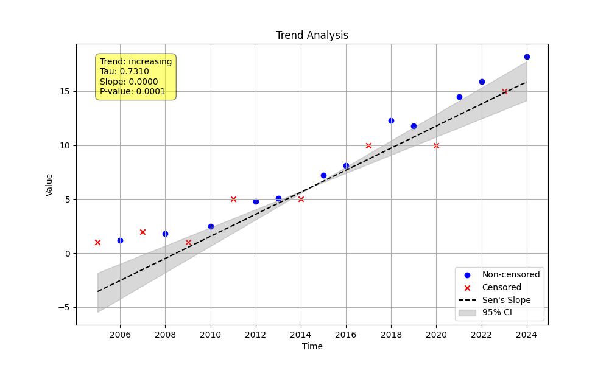

# Example 10: Handling Data with Multiple Censoring Levels

This example demonstrates the robustness of `MannKenSen` in handling complex, realistic datasets that contain numerous different censoring levels.

## Key Concepts
Real-world data often has a mix of censoring types (e.g., `<1`, `<5`, `>50`). The statistical engine in `MannKenSen` is designed to handle this complexity automatically. The standard workflow of `prepare_censored_data` followed by `trend_test` is sufficient. The test correctly interprets the relationships between all pairs of values, whether they are censored or not (e.g., it knows that `<5` is greater than `<2`, but the comparison between `<5` and `4.8` is ambiguous).

## The Python Script
The script generates a synthetic dataset with an increasing trend and a complex mix of left-censored (`<1`, `<2`, `<5`) and right-censored (`>10`, `>15`) data. It runs the standard analysis workflow.

```python

import numpy as np
import pandas as pd
import MannKenSen as mks
import os

# 1. Generate Data with Multiple Censoring Levels
dates = pd.to_datetime(pd.to_datetime(np.arange(2005, 2025), format='%Y'))
values = [
    '<1', '1.2', '<2', '1.8', '<1',
    '2.5', '<5', '4.8', '5.1', '<5',
    '7.2', '8.1', '>10', '12.3', '11.8',
    '>10', '14.5', '15.9', '>15', '18.2'
]

# 2. Pre-process and Analyze
prepared_data = mks.prepare_censored_data(values)
plot_path = 'multi_censor_plot.png'
result = mks.trend_test(
    x=prepared_data,
    t=dates,
    plot_path=plot_path
)

# 3. Print the result
print(result)

```

## Command Output
Running the script produces the following final result:

```
Mann_Kendall_Test(trend='increasing', h=np.True_, p=np.float64(0.0001494198279612391), z=np.float64(3.7920317119592375), Tau=np.float64(0.7310095758606722), s=np.float64(114.0), var_s=np.float64(888.0), slope=np.float64(3.238487879607101e-08), intercept=np.float64(-39.32816301703163), lower_ci=np.float64(2.6621638067421194e-08), upper_ci=np.float64(3.873283079245963e-08), C=0.9999252900860194, Cd=7.470991398061955e-05, classification='Highly Likely Increasing', analysis_notes=['WARNING: Sen slope influenced by left- and right-censored values.'], sen_probability=np.float64(0.00010971734427948767), sen_probability_max=np.float64(0.00010971734427948767), sen_probability_min=np.float64(0.00010971734427948767), prop_censored=np.float64(0.4), prop_unique=0.85, n_censor_levels=5)
```

## Interpretation of Results
Despite the complexity of the data, with 40% of the values being censored at five different levels, the analysis correctly identifies the strong **'Highly Likely Increasing'** trend. This demonstrates the power and reliability of the underlying rank-based statistics for handling complex, real-world data.

### Analysis Plot (`multi_censor_plot.png`)
The plot visualizes the complex data, using different markers for uncensored (circles), left-censored (downward triangles), and right-censored (upward triangles) data points.



**Conclusion:** `MannKenSen` is a robust tool for handling complex, messy, real-world censored data without requiring special configuration.
