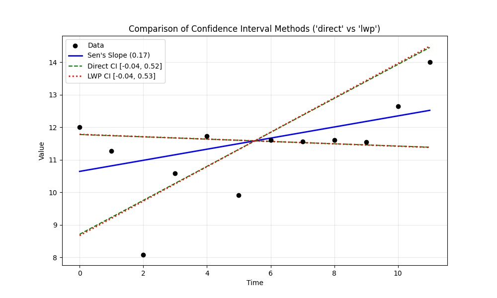

# Example 13: Comparing Confidence Interval Methods

## The "Why": Precision vs. Robustness
The Sen's Slope estimator calculates the median of all possible slopes between pairs of data points. To determine the **Confidence Interval (CI)** (the range where the true slope likely lies), we look at the distribution of these pairwise slopes.

There are two main ways to pick the upper and lower bounds from this list of slopes:

1.  **`ci_method='direct'` (Default)**:
    *   **Logic**: Calculates the rank indices for the confidence bounds and rounds them to the nearest integer.
    *   **Result**: The CI bounds are *always* actual slope values found in your data.
    *   **Pros**: statistically robust, makes fewer assumptions.
    *   **Cons**: Can be slightly "jumpy" with small datasets.

2.  **`ci_method='lwp'`**:
    *   **Logic**: Uses linear interpolation between ranks. If the 95% bound falls at index 15.4, it takes a weighted average of the 15th and 16th slope.
    *   **Result**: The CI bounds are interpolated values.
    *   **Pros**: Smoother, matches the behavior of the LWP-TRENDS R script.
    *   **Cons**: Returns a value that might not exist in the pairwise slopes.

This example compares these two methods to help you decide which to use.

## The "How": Code Walkthrough

We use a small dataset where the differences are more noticeable.

### Step 1: Python Code
```python
import numpy as np
import pandas as pd
import MannKS as mk

# 1. Generate Synthetic Data
# We use a small dataset (n=12) because differences in Confidence Interval (CI) calculation methods
# are most pronounced when sample sizes are small.
# With large datasets, the difference between integer ranks and interpolated ranks becomes negligible.
np.random.seed(10)
t = np.arange(12)
# A weak trend with noise
x = 10 + 0.2 * t + np.random.normal(0, 1.5, size=len(t))

print(f"Time: {t}")
print(f"Values: {np.round(x, 2)}")

# 2. Run Trend Test with Default 'direct' Method
# 'direct' method uses the standard non-parametric approach:
# It finds the indices for the Upper and Lower limits in the sorted list of slopes
# and rounds them to the nearest integer. It guarantees the CI is an actual slope from the pairs.
print("\n--- Method 1: ci_method='direct' (Default) ---")
result_direct = mk.trend_test(x, t, ci_method='direct')

print(f"Sen's Slope: {result_direct.slope:.4f}")
print(f"Confidence Interval: [{result_direct.lower_ci:.4f}, {result_direct.upper_ci:.4f}]")
print(f"Interval Width: {result_direct.upper_ci - result_direct.lower_ci:.4f}")

# 3. Run Trend Test with 'lwp' Method
# 'lwp' method (inspired by the LWP-TRENDS R script) uses linear interpolation.
# If the calculated rank index is 15.4, it interpolates between the 15th and 16th slope.
# This can provide a slightly 'tighter' or 'smoother' interval but yields a value
# that might not be an actual pairwise slope from the data.
print("\n--- Method 2: ci_method='lwp' ---")
result_lwp = mk.trend_test(x, t, ci_method='lwp')

print(f"Sen's Slope: {result_lwp.slope:.4f}")
print(f"Confidence Interval: [{result_lwp.lower_ci:.4f}, {result_lwp.upper_ci:.4f}]")
print(f"Interval Width: {result_lwp.upper_ci - result_lwp.lower_ci:.4f}")

# 4. Compare the Results
diff_lower = abs(result_direct.lower_ci - result_lwp.lower_ci)
diff_upper = abs(result_direct.upper_ci - result_lwp.upper_ci)

print("\n--- Comparison ---")
print(f"Difference in Lower CI: {diff_lower:.6f}")
print(f"Difference in Upper CI: {diff_upper:.6f}")

# 5. Visualizing the Difference
# We will create a custom plot to visualize the slopes and the two different confidence intervals.
# (Note: Standard mk.trend_test(plot_path=...) creates a full plot, but here we want to zoom in on the intervals).
import matplotlib.pyplot as plt

plt.figure(figsize=(10, 6))

# Plot the data points
plt.scatter(t, x, color='black', label='Data', zorder=5)

# Calculate the median point (pivot for the slopes)
t_med = np.median(t)
x_med = np.median(x)

# Function to generate line points
def get_line(slope, t_vals, t_pivot, x_pivot):
    return x_pivot + slope * (t_vals - t_pivot)

# Plot Sen's Slope (Same for both)
plt.plot(t, get_line(result_direct.slope, t, t_med, x_med),
         color='blue', linewidth=2, label=f"Sen's Slope ({result_direct.slope:.2f})")

# Plot 'direct' CI
plt.plot(t, get_line(result_direct.lower_ci, t, t_med, x_med),
         color='green', linestyle='--', label=f"Direct CI [{result_direct.lower_ci:.2f}, {result_direct.upper_ci:.2f}]")
plt.plot(t, get_line(result_direct.upper_ci, t, t_med, x_med),
         color='green', linestyle='--')

# Plot 'lwp' CI
plt.plot(t, get_line(result_lwp.lower_ci, t, t_med, x_med),
         color='red', linestyle=':', linewidth=2, label=f"LWP CI [{result_lwp.lower_ci:.2f}, {result_lwp.upper_ci:.2f}]")
plt.plot(t, get_line(result_lwp.upper_ci, t, t_med, x_med),
         color='red', linestyle=':', linewidth=2)

plt.title("Comparison of Confidence Interval Methods ('direct' vs 'lwp')")
plt.xlabel("Time")
plt.ylabel("Value")
plt.legend()
plt.grid(True, alpha=0.3)

# Save to script's directory
import os
script_dir = os.path.dirname(os.path.abspath(__file__)) if '__file__' in globals() else '.'
plt.savefig(os.path.join(script_dir, 'ci_comparison_plot.png'))
print("\nPlot saved to 'ci_comparison_plot.png'")
```

### Step 2: Text Output
```text
Time: [ 0  1  2  3  4  5  6  7  8  9 10 11]
Values: [12.   11.27  8.08 10.59 11.73  9.92 11.6  11.56 11.61 11.54 12.65 14.  ]

--- Method 1: ci_method='direct' (Default) ---
Sen's Slope: 0.1705
Confidence Interval: [-0.0354, 0.5216]
Interval Width: 0.5570

--- Method 2: ci_method='lwp' ---
Sen's Slope: 0.1705
Confidence Interval: [-0.0364, 0.5287]
Interval Width: 0.5651

--- Comparison ---
Difference in Lower CI: 0.000971
Difference in Upper CI: 0.007099

Plot saved to 'ci_comparison_plot.png'

```

## Interpreting the Results

### 1. Numerical Difference
*   **Lower CI Difference**: 0.000971
*   **Upper CI Difference**: 0.007099
*   **LWP Method**: Produced a wider interval in this case, due to interpolation between ranks.
*   **Significance**: In large datasets (n > 50), these two methods usually converge and the difference becomes negligible. In small datasets (n < 20), the difference can be noticeable, though rarely changes the overall conclusion of the test.

### 2. Visual Comparison
The plot below shows the Sen's Slope (Blue) and the two sets of Confidence Intervals.



*   **Green Dashed Lines**: The `direct` method bounds.
*   **Red Dotted Lines**: The `lwp` method bounds.

You can see they are very close, but the `lwp` method (red) provides a slightly different estimation of the uncertainty.

## Key Takeaway
*   Use **`ci_method='direct'`** (the default) for standard, robust analysis. It is generally safer as it relies only on observed slopes.
*   Use **`ci_method='lwp'`** if you are specifically trying to replicate results from the LWP-TRENDS R script or if you prefer interpolated bounds for small datasets.
