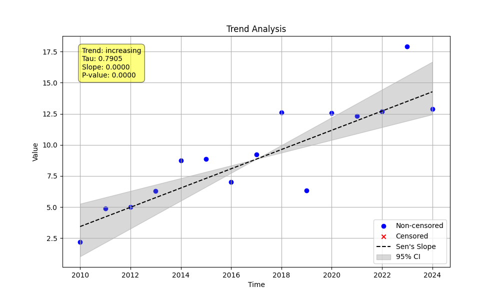
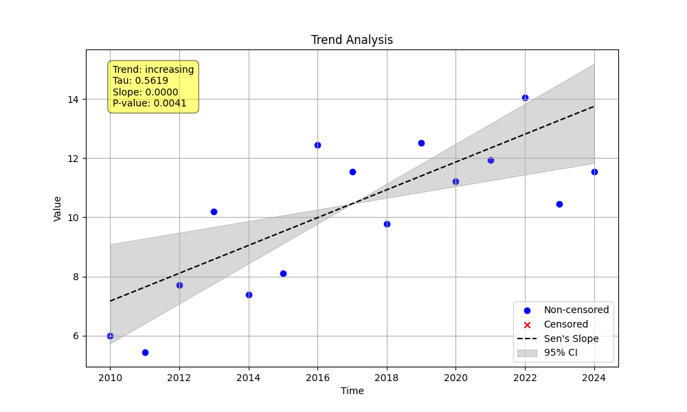

# Example 13: Comparing Confidence Interval Methods

This example compares the two methods for calculating the confidence intervals (CI) for the Sen's slope: `'direct'` (default) and `'lwp'`.

## Key Concepts
-   `'direct'` **(Default):** Calculates the ranks of the CIs and rounds them to the nearest integer to directly index the sorted array of pairwise slopes.
-   `'lwp'`: Emulates the LWP-TRENDS R script by using linear interpolation between slopes to get a more precise CI estimate.

The choice of method does **not** affect the Sen's slope itself, only its confidence interval.

## Script: `run_example.py`
The script analyzes a simple linear dataset twice, once with each `ci_method`, and generates this README.

## Results
The Sen's slope is identical, but the confidence intervals are slightly different due to the calculation method.

### Direct CI Method (`ci_method='direct'`)
- **Annual Slope:** 0.4702\n- **Annual CI:** (0.2171, 0.6718)\n

### LWP CI Method (`ci_method='lwp'`)
- **Annual Slope:** 0.4702\n- **Annual CI:** (0.1958, 0.6756)\n

**Conclusion:** The default `'direct'` method is generally sufficient. The `'lwp'` method is for users who need consistency with the LWP-TRENDS R script or prefer an interpolated result.
