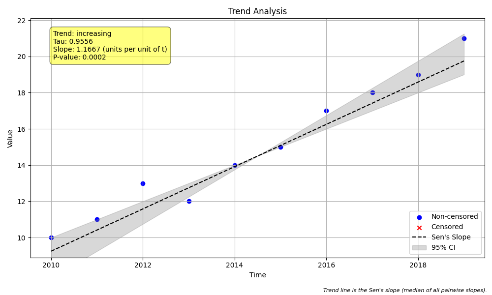

# Example 16: Interpreting the Full Output

## The "Why": Beyond Just "Increasing"
When you run `mk.trend_test`, you get back a `namedtuple` with over 20 fields. Most users only look at `trend`, `p`, and `slope`. However, for advanced analysis, debugging, or scientific reporting, the other fields are crucial.

This guide explains **every single field** in the output object, turning the "black box" into a transparent report.

## The "How": Code Walkthrough

We run a simple trend test and then print out every major field in the result.

### Step 1: Python Code
```python
import numpy as np
import pandas as pd
import MannKS as mk
import os

# 1. Generate Synthetic Data
# We create a simple dataset with a clear increasing trend.
t = np.arange(2010, 2020)
x = [10, 11, 13, 12, 14, 15, 17, 18, 19, 21]

print("--- Data ---")
print(pd.DataFrame({'Year': t, 'Value': x}))

# 2. Run Trend Test
# We run the standard test.
# Use absolute path to save in the same directory as the script
script_dir = os.path.dirname(os.path.abspath(__file__)) if '__file__' in globals() else '.'
plot_path = os.path.join(script_dir, 'trend_plot.png')
result = mk.trend_test(x, t, plot_path=plot_path)

# 3. Inspect the Full Output
# The result object is a namedtuple with many fields.
# We will iterate through them to understand what each one means.

print("\n--- Full Results Breakdown ---")
print(f"1.  trend: {result.trend}")
print(f"2.  h (Hypothesis): {result.h}")
print(f"3.  p (p-value): {result.p:.6f}")
print(f"4.  z (Z-score): {result.z:.4f}")
print(f"5.  Tau (Kendall's Tau): {result.Tau:.4f}")
print(f"6.  s (Mann-Kendall Score): {result.s}")
print(f"7.  var_s (Variance of S): {result.var_s:.2f}")
print(f"8.  slope (Sen's Slope): {result.slope:.4f}")
print(f"9.  intercept: {result.intercept:.4f}")
print(f"10. lower_ci: {result.lower_ci:.4f}")
print(f"11. upper_ci: {result.upper_ci:.4f}")
print(f"12. C (Confidence): {result.C:.1%}")
print(f"13. Cd (Decreasing Confidence): {result.Cd:.1%}")
print(f"14. classification: {result.classification}")
print(f"15. analysis_notes: {result.analysis_notes}")
print(f"16. sen_probability: {result.sen_probability:.4f}")
print(f"17. slope_units: {result.slope_units}")
```

### Step 2: Text Output
```text
--- Data ---
   Year  Value
0  2010     10
1  2011     11
2  2012     13
3  2013     12
4  2014     14
5  2015     15
6  2016     17
7  2017     18
8  2018     19
9  2019     21

--- Full Results Breakdown ---
1.  trend: increasing
2.  h (Hypothesis): True
3.  p (p-value): 0.000172
4.  z (Z-score): 3.7566
5.  Tau (Kendall's Tau): 0.9556
6.  s (Mann-Kendall Score): 43.0
7.  var_s (Variance of S): 125.00
8.  slope (Sen's Slope): 1.1667
9.  intercept: -2335.7500
10. lower_ci: 1.0000
11. upper_ci: 1.5000
12. C (Confidence): 100.0%
13. Cd (Decreasing Confidence): 0.0%
14. classification: Highly Likely Increasing
15. analysis_notes: []
16. sen_probability: 0.0001
17. slope_units: units per unit of t

```

## Interpreting the Fields

### Basic Results
1.  **`trend`**: The human-readable conclusion: 'increasing', 'decreasing', or 'no trend'.
2.  **`h`**: The boolean result of the hypothesis test. `True` means "Reject the Null Hypothesis" (Trend exists). `False` means "Fail to Reject" (No significant trend).
3.  **`p` (p-value)**: The probability that the observed trend happened by random chance. $p < 0.05$ usually indicates significance.
4.  **`classification`**: A nuanced text description (e.g., "Likely Increasing") based on the confidence level, useful for non-statisticians.

### Statistical Mechanics
5.  **`s` (Mann-Kendall Score)**: The raw score. It is the number of increasing pairs minus the number of decreasing pairs.
    *   $S > 0$: Overall increase.
    *   $S < 0$: Overall decrease.
6.  **`var_s` (Variance of S)**: How much we expect $S$ to vary if there were truly no trend. This is critical for calculating the Z-score and p-value.
7.  **`z` (Z-score)**: The standardized test statistic ($S / \\sqrt{var\_s}$). It tells you how many standard deviations the score is from zero.
8.  **`Tau` (Kendall's Tau)**: A normalized correlation coefficient between -1 and 1.
    *   $1.0$: Perfect monotonic increase.
    *   $-1.0$: Perfect monotonic decrease.
    *   $0.0$: No correlation.
    *   Unlike $S$, which depends on sample size, $\\tau$ is comparable across different datasets.

### Magnitude (Sen's Slope)
9.  **`slope`**: The median rate of change (Sen's Slope). If your time is in years, this is "units per year".
10. **`intercept`**: The estimated y-intercept of the trend line.
11. **`lower_ci` / `upper_ci`**: The 90% (or 95%) confidence bounds for the slope.
    *   If `lower_ci` and `upper_ci` have the same sign (both positive or both negative), the trend is significant.

### Advanced Confidence Metrics
12. **`C` (Confidence)**: The probability that the trend is in the indicated direction. Calculated as $1 - p/2$. A value of 0.95 means "95% confident".
13. **`Cd` (Decreasing Confidence)**: Specifically, the probability that the trend is *decreasing*.
    *   If trend is decreasing, $C_d = C$.
    *   If trend is increasing, $C_d = 1 - C$ (low).
14. **`sen_probability`**: The probability that the Sen's slope is less than zero (for negative trends) or greater than zero (for positive trends), derived from the z-score of the rank correlation. It approximates the p-value.

### Metadata
15. **`analysis_notes`**: A list of warnings or observations (e.g., "Tied values present"). **Always check this** for data quality issues.
16. **`slope_units`**: A helper string describing the units (e.g., "units per year").

## Visual Result

