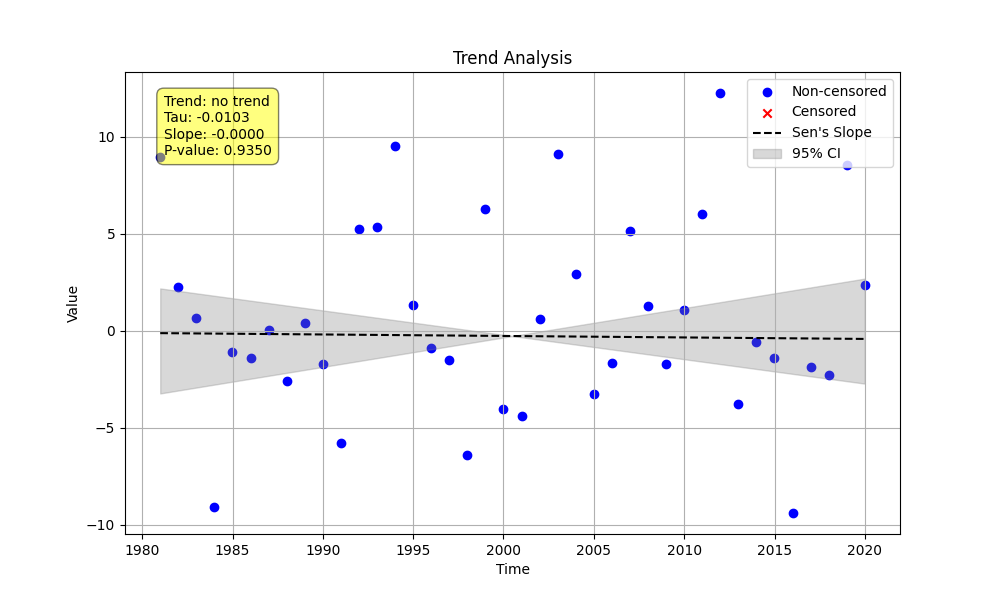

# Example 19: Visual Diagnostics of Trend Plots

The trend plots generated by the `MannKenSen` package are a powerful tool for diagnosing and interpreting your trend analysis. By observing the data points, the Sen's slope line, and the confidence intervals, you can gain a much deeper understanding of the results.

This example showcases three common scenarios.

## 1. Clear Increasing Trend

**Result:** `Highly Likely Increasing` (p=0.0000)

**Interpretation:**
-   **Data Points:** The points clearly follow an upward trajectory over time.
-   **Sen's Slope (Solid Line):** The trend line has a steep, positive slope, visually confirming the increasing trend.
-   **Confidence Intervals (Dotted Lines):** The CI bands are relatively narrow and are entirely above a horizontal (zero-slope) line. This indicates high confidence that the true slope is positive and significantly different from zero.

## 2. No Trend

**Result:** `No Trend` (p=0.289)

**Interpretation:**
-   **Data Points:** The points are scattered randomly around a central value with no clear upward or downward movement.
-   **Sen's Slope (Solid Line):** The trend line is nearly horizontal, indicating a slope close to zero.
-   **Confidence Intervals (Dotted Lines):** The CI band is centered around the Sen's slope and clearly contains the zero-slope line. This means that a true slope of zero is a plausible value, confirming the "No Trend" result.

## 3. High Uncertainty

**Result:** `No Trend` (p=0.935)

**Interpretation:**
-   **Data Points:** There might be a slight upward tendency, but the data is extremely noisy and scattered.
-   **Sen's Slope (Solid Line):** The trend line shows a slight positive slope, suggesting a weak increasing signal.
-   **Confidence Intervals (Dotted Lines):** The CI band is **very wide**. This indicates a high degree of uncertainty in the true value of the slope, caused by the high variability (noise) in the data. Although the calculated slope is positive, the CI band overlaps with zero, so we cannot confidently rule out the possibility of no trend. This leads to the "No Trend" classification.
