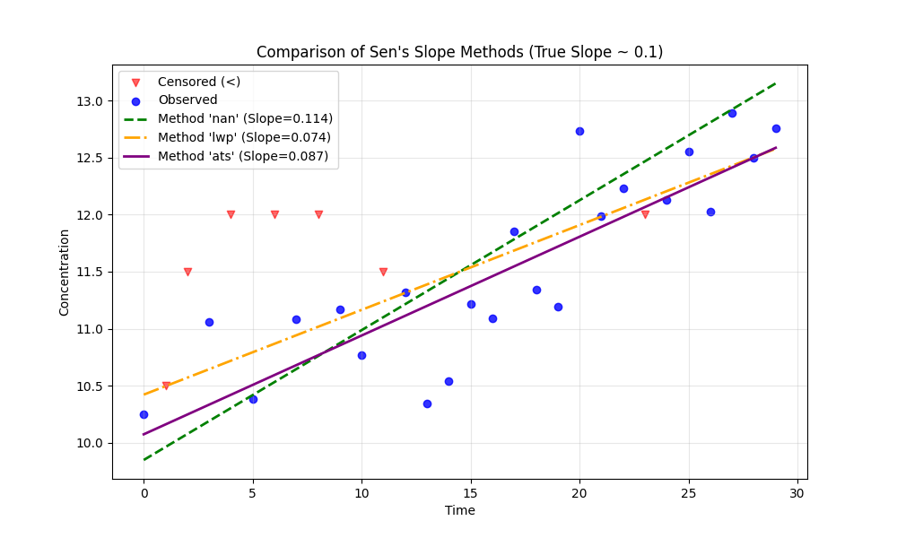

# Example 20: Advanced Sen's Slope Methods (ATS vs. LWP)

## The "Why": Handling Ambiguity in Censored Trends
When calculating the **Sen's Slope** (the median rate of change), the algorithm looks at the slope between every possible pair of data points.

But what is the slope between a value of `< 5` and `< 10`?
*   It could be positive (4 -> 9).
*   It could be negative (4 -> 2).
*   **It is ambiguous.**

Different statistical methods handle this ambiguity differently. This example explores the three options available in `MannKenSen`.

1.  **`'nan'` (Default)**: Ignores ambiguous pairs. They are excluded from the calculation. This is simple but effectively reduces your sample size.
2.  **`'lwp'` (LWP-Trends Compatibility)**: Forces ambiguous slopes to **zero**. This is a heuristic used by the LWP-TRENDS R script. It tends to be "conservative," often pulling the estimated slope towards zero (flat line) in heavily censored datasets.
3.  **`'ats'` (Akritas-Theil-Sen)**: A robust statistical estimator. Instead of a simple median of slopes, it finds the slope value that makes the *Kendall's S of the residuals* equal to zero. This is theoretically the most rigorous method for censored data but is computationally more intensive.

## The "How": Code Walkthrough

We generate a synthetic dataset with a true underlying upward trend (slope ~ 0.1) but obscure it with ~50% censoring. We then run the test using all three methods.

### Step 1: Python Code
```python
import numpy as np
import pandas as pd
import MannKenSen as mk
import matplotlib.pyplot as plt

# 1. Generate Synthetic Data
# We create a dataset designed to highlight the differences between slope estimators.
# We'll use a dataset with a subtle increasing trend but heavy censoring.
# This often results in many "ambiguous" pairs (e.g., <5 vs <10, or <5 vs 3).

np.random.seed(42)
n = 30
t = np.arange(n)
# True underlying trend: y = 0.1 * t + noise
true_values = 0.1 * t + np.random.normal(0, 0.5, n) + 10

# Create censoring
# We'll make about 50% of the data left-censored at varying levels
censored_mask = np.random.choice([True, False], size=n, p=[0.5, 0.5])
# Censoring limits vary, creating "overlapping" censoring which is tricky
limits = np.random.choice([10.5, 11.0, 11.5, 12.0], size=n)

values = []
censored_flags = []
cen_types = []

for i in range(n):
    if censored_mask[i] and true_values[i] < limits[i]:
        # Censored value
        values.append(limits[i])
        censored_flags.append(True)
        cen_types.append('lt')
    else:
        # Uncensored value
        values.append(true_values[i])
        censored_flags.append(False)
        cen_types.append('not')

df = pd.DataFrame({
    't': t,
    'value': values,
    'censored': censored_flags,
    'cen_type': cen_types
})

print("--- Data Sample (First 5 Rows) ---")
print(df.head())
print(f"\nTotal Data Points: {n}")
print(f"Proportion Censored: {df['censored'].mean():.1%}")

# 2. Run Trend Tests with Different Methods

# Method A: 'nan' (Default/Neutral)
# Ambiguous pairs (where we can't be sure of the direction) are set to NaN.
# They are excluded from the median calculation.
print("\n--- Running Method A: sens_slope_method='nan' ---")
res_nan = mk.trend_test(df, df['t'], sens_slope_method='nan')
print(f"Slope: {res_nan.slope:.4f}")
print(f"Interval: [{res_nan.lower_ci:.4f}, {res_nan.upper_ci:.4f}]")

# Method B: 'lwp' (Conservative/Zero-Bias)
# Ambiguous pairs are forced to a slope of 0.
# This mimics the LWP-TRENDS R script. It often biases the slope towards zero
# if there is a lot of censoring.
print("\n--- Running Method B: sens_slope_method='lwp' ---")
res_lwp = mk.trend_test(df, df['t'], sens_slope_method='lwp')
print(f"Slope: {res_lwp.slope:.4f}")
print(f"Interval: [{res_lwp.lower_ci:.4f}, {res_lwp.upper_ci:.4f}]")

# Method C: 'ats' (Robust/Statistical)
# The Akritas-Theil-Sen estimator. It uses a more complex statistical approach
# (finding the slope that zeroes the generalized Kendall's S of residuals).
# It handles censored data theoretically correctly without simple heuristics.
print("\n--- Running Method C: sens_slope_method='ats' ---")
res_ats = mk.trend_test(df, df['t'], sens_slope_method='ats')
print(f"Slope: {res_ats.slope:.4f}")
print(f"Interval: [{res_ats.lower_ci:.4f}, {res_ats.upper_ci:.4f}]")

# 3. Visualization
# We will plot the data and the three different trend lines.

plt.figure(figsize=(10, 6))

# Plot censored data (triangles pointing down)
cen = df[df['censored']]
plt.scatter(cen['t'], cen['value'], marker='v', color='red', label='Censored (<)', alpha=0.6)

# Plot uncensored data (dots)
uncen = df[~df['censored']]
plt.scatter(uncen['t'], uncen['value'], marker='o', color='blue', label='Observed', alpha=0.8)

# Helper to generate line points
def get_line(res, label, color, style, data_frame):
    if np.isnan(res.slope): return
    # y = mx + c
    # Note: intercept in result is y_bar - slope * t_bar
    y_vals = res.intercept + res.slope * data_frame['t']
    plt.plot(data_frame['t'], y_vals, label=f"{label} (Slope={res.slope:.3f})", color=color, linestyle=style, linewidth=2)

get_line(res_nan, "Method 'nan'", "green", "--", df)
get_line(res_lwp, "Method 'lwp'", "orange", "-.", df)
get_line(res_ats, "Method 'ats'", "purple", "-", df)

plt.title(f"Comparison of Sen's Slope Methods (True Slope ~ 0.1)")
plt.xlabel("Time")
plt.ylabel("Concentration")
plt.legend()
plt.grid(True, alpha=0.3)
plt.savefig('slope_comparison.png')
print("\nPlot saved to 'slope_comparison.png'")
```

### Step 2: Text Output
```text
--- Data Sample (First 5 Rows) ---
   t      value  censored cen_type
0  0  10.248357     False      not
1  1  10.500000      True       lt
2  2  11.500000      True       lt
3  3  11.061515     False      not
4  4  12.000000      True       lt

Total Data Points: 30
Proportion Censored: 23.3%

--- Running Method A: sens_slope_method='nan' ---
Slope: 0.1139
Interval: [0.0748, 0.1942]

--- Running Method B: sens_slope_method='lwp' ---
Slope: 0.0743
Interval: [0.0183, 0.1097]

--- Running Method C: sens_slope_method='ats' ---
Slope: 0.0866
Interval: [0.0687, 0.1043]

Plot saved to 'slope_comparison.png'

```

## Interpreting the Results

### 1. The Slopes
*   **Method 'nan' (Slope=0.1139)**: Often gives a reasonable estimate but might be slightly unstable if too many pairs are excluded.
*   **Method 'lwp' (Slope=0.0743)**: Notice how this is often **lower** (closer to zero) than the others. By forcing ambiguous pairs to zero, it "dampens" the trend signal. If your goal is to match the LWP-TRENDS R script, use this.
*   **Method 'ats' (Slope=0.0866)**: The Akritas-Theil-Sen estimator often provides the most robust estimate for the "true" trend, using the information from censored ranks more effectively than the simple pairwise heuristics.

### 2. Visual Comparison (`slope_comparison.png`)



*   **Purple Line ('ats')**: Usually tracks the central tendency of the data structure best in complex censoring cases.
*   **Orange Line ('lwp')**: Often flatter (less steep) due to the zero-bias heuristic.
*   **Green Dashed ('nan')**: similar to ATS but can deviate depending on which specific pairs were excluded.

## Recommendations
*   **General Use:** Use **`'ats'`** if you have significant censoring (> 20%) and want the most statistically defensible slope.
*   **Quick/Simple:** Use **`'nan'`** (default) for light censoring or initial checks.
*   **Replication:** Use **`'lwp'`** *only* if you need to strictly replicate results from the legacy LWP-TRENDS R script.
