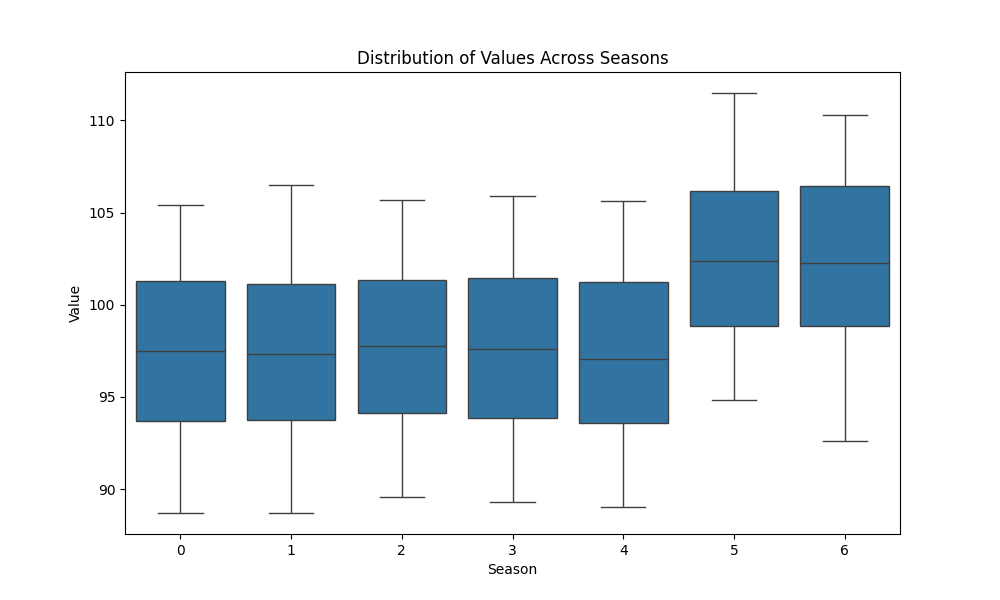
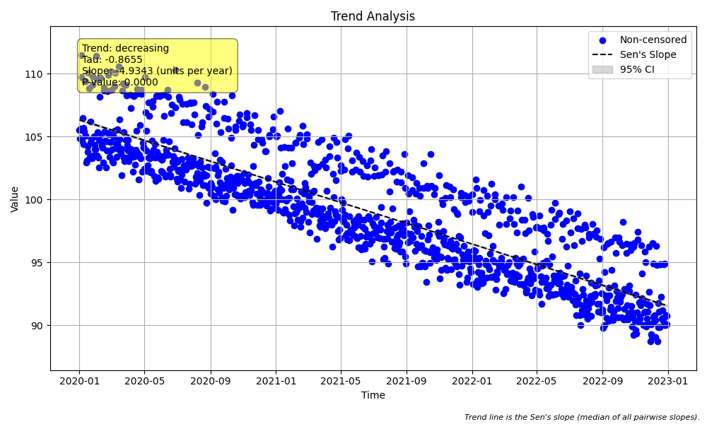

# Example 21: Seasonal Trend with Weekly Data (Decreasing)

## The "Why": High-Frequency Cycles
Most trend analyses focus on monthly data (annual cycle). However, high-frequency data (daily, hourly) often exhibits shorter cycles that can mask long-term trends if not handled correctly.

A common example is a **weekly cycle** in anthropogenic data:
*   **Water Consumption**: Higher on weekends.
*   **Traffic Pollution**: Higher on weekdays.
*   **Industrial Effluent**: Varies by production schedule.

If we just plot the raw data, the "sawtooth" pattern of the weekly cycle increases the variance, making it harder to detect a subtle long-term trend. By using a **Seasonal Kendall Test** with `season_type='day_of_week'`, we isolate these groups.

## The Scenario
We simulate 3 years of daily data with:
1.  **Weekly Seasonality**: Values are significantly higher on weekends (Saturday/Sunday).
2.  **Decreasing Trend**: A steady decline of 5 units per year.

## The "How": Code Walkthrough

### Step 1: Python Code
```python
import numpy as np
import pandas as pd
import MannKS as mk
import matplotlib.pyplot as plt

# 1. Generate Synthetic Data: Weekly Pattern + Decreasing Trend
# We simulate daily data for 3 years (approx 1095 days).
t = pd.date_range(start='2020-01-01', periods=1095, freq='D')

# Create a weekly cycle (season_type='day_of_week')
# Day 0=Monday, ..., 6=Sunday
day_of_week = t.dayofweek

# Pattern: Values are high on weekends (Sat=5, Sun=6) and low on weekdays.
seasonal_signal = np.where(day_of_week >= 5, 10, 5)

# Create a decreasing trend
# -5 units per year
years_elapsed = (t - t[0]).days / 365.25
trend_signal = 100 - (5 * years_elapsed)

# Add noise
np.random.seed(42)
noise = np.random.normal(0, 1.0, len(t))

# Combine
x = seasonal_signal + trend_signal + noise

print("Data Head:")
print(pd.DataFrame({'Date': t, 'Value': x, 'Day': day_of_week}).head())


# 2. Visualize the Seasonality
# Before running the test, let's confirm the weekly pattern.
print("\n--- Visualizing Seasonality ---")
mk.plot_seasonal_distribution(
    x, t,
    period=7,
    season_type='day_of_week',
    plot_path='weekly_distribution.png'
)
print("Saved 'weekly_distribution.png'. Expect higher boxes for days 5 and 6.")


# 3. Run Seasonal Trend Test
# We specify `season_type='day_of_week'` and `period=7`.
# This ensures we compare Mondays to Mondays, Tuesdays to Tuesdays, etc.
print("\n--- Running Seasonal Trend Test ---")

result = mk.seasonal_trend_test(
    x, t,
    period=7,
    season_type='day_of_week',
    slope_scaling='year',
    plot_path='seasonal_trend_plot.png'
)

print(f"Trend: {result.trend}")
print(f"Classification: {result.classification}")
print(f"p-value: {result.p:.4f}")
print(f"Sen's Slope: {result.slope:.4f} units/year")
print(f"Confidence Interval: [{result.lower_ci:.4f}, {result.upper_ci:.4f}]")
```

### Step 2: Text Output
```text
Data Head:
        Date       Value  Day
0 2020-01-01  105.496714    2
1 2020-01-02  104.848046    3
2 2020-01-03  105.620310    4
3 2020-01-04  111.481962    5
4 2020-01-05  109.711090    6

--- Visualizing Seasonality ---
Saved 'weekly_distribution.png'. Expect higher boxes for days 5 and 6.

--- Running Seasonal Trend Test ---
Trend: decreasing
Classification: Highly Likely Decreasing
p-value: 0.0000
Sen's Slope: -4.9343 units/year
Confidence Interval: [-5.0037, -4.8685]

```

## Interpreting the Results

### 1. Visualizing Seasonality (`weekly_distribution.png`)

The boxplots clearly show the "weekend effect" (Days 5 and 6 are higher).

### 2. Trend Results
*   **Trend (Decreasing)**: The test correctly identifies the downward trend.
*   **Sen's Slope (-4.9343)**: This is remarkably close to the true generated trend of -5.0.
*   **Confidence**: The result is "Highly Likely Decreasing" with p < 0.0001.

### 3. Visualizing the Trend (`seasonal_trend_plot.png`)

The plot shows the daily data points. The black trend line cuts through the seasonal noise, accurately capturing the long-term decline.
