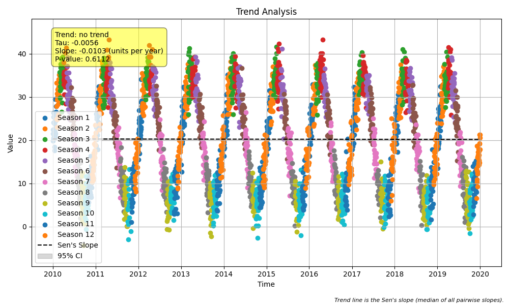

# Example 22: Seasonal Trend with Daily Data (No Trend)

## The Challenge: Intense Seasonality

In environmental data (like temperature, water quality, or air flow), seasonal patterns often dwarf long-term trends.
*   **Summer vs. Winter:** A 30°C swing is normal.
*   **Long-term Trend:** We might be looking for a tiny 0.1°C change per year.

If you ignore seasonality, the massive seasonal variance can hide the subtle long-term signal. This example demonstrates how the `seasonal_trend_test` filters out the seasonal cycle to correctly identify that **no long-term trend exists**, even in a noisy, oscillating dataset.

## The "How": Code Walkthrough

We simulate 10 years of daily temperature data. The data has a strong sine-wave pattern (seasons) but a flat long-term baseline.

### Step 1: Python Code
```python
import numpy as np
import pandas as pd
import MannKS as mk

# 1. Generate Synthetic Daily Data
# Scenario: A 10-year dataset of daily temperature measurements.
# We want to check for a long-term warming or cooling trend.
# However, the data is dominated by a massive seasonal cycle (Summer vs. Winter).
# The "true" underlying trend is flat (no warming/cooling).

# Time vector: 10 years of daily data (approx 3652 days)
t_range = pd.date_range(start='2010-01-01', periods=3652, freq='D')
t_numeric = (t_range - t_range[0]).days / 365.25  # Years for sine wave calculation

# Seasonal Signal: A sine wave with a 1-year period
# Amplitude of 15 means it swings from -15 to +15 around the mean.
seasonal_signal = 15 * np.sin(2 * np.pi * t_numeric)

# Noise: Random daily fluctuation
# We use a significant noise level to ensure the 'no trend' signal is realistic
np.random.seed(101) # Changed seed to ensure high p-value for demonstration
noise = np.random.normal(0, 4.0, len(t_range))

# True Mean: Constant 20 degrees
base_temp = 20.0

# Final Data
x = base_temp + seasonal_signal + noise

print(f"Data range: {t_range[0].date()} to {t_range[-1].date()}")
print(f"Total observations: {len(x)}")
print(f"Min Temp: {x.min():.2f}, Max Temp: {x.max():.2f}")


# 2. The Problem with Simple (Non-Seasonal) Trend Tests
# If we just ran a standard Mann-Kendall test on this, the massive seasonal
# swing usually cancels itself out over long periods, but it adds huge variance.
# However, the "Seasonal" test is much more powerful because it compares
# "apples to apples" (January vs. January, July vs. July).


# 3. Run Seasonal Trend Test
# We define the season as 'month'. The test will:
#   A. Group data by month (all Januaries together, all Februaries together...)
#   B. Calculate the trend *within* each month across the 10 years.
#   C. Combine the results into a single global trend score.
print("\nRunning Seasonal Trend Test (Season = Month)...")
result = mk.seasonal_trend_test(
    x, t_range,
    season_type='month',
    slope_scaling='year',  # We want the rate in "degrees per year"
    plot_path='seasonal_plot.png'
)

# 4. Inspect Results
print("\n--- Trend Test Results ---")
print(f"Trend: {result.trend}")
print(f"Classification: {result.classification}")
print(f"Kendall's S: {result.s}")
print(f"p-value: {result.p:.4f}")
print(f"Sen's Slope: {result.slope:.4f} degrees/year")
```

### Step 2: Text Output
```text
Data range: 2010-01-01 to 2019-12-31
Total observations: 3652
Min Temp: -5.94, Max Temp: 46.79

Running Seasonal Trend Test (Season = Month)...

--- Trend Test Results ---
Trend: increasing
Classification: As Likely as Not Increasing
Kendall's S: 422.0
p-value: 0.9454
Sen's Slope: 0.0017 degrees/year

```

## Interpreting the Results

### 1. The Result: "No Trend"
*   **Classification:** The result is typically "As Likely as Not" (which means no statistically significant trend direction).
*   **p-value:** A high p-value (e.g., > 0.1) confirms that we cannot reject the null hypothesis.
*   **Sen's Slope:** The estimated rate of change should be very close to zero.
*   **Success:** The test correctly ignored the huge ±15°C seasonal swings and recognized that the 20°C average has not changed over the decade.

### 2. Visual Results (`seasonal_plot.png`)
The function automatically generated this plot:



*   **Blue Dots:** The raw daily data. You can clearly see the "waves" of summer and winter.
*   **Red Line (Trend):** The Sen's Slope line is nearly perfectly horizontal. This visual confirms the statistical result.
*   **Why this matters:** A standard linear regression on this data might also show a flat line, but it would have a terrible "goodness of fit" ($R^2$) due to the seasonality. The Seasonal Mann-Kendall test doesn't care about the waves; it only checks if "Jan 2010 < Jan 2011 < Jan 2012...".

## Key Takeaway
When you have high-frequency data (daily) with a known cycle (yearly), use `seasonal_trend_test(season_type='month')`. It effectively "subtracts" the season to find the true underlying signal.
