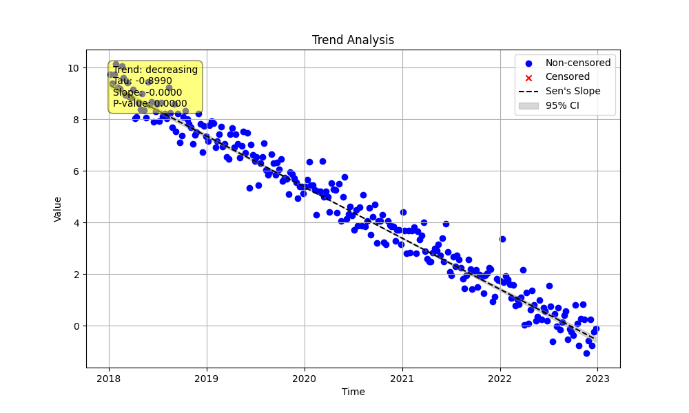

# Example 21: Seasonal Trend with Weekly Data

The `MannKenSen` package is not limited to monthly or annual seasons. It can perform seasonal trend analysis on any regular time interval by specifying the `season_type` and `period`.

This example demonstrates an analysis of weekly data, testing for an overall trend while accounting for variations between each day of the week.

## The Python Script

The following script generates 5 years of weekly data with two patterns:
1.  A steady long-term **decreasing** trend.
2.  A weekly seasonal pattern where values are slightly lower on weekends (Saturday and Sunday).

```python

import numpy as np
import pandas as pd
import MannKenSen as mks
import os

# 1. Generate Synthetic Data
np.random.seed(42)
n_years = 5
t = pd.to_datetime(pd.date_range(start='2018-01-01', periods=n_years * 52, freq='W'))

# Create a long-term decreasing trend
long_term_trend = np.linspace(10, 0, len(t))

# Create a weekly seasonal pattern (lower on weekends)
seasonal_pattern = np.array([-0.5 if day in [5, 6] else 0.5 for day in t.dayofweek])

# Combine with noise
noise = np.random.normal(0, 0.5, len(t))
x = long_term_trend + seasonal_pattern + noise

# 2. Run the Seasonal Trend Test
plot_path = 'seasonal_weekly_trend.png'
# For 'day_of_week', the period is 7
result = mks.seasonal_trend_test(x, t, season_type='day_of_week', period=7, plot_path=plot_path)

# 3. Print the result
print(result)

```

## Command Output

Running the script produces a single result object that summarizes the overall trend across all seasons (days of the week).

```
Seasonal_Mann_Kendall_Test(trend='decreasing', h=np.True_, p=np.float64(0.0), z=np.float64(-21.598227837315463), Tau=np.float64(-0.8990198990198989), s=np.float64(-30270.0), var_s=np.float64(1964083.3333333333), slope=np.float64(-6.279592526826287e-08), intercept=np.float64(104.45777696024683), lower_ci=np.float64(-6.413921418962381e-08), upper_ci=np.float64(-6.145083710025975e-08), C=1.0, Cd=1.0, classification='Highly Likely Decreasing', analysis_notes=[], sen_probability=np.float64(1.0), sen_probability_max=np.float64(1.0), sen_probability_min=np.float64(1.0), prop_censored=np.float64(0.0), prop_unique=1.0, n_censor_levels=0)
```

## Interpretation of Results

The result shows a **'Highly Likely Decreasing'** trend with a very small p-value. The test combines the evidence from each day of the week to produce one set of statistics. It successfully identified the strong, underlying decreasing trend present in the data, even with the weekly seasonal pattern.

## Plot

The generated plot is the primary tool for visualizing the behavior of individual seasons. Each subplot shows the data for a specific day of the week (Monday=0, Sunday=6). The plot visually confirms that a decreasing trend is present for every day, consistent with the overall result.


