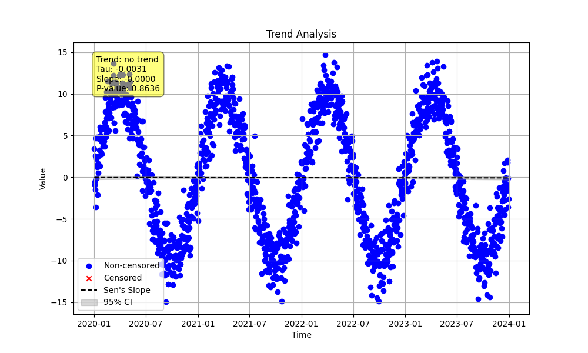

# Example 22: Seasonal Trend with Daily Data (No Trend)

A key capability of the seasonal trend test is to distinguish between a true long-term trend and strong, regular seasonality. A dataset can have a very prominent seasonal pattern but no actual year-over-year trend.

This example demonstrates how the test correctly identifies "No Trend" in such a scenario.

## The Python Script

The following script generates 4 years of daily data. The data has a strong sinusoidal pattern, simulating high values in the summer and low values in the winter. Crucially, **no long-term trend** is added.

```python

import numpy as np
import pandas as pd
import MannKenSen as mks
import os

# 1. Generate Synthetic Data
np.random.seed(1)
n_years = 4
t = pd.to_datetime(pd.date_range(start='2020-01-01', periods=n_years * 365, freq='D'))

# Create a strong seasonal pattern (sine wave over the year)
seasonal_cycle = 10 * np.sin(2 * np.pi * t.dayofyear / 365.25)

# Add noise, but NO long-term trend
noise = np.random.normal(0, 2.0, len(t))
x = seasonal_cycle + noise

# 2. Run the Seasonal Trend Test
plot_path = 'seasonal_daily_no_trend.png'
# We test for trends within each month, so period is 12
result = mks.seasonal_trend_test(x, t, season_type='month', period=12, plot_path=plot_path)

# 3. Print the result
print(result)

```

## Command Output

Running the script produces a single result object. The test analyzes the trend *within* each season (e.g., it compares all January data across the years, all February data, etc.) and combines the results.

```
Seasonal_Mann_Kendall_Test(trend='no trend', h=np.False_, p=np.float64(0.8636483779269195), z=np.float64(-0.17173180825294374), Tau=np.float64(-0.0030517204215685157), s=np.float64(-269.0), var_s=np.float64(2435387.6666666665), slope=np.float64(-2.8833070713091555e-10), intercept=np.float64(0.4178560501956139), lower_ci=np.float64(-3.80814737381049e-09), upper_ci=np.float64(3.2536767421650657e-09), C=0.5681758110365402, Cd=0.5681758110365402, classification='No Trend', analysis_notes=['WARNING: Sen slope based on tied non-censored values'], sen_probability=np.float64(0.568840180216415), sen_probability_max=np.float64(0.568840180216415), sen_probability_min=np.float64(0.568840180216415), prop_censored=np.float64(0.0), prop_unique=1.0, n_censor_levels=0)
```

## Interpretation of Results

Because there is no year-over-year trend in any month, the combined result correctly shows no overall trend. The high p-value and **'No Trend'** classification confirm that the test was not fooled by the strong seasonal pattern.

## Plot

The plot clearly visualizes the situation. The main plot (top left) shows the strong yearly cycle. However, each of the seasonal subplots (for each month) shows a nearly horizontal trend line, confirming the absence of a long-term trend within any given month.


