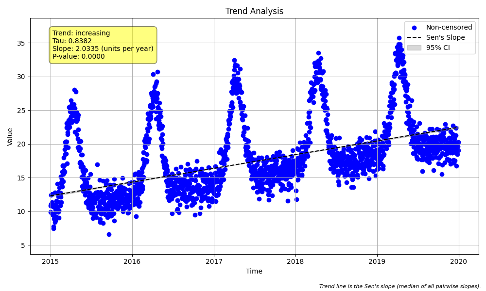

# Example 24: Advanced Seasonality with `day_of_year`

## Goal
Showcase a granular seasonal analysis using the **day of the year** (`season_type='day_of_year'`). This is particularly useful for environmental data driven by specific annual events, such as spring runoff, phenology, or temperature cycles, where "Month" is too coarse a grouping.

## Introduction
Standard seasonal analysis often groups data by month (12 seasons). However, some natural phenomena are better described by the day of the year (1-366). For example, a river's peak flow might shift by a few weeks, which could be split across March and April. Grouping by day allows us to compare "Day 100 in 2015" against "Day 100 in 2016", providing a very fine-grained control for seasonality.

**Why use `day_of_year`?**
*   **Precision:** Removes the arbitrary boundaries of calendar months.
*   **Event Alignment:** Better aligns with biological or physical cycles that don't follow the Gregorian calendar months perfectly.

**Trade-offs:**
*   **Data Requirements:** You need multi-year daily data. If you have gaps, many "seasons" (days) might have insufficient data for a trend test.
*   **Computational Load:** Instead of 12 seasons, the test analyzes up to 366 seasons.

## Step 1: The Data
We generate 5 years of daily data.
*   **Trend:** A steady increase of **+2.0 units/year**.
*   **Seasonality:** A strong peak around **Day 100** (early April) each year, simulating a spring event.

## Step 2: Analysis
We run the `seasonal_trend_test` with `season_type='day_of_year'`.
*   **Period:** Implicitly handles the annual cycle (period ~ 365/366).
*   **Comparison:** It compares Day 1 of Year 1 vs Day 1 of Year 2, Day 2 vs Day 2, etc.

## Python Code and Results

```python
import pandas as pd
import numpy as np
import MannKS as mk

# 1. Generate synthetic daily data (5 years)
# (See run_example.py for details)
df = create_synthetic_data()

print(f"Generated {len(df)} daily observations.")
print("True Trend: +2.0 units/year")
print()

# 2. Run Seasonal Trend Test with 'day_of_year'
# We also use slope_scaling='year' to get a readable slope unit.
result = mk.seasonal_trend_test(
    x=df['Value'],
    t=df['Date'],
    season_type='day_of_year',
    slope_scaling='year',
    plot_path='seasonal_plot_doy.png'
)

print("--- Seasonal Trend Test Results ---")
print(f"Trend: {result.trend}")
print(f"P-value: {result.p:.5f}")
print(f"Sen's Slope: {result.slope:.4f} {result.slope_units}")
print(f"Significance: {result.h}")
```

### Output

```text
Generated {len(df)} daily observations.
True Trend: +2.0 units/year

--- Seasonal Trend Test Results ---
Trend: increasing
P-value: 0.00000
Sen's Slope: 2.0335 units per year
Significance: True

```

## Visualizing the Results
The plot below shows the daily data. Because `day_of_year` seasonality is high-frequency, the "seasonal pattern" is the entire annual shape (the humps). The trend line (Sen's slope) cuts through the noise and seasonality to show the underlying increase.



## Interpretation
*   **Trend Detected:** The test correctly identifies an **increasing** trend.
*   **Slope Accuracy:** The calculated slope is **2.0335 units per year**, which is very close to the true synthetic trend of **+2.0 units/year**.
*   **Robustness:** By comparing "apples to apples" (Day X vs Day X), the test effectively removes the massive seasonal variation (the spring peak) from the trend calculation. If we had ignored seasonality, the variance might have been too high to detect the trend, or the seasonal shape could have confounded a simple linear regression.
