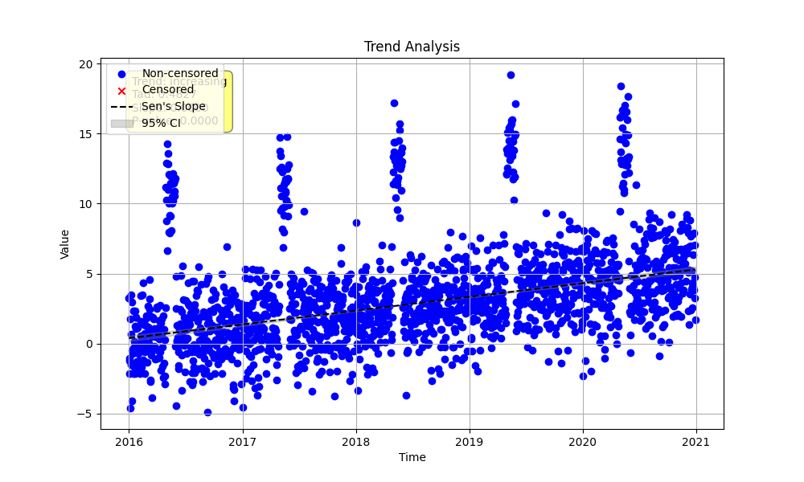

# Example 24: Advanced Seasonality with `day_of_year`

For some datasets, particularly in environmental science, seasonality is tied to specific days of the year rather than just the month. For example, a river's flow might be highest during a specific week of spring due to snowmelt.

The `MannKenSen` package supports this type of granular analysis using `season_type='day_of_year'`.

## 1. Data Generation

We generate 5 years of daily data. The dataset includes:
1.  A subtle long-term **increasing** trend.
2.  A sharp **spike** in values for a 30-day period each year (days 120-150), simulating an annual event.

```python
import numpy as np
import pandas as pd
import MannKenSen

# 1. Generate Synthetic Data
np.random.seed(1)
n_years = 5
t = pd.to_datetime(pd.date_range(start='2016-01-01', periods=n_years * 365, freq='D'))

# Create a subtle long-term increasing trend
long_term_trend = np.linspace(0, 5, len(t))

# Create a seasonal pattern with a spike between day 120 and 150
day_of_year = t.dayofyear
seasonal_pattern = np.zeros(len(t))
spike_mask = (day_of_year >= 120) & (day_of_year <= 150)
seasonal_pattern[spike_mask] = 10

# Combine with noise
noise = np.random.normal(0, 2.0, len(t))
x = long_term_trend + seasonal_pattern + noise

# 2. Run the Seasonal Trend Test
# For day_of_year, set period=366 to handle leap years
plot_path = 'seasonal_day_of_year_trend.png'
result = MannKenSen.seasonal_trend_test(x, t, season_type='day_of_year', period=366, plot_path=plot_path)

print(result)
```

## 2. Results

The test is configured with `season_type='day_of_year'` and `period=366`. The period must be 366 to correctly handle leap years, preventing day numbers from shifting. The test compares the value for each specific day across all years (e.g., Jan 1st 2016 vs. Jan 1st 2017, etc.).

```
trend: increasing\nh: True\np: 0.0000\nz: 22.5674\nclassification: Highly Likely Increasing\nslope: 0.9816 (units/year)
```

The result is a **'Highly Likely Increasing'** trend. The test successfully identified the subtle, long-term increasing trend that was present on each day, independent of the large annual spike.

## 3. Plot

**Note:** The plot for this analysis is very large, as it generates a subplot for every day of the year (366 in total). It is still a useful diagnostic tool but can be slow to generate and view.

The plot below shows the overall data and the first few seasonal subplots. Each subplot for each day of the year would show a slight increasing trend line, consistent with the overall result.


