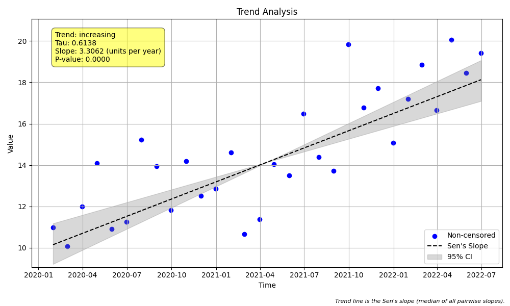
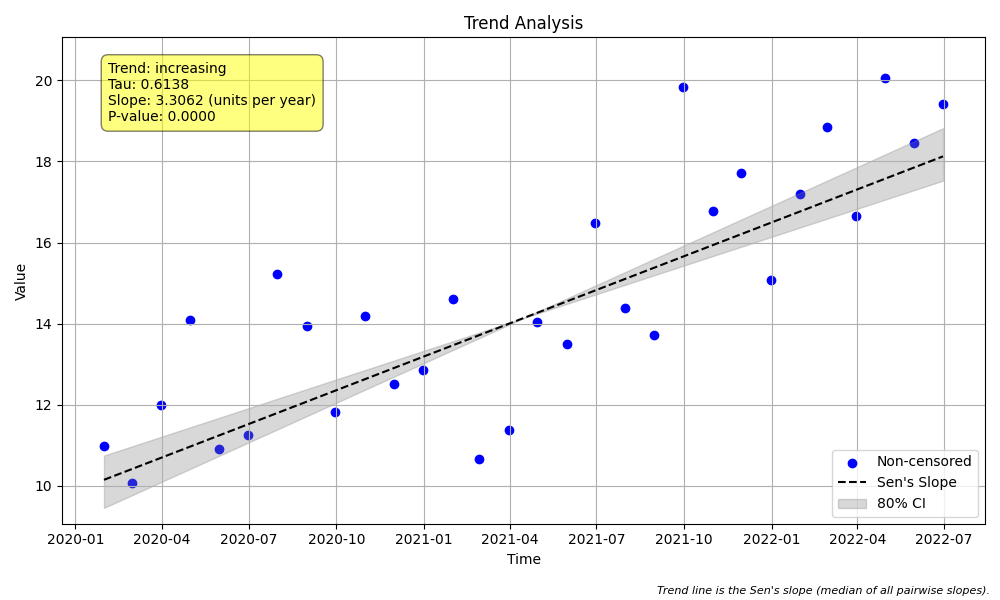
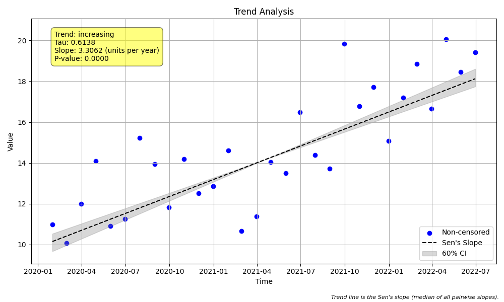

# Example 26: Alpha and Confidence Intervals

## The "Why": Understanding Significance Levels
This example demonstrates how the `alpha` parameter influences the **Confidence Intervals (CI)** of the Sen's slope and the final trend classification.

The `alpha` parameter sets the significance level for the test:
*   **Confidence Level = 100% * (1 - alpha)**
*   **Lower `alpha` (e.g., 0.05):** corresponds to a **higher confidence level** (e.g., 95%). This produces a **wider** interval because we want to be more certain that the true slope lies within it.
*   **Higher `alpha` (e.g., 0.40):** corresponds to a **lower confidence level** (e.g., 60%). This produces a **narrower** interval because we are accepting a higher risk that the true slope is outside the range.

## The "How": Code Walkthrough

We analyze the same synthetic dataset three times, changing only the `alpha` parameter.

### Step 1: Python Code
```python
import numpy as np
import pandas as pd
import MannKS as mk
import matplotlib.pyplot as plt

# 1. Generate Synthetic Data
# We generate a monthly dataset for 2.5 years (30 observations).
# The data has a clear increasing trend (~4 units/year) with added random noise.
np.random.seed(42)
n = 30
dates = pd.date_range(start='2020-01-01', periods=n, freq='ME')
# Linear trend (10 to 20 over 30 months) + Noise
values = np.linspace(10, 20, n) + np.random.normal(0, 2, n)

print("Data Summary:")
print(f"Time Range: {dates[0].date()} to {dates[-1].date()}")
print(f"Value Range: {values.min():.2f} to {values.max():.2f}")

# 2. Run Trend Test with Different Alpha Values
# The 'alpha' parameter controls the width of the confidence interval (CI).
# Lower alpha = Higher Confidence Level = Wider Interval
alphas = [0.05, 0.20, 0.40]

for alpha in alphas:
    confidence_level = (1 - alpha) * 100
    print(f"\n--- Analysis with alpha = {alpha} ({confidence_level:.0f}% CI) ---")

    # We specify 'slope_scaling="year"' to see the slope in units/year.
    plot_filename = f"plot_alpha_{alpha}.png"
    result = mk.trend_test(
        x=values,
        t=dates,
        alpha=alpha,
        slope_scaling='year',
        plot_path=plot_filename
    )

    # Inspect the Confidence Interval (CI)
    ci_width = result.upper_ci - result.lower_ci
    print(f"Trend Classification: {result.classification}")
    print(f"Sen's Slope: {result.slope:.4f} units/year")
    print(f"Confidence Interval: [{result.lower_ci:.4f}, {result.upper_ci:.4f}]")
    print(f"Width of Interval: {ci_width:.4f}")

    # Clean up plot memory
    plt.close('all')
```

### Step 2: Text Output
```text
Data Summary:
Time Range: 2020-01-31 to 2022-06-30
Value Range: 10.07 to 20.06

--- Analysis with alpha = 0.05 (95% CI) ---
Trend Classification: Highly Likely Increasing
Sen's Slope: 3.3062 units/year
Confidence Interval: [2.4519, 4.0832]
Width of Interval: 1.6312

--- Analysis with alpha = 0.2 (80% CI) ---
Trend Classification: Highly Likely Increasing
Sen's Slope: 3.3062 units/year
Confidence Interval: [2.8099, 3.8816]
Width of Interval: 1.0717

--- Analysis with alpha = 0.4 (60% CI) ---
Trend Classification: Highly Likely Increasing
Sen's Slope: 3.3062 units/year
Confidence Interval: [2.9892, 3.7039]
Width of Interval: 0.7147

```

## Interpreting the Results

### 1. Interval Width
Notice how the width of the confidence interval changes with `alpha`:
*   **alpha = 0.05 (95% CI):** The interval is the **widest** (Width $\approx$ 1.63). We are 95% sure the true slope is in this wide range.
*   **alpha = 0.20 (80% CI):** The interval is **intermediate** (Width $\approx$ 1.07).
*   **alpha = 0.40 (60% CI):** The interval is the **narrowest** (Width $\approx$ 0.71). We are only 60% sure the true slope is in this narrow range.

### 2. Visual Comparison
The `plot_path` argument automatically generated these plots. Observe the shaded gray region (the confidence interval) in each plot.

#### Alpha = 0.05 (Wide Interval)


#### Alpha = 0.20 (Medium Interval)


#### Alpha = 0.40 (Narrow Interval)


## Key Takeaway
Choosing `alpha` is a trade-off between **precision** (narrow interval) and **certainty** (confidence level). The standard default in most scientific literature is `alpha=0.05` or `alpha=0.10`.
