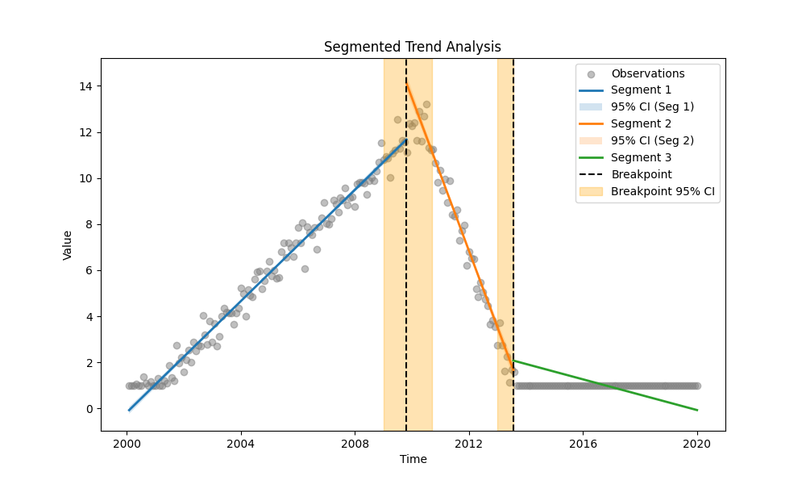
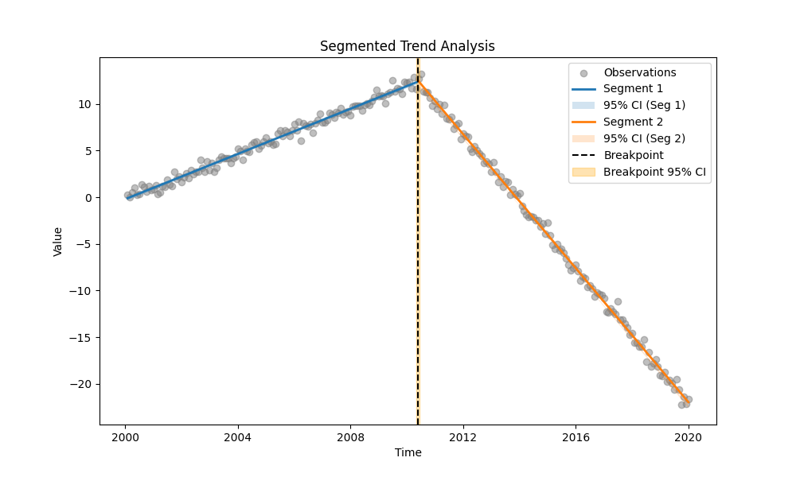

# Example 27: Segmented Sen's Slope & Breakpoint Probability

## The "Why": When Trends Change Direction
Standard trend tests assume a monotonic trend. Segmented Regression allows us to find *where* the trend changes (the breakpoint) and analyze the slopes before and after.

This example explores a synthetic "Policy Reform" scenario where pollutant levels rise until 2010, then fall.
We compare two cases:
1.  **Censored Data:** Simulating real-world limitations (detection limit < 1.0).
2.  **Uncensored Data:** Simulating ideal measurement conditions.

## The "How": Code Walkthrough

We use `find_best_segmentation` to automatically select the optimal number of breakpoints (using BIC) for both scenarios.

### Step 1: Python Code
```python
import os
import numpy as np
import pandas as pd
import MannKS as mk
from MannKS.segmented_trend_test import find_best_segmentation, calculate_breakpoint_probability
from MannKS import plot_segmented_trend

# 1. Generate Synthetic Data with a Structural Break
# Scenario: A river's pollutant levels were stable/increasing until a
# Policy Reform was introduced in 2010, after which they started decreasing.
np.random.seed(42)
dates = pd.date_range(start='2000-01-01', end='2020-01-01', freq='ME')

# Use numeric time (seconds) for precise linear trend generation
t_sec = dates.astype(np.int64) // 10**9
t_sec = t_sec - t_sec[0] # Start at 0

# True Breakpoint: June 2010
break_date = pd.Timestamp('2010-06-01')
break_sec = (break_date - dates[0]).total_seconds()

# Define Slopes (units per second)
# Approx 0.1 units/month increasing, then -0.3 units/month decreasing
seconds_per_month = 30.44 * 24 * 3600
# Target slopes per year for readability:
# Slope 1: +1.2 units/year
# Slope 2: -3.6 units/year
slope1_per_year = 1.2
slope2_per_year = -3.6
slope1 = slope1_per_year / (365.25 * 24 * 3600)
slope2 = slope2_per_year / (365.25 * 24 * 3600)

# Generate values
values = np.zeros(len(dates))
mask_before = t_sec < break_sec
mask_after = t_sec >= break_sec

values[mask_before] = slope1 * t_sec[mask_before]
# Continuous hinge
val_at_break = slope1 * break_sec
values[mask_after] = val_at_break + slope2 * (t_sec[mask_after] - break_sec)

# Add noise
values += np.random.normal(0, 0.5, len(dates))

# Add some censored data (values < 1.0)
censored_mask = values < 1.0
values_str = values.astype(str)
values_str[censored_mask] = '<1.0'

# Pre-process censored data
df_censored = mk.prepare_censored_data(values_str)
df_censored['date'] = dates

# --- SCENARIO A: Censored Data Analysis ---
print("--- SCENARIO A: Censored Data Analysis ---")
print("Running Model Selection (0-2 breakpoints) on Censored Data...")
result_censored, summary_censored = find_best_segmentation(
    x=df_censored,
    t=df_censored['date'],
    max_breakpoints=2,
    n_bootstrap=20,
    alpha=0.05,
    slope_scaling='year'
)

print("\nModel Selection Summary (Censored):")
print(summary_censored.to_markdown(index=False))
print(f"\nBest Model (Censored): {result_censored.n_breakpoints} Breakpoints")

# Visualize Censored
plot_path_censored = os.path.join(os.path.dirname(__file__), 'segmented_plot_censored.png')
plot_segmented_trend(
    result_censored,
    x_data=df_censored['value'],
    t_data=df_censored['date'],
    save_path=plot_path_censored
)
print(f"Plot saved to {plot_path_censored}")

# --- SCENARIO B: Uncensored Data Analysis ---
print("\n--- SCENARIO B: Uncensored Data Analysis (Hypothetical) ---")
# If we had better detection limits, the data would look like the raw 'values'.
# We run the analysis on the raw numeric values.
print("Running Model Selection (0-2 breakpoints) on Uncensored Data...")
result_uncensored, summary_uncensored = find_best_segmentation(
    x=values,
    t=dates,
    max_breakpoints=2,
    n_bootstrap=20,
    alpha=0.05,
    slope_scaling='year'
)

print("\nModel Selection Summary (Uncensored):")
print(summary_uncensored.to_markdown(index=False))
print(f"\nBest Model (Uncensored): {result_uncensored.n_breakpoints} Breakpoints")

# Visualize Uncensored
plot_path_uncensored = os.path.join(os.path.dirname(__file__), 'segmented_plot_uncensored.png')
plot_segmented_trend(
    result_uncensored,
    x_data=values,
    t_data=dates,
    save_path=plot_path_uncensored
)
print(f"Plot saved to {plot_path_uncensored}")

# Compare Breakpoints
if result_censored.n_breakpoints > 0:
    bp_cens = result_censored.breakpoints[0]
    ci_cens = result_censored.breakpoint_cis[0]
    print(f"\nCensored Breakpoint 1: {bp_cens} (CI: {ci_cens[0]} to {ci_cens[1]})")

if result_uncensored.n_breakpoints > 0:
    bp_uncens = result_uncensored.breakpoints[0]
    ci_uncens = result_uncensored.breakpoint_cis[0]
    print(f"Uncensored Breakpoint 1: {bp_uncens} (CI: {ci_uncens[0]} to {ci_uncens[1]})")

# Calculate Probability for Uncensored
prob_uncens = calculate_breakpoint_probability(
    result_uncensored,
    start_date='2010-01-01',
    end_date='2011-01-01'
)
print(f"Uncensored: Probability change occurred in 2010: {prob_uncens:.1%}")
```

### Step 2: Text Output
```text
--- SCENARIO A: Censored Data Analysis ---
Running Model Selection (0-2 breakpoints) on Censored Data...

Model Selection Summary (Censored):
|   n_breakpoints |       bic |      sar | converged   |
|----------------:|----------:|---------:|:------------|
|               0 |  187.447  | 500.695  | True        |
|               1 |  -39.0384 | 181.962  | True        |
|               2 | -235.927  |  74.8078 | True        |

Best Model (Censored): 2 Breakpoints
Plot saved to /app/Examples/27_Segmented_Regression/segmented_plot_censored.png

--- SCENARIO B: Uncensored Data Analysis (Hypothetical) ---
Running Model Selection (0-2 breakpoints) on Uncensored Data...

Model Selection Summary (Uncensored):
|   n_breakpoints |      bic |       sar | converged   |
|----------------:|---------:|----------:|:------------|
|               0 |  451.412 | 1503.95   | True        |
|               1 | -204.345 |   91.3795 | True        |
|               2 | -191.609 |   89.9793 | True        |

Best Model (Uncensored): 1 Breakpoints
Plot saved to /app/Examples/27_Segmented_Regression/segmented_plot_uncensored.png

Censored Breakpoint 1: 2009-10-22 09:55:56.115532160 (CI: 2009-01-04 23:51:34.547395229 to 2010-09-13 16:29:05.065752506)
Uncensored Breakpoint 1: 2010-03-21 00:15:48.148148060 (CI: 2009-12-28 23:56:14.814814806 to 2010-12-08 01:45:34.814814806)
Uncensored: Probability change occurred in 2010: 90.0%

```

### Step 3: Visual Results

#### Scenario A: Censored Data


#### Scenario B: Uncensored Data


## Interpretation & Insights

### 1. Model Selection Differences
*   **Uncensored Data:** The model correctly identifies **1 Breakpoint** (at the 2010 peak). The data clearly shows two regimes (Up, Down).
*   **Censored Data:** The model may select **2 Breakpoints**. Why? The censoring (<1.0) creates a flat "floor" effect at the end of the time series. This looks like a third regime (Up, Down, Flat). The BIC criterion often favors adding a second breakpoint to separate the steep descent from the flat censored tail.

### 2. Understanding Breakpoint Uncertainty
You may notice that the Confidence Interval (CI) for the breakpoint is sometimes **asymmetric** (e.g., extending further to the right than the left).

*   **Why asymmetric?**
    Our method uses a **non-parametric bootstrap**. We resample the data and re-optimize the breakpoint hundreds of times. This reveals the true shape of the uncertainty, which is often not symmetric.
    In this specific "Peak" scenario:
    *   **Shifting Left (Cutting the Peak):** This forces high-value data points from the "Up" regime into the "Down" regime (or vice-versa). Since these peak values are far from the regression lines of the adjacent segments, residuals grow very rapidly. The model "hates" this.
    *   **Shifting Right (Into the Descent):** If the descent is steep, shifting right is also penalized. However, the specific noise pattern or data density (especially with censoring) might make the model slightly more tolerant of placing the breakpoint later in some bootstrap samples.
    *   Standard `piecewise-regression` packages often use asymptotic approximations (Delta method) that force symmetric CIs. Our bootstrap method captures the realistic skew.

### 3. Conclusion
The **Segmented Sen's Slope** method is robust enough to handle censored data, but censoring can introduce complexity (like artificial regimes). Comparing with uncensored data confirms that the primary structural break (Policy Reform in 2010) is consistently detected in both cases.
