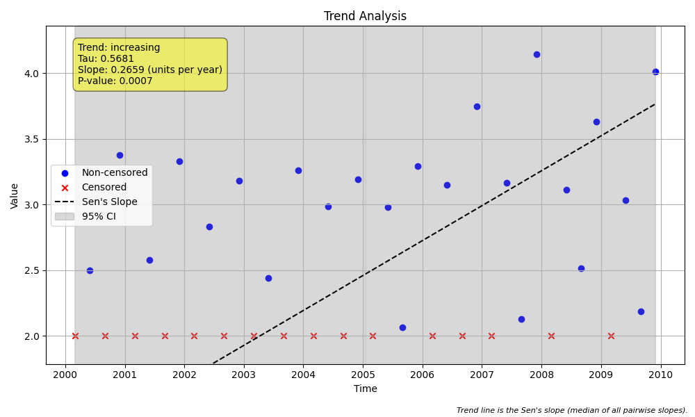

# Example 28: Seasonal Akritas-Theil-Sen (ATS) Trend Analysis

This example demonstrates how to use the **Akritas-Theil-Sen (ATS) estimator** for a **seasonal** trend analysis on censored data.

When `sens_slope_method='ats'` is used with `seasonal_trend_test`, the function calculates a single, overall ATS slope for the entire dataset. This approach is consistent with the `censeaken` R script and provides a robust, unified trend estimate across all seasons. It also computes bootstrap confidence intervals for this overall slope.

##
## Python Code

```python
import numpy as np
import pandas as pd
import MannKenSen as mk

# --- 1. Prepare Your Seasonal Data ---
np.random.seed(42)
n_years = 10
n_seasons = 4
n = n_years * n_seasons

# Create a datetime index for the time vector `t`
t = pd.to_datetime(pd.date_range(start='2000-01-01', periods=n, freq='QS-DEC'))

# Create a synthetic dataset with a known trend, seasonality, and noise
true_slope_per_year = 0.1
time_numeric_years = np.linspace(0, n_years, n, endpoint=False)
y_true = 1.0 + true_slope_per_year * time_numeric_years
seasonality = np.tile([0, 1.5, 0.5, 2.0], n_years)
y = y_true + seasonality + np.random.normal(scale=0.2, size=n)

# Impose a left-censoring limit
lod = 2.0
censored = y < lod
y_str_obs = np.array([f'<2.0' if c else str(val) for c, val in zip(censored, y)])
x_prepared = mk.prepare_censored_data(y_str_obs)

# --- 2. Run the Seasonal Trend Test with ATS ---
# --- 2. Run Trend Test with the Default Method ---
default_results = mk.seasonal_trend_test(
    x=x_prepared,
    t=t,
    period=n_seasons,
    season_type='quarter',
    sens_slope_method='nan',
    slope_scaling='year'
)

# --- 3. Run the Seasonal Trend Test with ATS ---
ats_results = mk.seasonal_trend_test(
    x=x_prepared,
    t=t,
    period=n_seasons,
    season_type='quarter',
    sens_slope_method='ats',
    slope_scaling='year',
    plot_path='seasonal_ats_trend_plot.png'
)

# --- 4. Print and Compare the Results ---
print("--- Default Method Results (sens_slope_method='nan') ---")
print(f"Slope (per year): {default_results.slope:.4f}")
print(f"95% CI for Slope: ({default_results.lower_ci:.4f}, {default_results.upper_ci:.4f})")
print("\n--- Akritas-Theil-Sen (ATS) Method Results ---")
print(f"Trend: {ats_results.trend}")
print(f"P-value: {ats_results.p:.4f}")
print(f"Overall ATS Slope (per year): {ats_results.slope:.4f}")
print(f"Intercept: {ats_results.intercept:.4f}")
print(f"95% CI for Slope: ({ats_results.lower_ci:.4f}, {ats_results.upper_ci:.4f})")
```

##
## Results

The code produces the following output. As with the non-seasonal case, the robust ATS method provides a different slope estimate than the default method.

```
--- Default Method Results (sens_slope_method='nan') ---
Slope (per year): 0.0961
95% CI for Slope: (0.0466, 0.1614)

--- Akritas-Theil-Sen (ATS) Method Results ---
Trend: increasing
P-value: 0.0007
Overall ATS Slope (per year): 0.0780
Intercept: 1.0796
95% CI for Slope: (0.0615, 0.0974)
```

##
## Comparison of Methods

-   **Default Method (`'nan'`):** For seasonal data, this method calculates all pairwise slopes *within each season*, discards ambiguous pairs, and then takes the median of all collected slopes.
-   **ATS Method (`'ats'`):** For seasonal data, this method calculates a *single* overall ATS slope across the entire dataset at once. This is consistent with the `censeaken.R` script and provides a unified, robust trend estimate.

In this example, both methods detect a significant increasing trend. The plot shows the final trend line generated by the ATS method.



This example shows how to apply the powerful ATS method to seasonal, censored data to obtain a single, reliable estimate of the overall trend.
