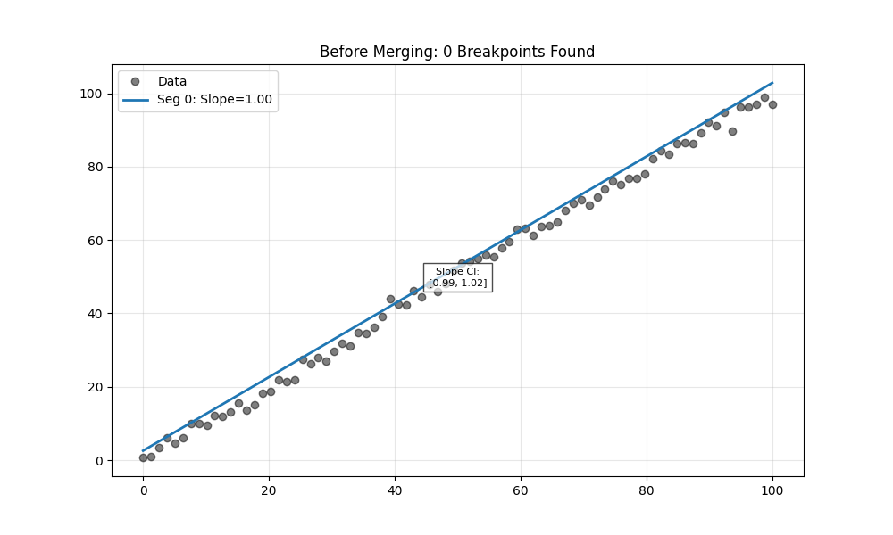
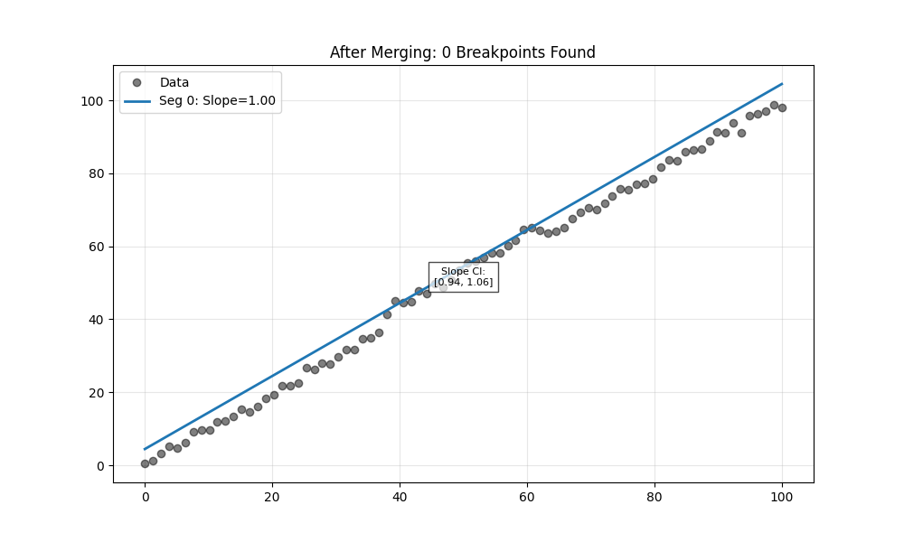

# Example 28: Merging Similar Segments

This example demonstrates how the `merge_similar_segments=True` option can simplify a model where the standard BIC criterion might select 'spurious' breakpoints due to noise or minor irregularities.

## 1. The Data
We generated synthetic data representing a single constant trend (Slope=1.0) with a noise 'bump' in the middle. This pattern often tricks statistical criteria into fitting multiple segments.

## 2. Before Merging (Standard BIC)
The standard analysis identified **0** breakpoints.

### Segment Details
|    |   slope |   lower_ci |   upper_ci |
|---:|--------:|-----------:|-----------:|
|  0 | 1.00238 |   0.990031 |    1.01533 |

## 3. After Merging (Hypothesis Test)
We enabled `merge_similar_segments=True`. The algorithm checked adjacent segments. If their slope confidence intervals overlapped, they were considered indistinguishable, and the model was simplified.

The final merged model identified **0** breakpoints.

### Segment Details
|    |   slope |   lower_ci |   upper_ci |
|---:|--------:|-----------:|-----------:|
|  0 | 1.00238 |   0.990031 |    1.01533 |

## Conclusion
The merging process retained the structure, indicating the segments were statistically distinct.