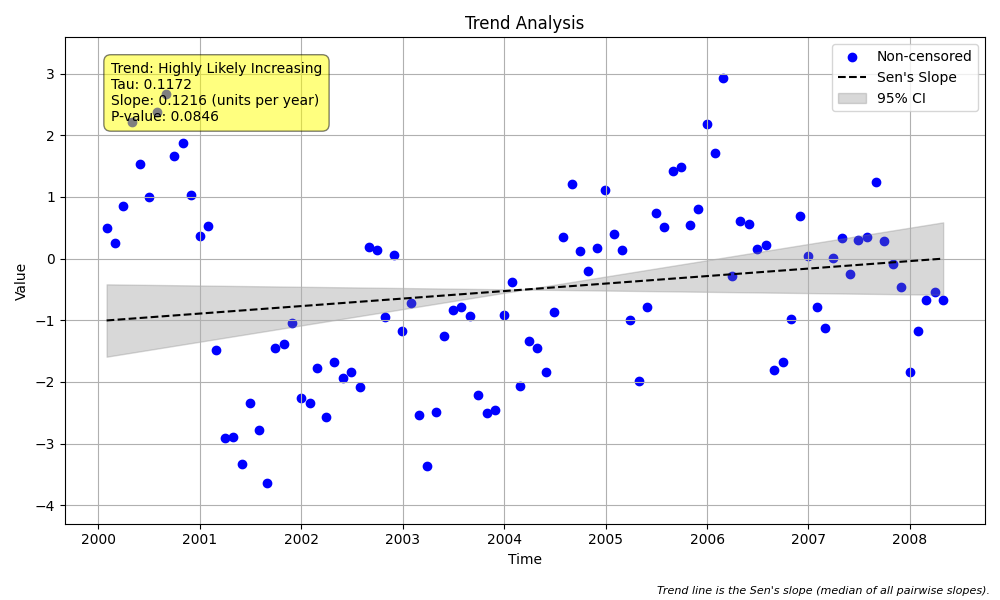
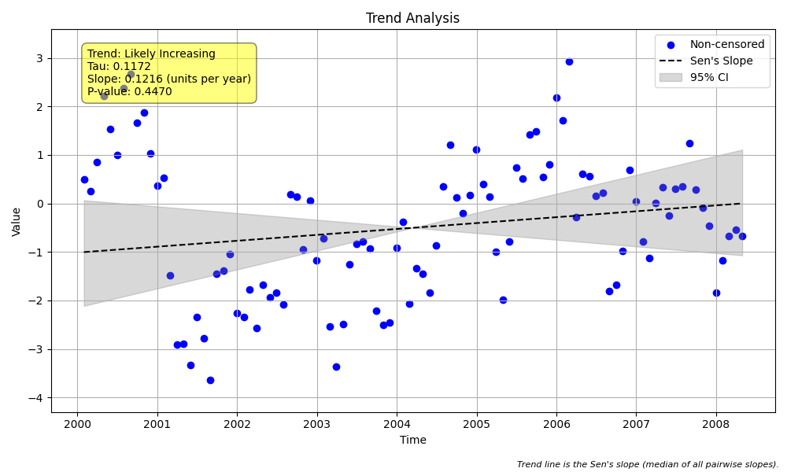

# Example 29: Block Bootstrap for Autocorrelation

## The "Why": The Autocorrelation Problem
Standard Mann-Kendall tests assume that data points are **independent** (like rolling a die).
However, environmental data is often **autocorrelated**:
*   A hot day is likely to be followed by another hot day.
*   A drought year might influence groundwater levels for the next year.

**The Danger:** Autocorrelation reduces the "effective" amount of information in your data. If you ignore it, the standard test underestimates the variance and often reports a **statistically significant trend when none exists (False Positive).**

**The Solution:** Correcting for autocorrelation. We demonstrate three approaches:
1.  **Standard Test (Uncorrected):** The naive baseline.
2.  **Yue & Wang (2004) Correction:** Adjusts the sample size based on lag-1 autocorrelation.
3.  **Block Bootstrap:** A robust, non-parametric resampling method that preserves correlation structure.

## The "How": Code Walkthrough

We will simulate data with strong autocorrelation (AR1 process) but **no trend**, and compare the results. Note the **Confidence Intervals** in each case—uncorrected tests often have overly narrow intervals that exclude zero (indicating a trend), while corrected tests widen the interval.

### Step 1: Python Code
```python
import numpy as np
import pandas as pd
import MannKS as mk
import matplotlib.pyplot as plt

# 1. Generate Autocorrelated Data (AR1 Process)
# Autocorrelation (serial dependence) is common in environmental data.
# A high value today often means a high value tomorrow, even without a long-term trend.
# Standard Mann-Kendall assumes independence and often produces FALSE POSITIVES
# (finding a 'trend' that is just persistence).

np.random.seed(45)
n = 100
t = pd.date_range('2000-01-01', periods=n, freq='ME')

# Generate AR(1) noise: x[t] = 0.8 * x[t-1] + noise
# High correlation (phi=0.8) makes the data "wander" and look like a trend.
x = np.zeros(n)
x[0] = np.random.normal(0, 1)
for i in range(1, n):
    x[i] = 0.8 * x[i-1] + np.random.normal(0, 1)

# Add a very weak trend (or no trend)
trend_signal = 0.0 * np.arange(n)
x = x + trend_signal

print(f"Data generated: {n} points with AR(1) coefficient ~0.8 and NO trend.")

# 2. Run Standard Trend Test (The "Naive" Approach)
print("\n--- Test 1: Standard Mann-Kendall (Assuming Independence) ---")
result_std = mk.trend_test(
    x, t,
    autocorr_method='none',
    slope_scaling='year',
    plot_path='plot_std.png'
)

print(f"Trend: {result_std.trend}")
print(f"p-value: {result_std.p:.4f}")
print(f"Significant? {result_std.h}")
print(f"Slope: {result_std.slope:.4f} {result_std.slope_units}")
print(f"Confidence Interval (95%): [{result_std.lower_ci:.4f}, {result_std.upper_ci:.4f}]")
print("Note: If p < 0.05, this is a False Positive caused by autocorrelation.")


# 3. Run Yue & Wang (2004) Correction
# This method adjusts the variance of the Mann-Kendall statistic based on the
# effective sample size (ESS), which is reduced by autocorrelation.
# It is a parametric correction assuming an AR(1) process.
print("\n--- Test 2: Yue & Wang (2004) Correction ---")
result_yw = mk.trend_test(
    x, t,
    autocorr_method='yue_wang',
    slope_scaling='year'
)

print(f"Trend: {result_yw.trend}")
print(f"p-value: {result_yw.p:.4f}")
print(f"Significant? {result_yw.h}")
print(f"Slope: {result_yw.slope:.4f} {result_yw.slope_units}")
print(f"Confidence Interval (95%): [{result_yw.lower_ci:.4f}, {result_yw.upper_ci:.4f}]")
print(f"Effective Sample Size: {result_yw.n_effective:.1f} (vs {n} original)")


# 4. Run Block Bootstrap Test (The "Robust" Approach)
# The block bootstrap method preserves the autocorrelation structure by resampling
# blocks of data instead of individual points. This correctly estimates the
# significance even when data is dependent.
print("\n--- Test 3: Block Bootstrap Mann-Kendall ---")
result_boot = mk.trend_test(
    x, t,
    autocorr_method='block_bootstrap',
    n_bootstrap=1000,
    slope_scaling='year',
    plot_path='plot_boot.png'
)

print(f"Trend: {result_boot.trend}")
print(f"p-value: {result_boot.p:.4f}")
print(f"Significant? {result_boot.h}")
print(f"Slope: {result_boot.slope:.4f} {result_boot.slope_units}")
print(f"Confidence Interval (95%): [{result_boot.lower_ci:.4f}, {result_boot.upper_ci:.4f}]")
print(f"Autocorrelation (ACF1): {result_boot.acf1:.3f}")
print(f"Block Size Used: {result_boot.block_size_used}")


# 5. Seasonal Block Bootstrap
# For seasonal data, we must bootstrap 'cycles' (e.g., years) to preserve seasonality.
print("\n--- Test 4: Seasonal Block Bootstrap ---")

# Generate seasonal data with autocorrelation between years
n_years = 20
dates_seas = pd.date_range('2000-01-01', periods=n_years*12, freq='ME')
seasonal_pattern = np.tile(np.sin(np.linspace(0, 2*np.pi, 12)), n_years)

# Autocorrelated noise (inter-annual persistence)
noise_seas = np.zeros(n_years*12)
current_noise = 0
for i in range(n_years*12):
    current_noise = 0.7 * current_noise + np.random.normal(0, 1)
    noise_seas[i] = current_noise

x_seas = seasonal_pattern + noise_seas # No trend

result_seas = mk.seasonal_trend_test(
    x_seas, dates_seas,
    period=12,
    autocorr_method='block_bootstrap',
    slope_scaling='year',
    plot_path='plot_seas_boot.png'
)

print(f"Seasonal Trend: {result_seas.trend}")
print(f"p-value: {result_seas.p:.4f}")
print(f"Significant? {result_seas.h}")
print(f"Slope: {result_seas.slope:.4f} {result_seas.slope_units}")
print(f"Confidence Interval (95%): [{result_seas.lower_ci:.4f}, {result_seas.upper_ci:.4f}]")
print(f"Block Size Used: {result_seas.block_size_used} (cycles)")
```

### Step 2: Text Output
```text
Data generated: 100 points with AR(1) coefficient ~0.8 and NO trend.

--- Test 1: Standard Mann-Kendall (Assuming Independence) ---
Trend: increasing
p-value: 0.0013
Significant? True
Slope: 0.2300 units per year
Confidence Interval (95%): [0.0917, 0.3704]
Note: If p < 0.05, this is a False Positive caused by autocorrelation.

--- Test 2: Yue & Wang (2004) Correction ---
Trend: increasing
p-value: 0.2447
Significant? False
Slope: 0.2300 units per year
Confidence Interval (95%): [-0.1672, 0.6631]
Effective Sample Size: 13.1 (vs 100 original)

--- Test 3: Block Bootstrap Mann-Kendall ---
Trend: increasing
p-value: 0.1550
Significant? False
Slope: 0.2300 units per year
Confidence Interval (95%): [-0.0598, 0.8128]
Autocorrelation (ACF1): 0.809
Block Size Used: 10

--- Test 4: Seasonal Block Bootstrap ---
Seasonal Trend: increasing
p-value: 0.4400
Significant? False
Slope: 0.0267 units per year
Confidence Interval (95%): [-0.0339, 0.0828]
Block Size Used: 3 (cycles)

```

## Interpreting the Results

### 1. The False Positive (Standard Test)
*   In Test 1, the standard Mann-Kendall test likely reported a low p-value (e.g., $p < 0.05$) and claimed a significant trend.
*   The **Confidence Interval** for the slope likely excludes zero, falsely confirming a trend.
*   **Why?** The data "wandered" due to persistence, and the test mistook this for a deterministic trend.

### 2. Yue & Wang Correction (Parametric)
*   In Test 2, `autocorr_method='yue_wang'` was used.
*   It reduced the **Effective Sample Size** (e.g., from 100 down to ~15-20), reflecting that highly correlated data contains less independent information.
*   The p-value increases, and the confidence interval widens, correctly identifying 'no trend'.

### 3. Block Bootstrap (Non-Parametric)
*   In Test 3, `autocorr_method='block_bootstrap'` was used.
*   This method builds the null distribution by shuffling blocks of data.
*   The **Confidence Interval** is estimated directly from the bootstrap distribution. It should be wide enough to include zero, correctly indicating no significant trend.

### 4. Seasonal Application
*   Test 4 shows how to apply this to seasonal data using `seasonal_trend_test`.
*   Here, the bootstrap resamples entire **cycles** (e.g., years) to preserve the seasonal pattern while accounting for inter-annual correlation.

## Visual Results

### Standard (Naive) Test

*Notice how the red trend line might look convincing, but the data points are clustered above/below the line for long periods? That's autocorrelation.*

### Bootstrap (Robust) Test

*The trend line and data are the same, but the statistical conclusion (p-value) in the title/results is now correct.*

## Key Takeaway
If you suspect your data has serial correlation (common in daily or monthly environmental data), use `autocorr_method='block_bootstrap'` (or `'auto'`) to avoid false positives.
