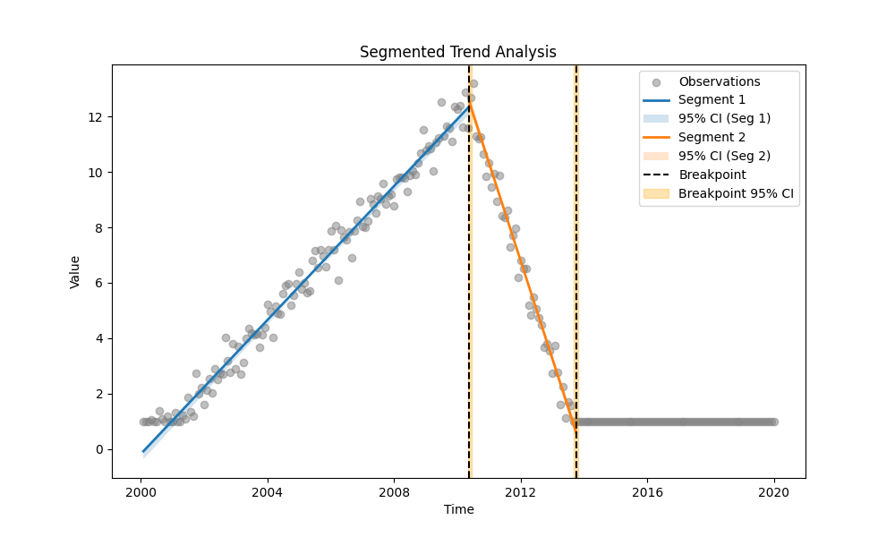
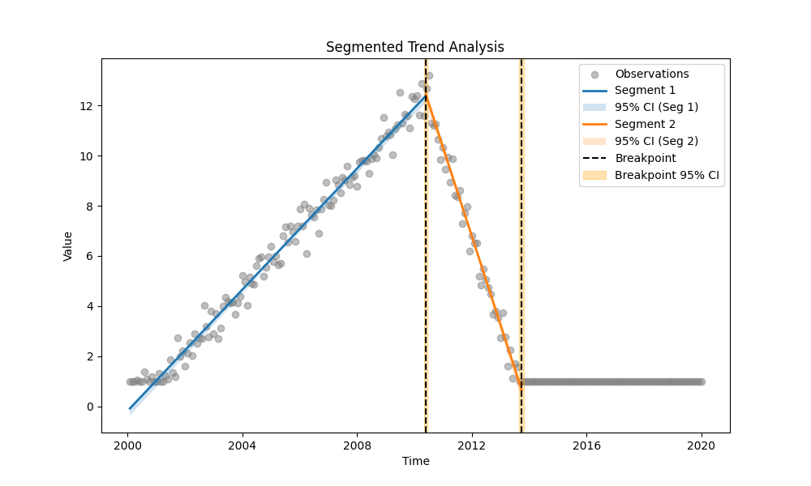
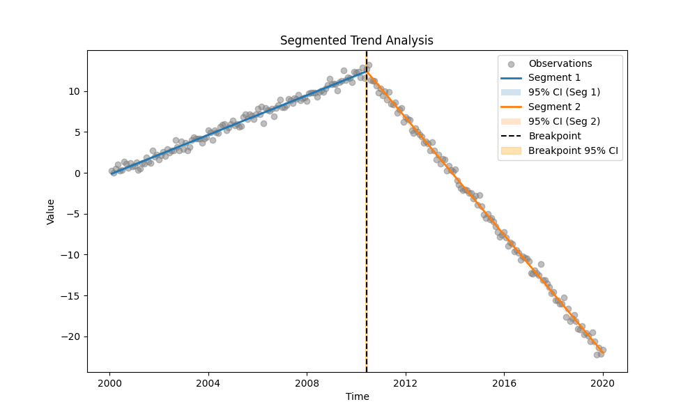

# Example 32: Segmented Sen's Slope & Breakpoint Probability

## The "Why": When Trends Change Direction
Standard trend tests assume a monotonic trend. Segmented Regression allows us to find *where* the trend changes (the breakpoint) and analyze the slopes before and after.

This example explores a synthetic "Policy Reform" scenario where pollutant levels rise until 2010, then fall.
We compare two cases:
1.  **Censored Data:** Simulating real-world limitations (detection limit < 1.0).
2.  **Uncensored Data:** Simulating ideal measurement conditions.

## The "How": Code Walkthrough

We use `find_best_segmentation` to automatically select the optimal number of breakpoints (using BIC) for both scenarios.

### Step 1: Python Code
```python
import os
import numpy as np
import pandas as pd
import MannKS as mk
from MannKS.segmented_trend_test import find_best_segmentation, calculate_breakpoint_probability
from MannKS import plot_segmented_trend

# -----------------------------------------------------------------------------
# 1. Generate Synthetic Data with a Structural Break
# -----------------------------------------------------------------------------
# Scenario: A river's pollutant levels were stable/increasing until a
# Policy Reform was introduced in 2010, after which they started decreasing.
# We create a datetime range spanning 20 years.
np.random.seed(42)
dates = pd.date_range(start='2000-01-01', end='2020-01-01', freq='ME')

# Convert dates to numeric seconds for precise linear trend generation.
# This ensures the underlying true signal is perfectly linear before adding noise.
t_sec = dates.astype(np.int64) // 10**9
t_sec = t_sec - t_sec[0] # Start at 0

# True Breakpoint: June 2010 (Policy Reform)
break_date = pd.Timestamp('2010-06-01')
break_sec = (break_date - dates[0]).total_seconds()

# Define Slopes (units per second)
# - Period 1 (Pre-2010): Increasing trend (+1.2 units/year)
# - Period 2 (Post-2010): Decreasing trend (-3.6 units/year)
slope1_per_year = 1.2
slope2_per_year = -3.6
slope1 = slope1_per_year / (365.25 * 24 * 3600)
slope2 = slope2_per_year / (365.25 * 24 * 3600)

# Generate true values (piecewise linear function)
values = np.zeros(len(dates))
mask_before = t_sec < break_sec
mask_after = t_sec >= break_sec

values[mask_before] = slope1 * t_sec[mask_before]
# Ensure continuous hinge at the breakpoint
val_at_break = slope1 * break_sec
values[mask_after] = val_at_break + slope2 * (t_sec[mask_after] - break_sec)

# Add Gaussian noise to simulate measurement error
values += np.random.normal(0, 0.5, len(dates))

# -----------------------------------------------------------------------------
# 2. Simulate Censored Data
# -----------------------------------------------------------------------------
# In environmental monitoring, low concentrations often fall below a
# detection limit (e.g., < 1.0). We simulate this by marking values < 1.0
# as censored strings ("<1.0").
censored_mask = values < 1.0
values_str = values.astype(str)
values_str[censored_mask] = '<1.0'

# Pre-process censored data into a format suitable for MannKS
# This converts "<1.0" into numeric 1.0 and sets censored=True
df_censored = mk.prepare_censored_data(values_str)
df_censored['date'] = dates

# -----------------------------------------------------------------------------
# 3. SCENARIO A: Analyzing Censored Data
# -----------------------------------------------------------------------------
print("--- SCENARIO A: Censored Data Analysis ---")
# We use 'find_best_segmentation' to automatically determine the optimal
# number of breakpoints (0, 1, or 2) using the BIC criterion.
#
# Key Parameters:
# - max_breakpoints=2: Search for up to 2 changes in trend.
# - use_bagging=True: Use Bootstrap Aggregating to find robust breakpoint locations.
#                     This is crucial for censored/noisy data to avoid local minima.
# - slope_scaling='year': Report slopes in units per year (easier to interpret).
print("Running Model Selection (0-2 breakpoints) on Censored Data...")
result_censored, summary_censored = find_best_segmentation(
    x=df_censored,
    t=df_censored['date'],
    max_breakpoints=2,
    use_bagging=True,
    n_bootstrap=20, # Use >=100 for production
    alpha=0.05,
    slope_scaling='year'
)

print("\nModel Selection Summary (Censored):")
print(summary_censored.to_markdown(index=False))
print(f"\nBest Model (Censored): {result_censored.n_breakpoints} Breakpoints")

# Visualize the result
# The plot will show the segments, confidence intervals, and breakpoints.
plot_path_censored = os.path.join(os.path.dirname(__file__), 'segmented_plot_censored.png')
plot_segmented_trend(
    result_censored,
    x_data=df_censored['value'],
    t_data=df_censored['date'],
    save_path=plot_path_censored
)
print(f"Plot saved to {plot_path_censored}")

# -----------------------------------------------------------------------------
# 4. SCENARIO B: Analyzing Uncensored Data (Hypothetical)
# -----------------------------------------------------------------------------
print("\n--- SCENARIO B: Uncensored Data Analysis (Hypothetical) ---")
# For comparison, we run the same analysis on the raw numeric values,
# assuming we had a perfect instrument with no detection limit.
print("Running Model Selection (0-2 breakpoints) on Uncensored Data...")
result_uncensored, summary_uncensored = find_best_segmentation(
    x=values,
    t=dates,
    max_breakpoints=2,
    use_bagging=True,
    n_bootstrap=20,
    alpha=0.05,
    slope_scaling='year'
)

print("\nModel Selection Summary (Uncensored):")
print(summary_uncensored.to_markdown(index=False))
print(f"\nBest Model (Uncensored): {result_uncensored.n_breakpoints} Breakpoints")

# Visualize Uncensored
plot_path_uncensored = os.path.join(os.path.dirname(__file__), 'segmented_plot_uncensored.png')
plot_segmented_trend(
    result_uncensored,
    x_data=values,
    t_data=dates,
    save_path=plot_path_uncensored
)
print(f"Plot saved to {plot_path_uncensored}")

# -----------------------------------------------------------------------------
# 5. Deep Dive: Bootstrap vs Standard OLS
# -----------------------------------------------------------------------------
# We compare two methods for calculating breakpoint confidence intervals (CIs):
# 1. Bootstrap (Bagging): Non-parametric, handles complex error distributions.
#    Often yields wider, asymmetric CIs that better reflect reality.
# 2. Standard OLS: Parametric, assumes normal errors. Often yields symmetric,
#    optimistically narrow CIs.
print("\n--- CI Comparison: Bootstrap vs Standard OLS ---")

# Re-run Censored without bagging to get Standard OLS CIs
if result_censored.n_breakpoints > 0:
    # Bootstrap CI (from previous run)
    bp_cens = result_censored.breakpoints[0]
    ci_cens = result_censored.breakpoint_cis[0]
    print(f"Censored (Bootstrap): {bp_cens} (CI: {ci_cens[0]} to {ci_cens[1]})")

    # Standard OLS CI
    # We fix n_breakpoints to match the best result found above.
    # setting use_bagging=False triggers the standard OLS path.
    res_cens_std = mk.segmented_trend_test(
        df_censored, df_censored['date'],
        n_breakpoints=result_censored.n_breakpoints,
        use_bagging=False,
        slope_scaling='year'
    )
    bp_std = res_cens_std.breakpoints[0]
    ci_std = res_cens_std.breakpoint_cis[0]
    print(f"Censored (Standard OLS): {bp_std} (CI: {ci_std[0]} to {ci_std[1]})")

    # Plot Standard OLS Censored
    plot_path_cens_ols = os.path.join(os.path.dirname(__file__), 'segmented_plot_censored_ols.png')
    plot_segmented_trend(
        res_cens_std,
        x_data=df_censored['value'],
        t_data=df_censored['date'],
        save_path=plot_path_cens_ols
    )
    print(f"Standard OLS Censored Plot saved to {plot_path_cens_ols}")

if result_uncensored.n_breakpoints > 0:
    # Bootstrap CI
    bp_uncens = result_uncensored.breakpoints[0]
    ci_uncens = result_uncensored.breakpoint_cis[0]
    print(f"\nUncensored (Bootstrap): {bp_uncens} (CI: {ci_uncens[0]} to {ci_uncens[1]})")

    # Standard OLS CI
    res_uncens_std = mk.segmented_trend_test(
        values, dates,
        n_breakpoints=result_uncensored.n_breakpoints,
        use_bagging=False,
        slope_scaling='year'
    )
    bp_std_u = res_uncens_std.breakpoints[0]
    ci_std_u = res_uncens_std.breakpoint_cis[0]
    print(f"Uncensored (Standard OLS): {bp_std_u} (CI: {ci_std_u[0]} to {ci_std_u[1]})")

    # Plot Standard OLS Uncensored
    plot_path_uncens_ols = os.path.join(os.path.dirname(__file__), 'segmented_plot_uncensored_ols.png')
    plot_segmented_trend(
        res_uncens_std,
        x_data=values,
        t_data=dates,
        save_path=plot_path_uncens_ols
    )
    print(f"Standard OLS Uncensored Plot saved to {plot_path_uncens_ols}")

# -----------------------------------------------------------------------------
# 6. Breakpoint Probability Analysis
# -----------------------------------------------------------------------------
# Using bagging results, we can ask probabilistic questions:
# "What is the probability that the trend change occurred in 2010?"
# This aggregates the counts from all bootstrap iterations.

# Calculate Probability for Uncensored
prob_uncens = calculate_breakpoint_probability(
    result_uncensored,
    start_date='2010-01-01',
    end_date='2011-01-01'
)
print(f"Uncensored: Probability change occurred in 2010: {prob_uncens:.1%}")

# Calculate Probability for Censored
prob_cens = calculate_breakpoint_probability(
    result_censored,
    start_date='2010-01-01',
    end_date='2011-01-01'
)
print(f"Censored: Probability change occurred in 2010: {prob_cens:.1%}")
```

### Step 2: Text Output
```text
--- SCENARIO A: Censored Data Analysis ---
Running Model Selection (0-2 breakpoints) on Censored Data...

Model Selection Summary (Censored):
|   n_breakpoints |      bic |      aic |       sar | converged   |
|----------------:|---------:|---------:|----------:|:------------|
|               0 |  652.065 |  645.104 | 3469.98   | True        |
|               1 |  280.711 |  266.788 |  705.511  | True        |
|               2 | -421.626 | -442.51  |   36.1201 | True        |

Best Model (Censored): 2 Breakpoints
Plot saved to /app/Examples/32_Segmented_Regression/segmented_plot_censored.png

--- SCENARIO B: Uncensored Data Analysis (Hypothetical) ---
Running Model Selection (0-2 breakpoints) on Uncensored Data...

Model Selection Summary (Uncensored):
|   n_breakpoints |      bic |      aic |        sar | converged   |
|----------------:|---------:|---------:|-----------:|:------------|
|               0 |  940.669 |  933.708 | 11549.8    | True        |
|               1 | -328.415 | -342.337 |    55.7513 | True        |
|               2 | -322.515 | -343.398 |    54.5879 | True        |

Best Model (Uncensored): 1 Breakpoints
Plot saved to /app/Examples/32_Segmented_Regression/segmented_plot_uncensored.png

--- CI Comparison: Bootstrap vs Standard OLS ---
Censored (Bootstrap): 2010-05-16 18:29:15.925353765 (CI: 2010-04-30 07:25:27.472343922 to 2010-06-11 04:50:16.322888136)
Censored (Standard OLS): 2010-05-25 01:55:24.474270582 (CI: 2010-05-03 16:04:51.965868235 to 2010-06-15 11:45:56.982672930)
Standard OLS Censored Plot saved to /app/Examples/32_Segmented_Regression/segmented_plot_censored_ols.png

Uncensored (Bootstrap): 2010-05-28 19:54:14.609125614 (CI: 2010-05-16 02:11:56.899489164 to 2010-06-10 15:01:24.963670015)
Uncensored (Standard OLS): 2010-05-30 18:27:04.428439617 (CI: 2010-05-11 23:17:11.799438 to 2010-06-18 13:36:57.057441235)
Standard OLS Uncensored Plot saved to /app/Examples/32_Segmented_Regression/segmented_plot_uncensored_ols.png
Uncensored: Probability change occurred in 2010: 100.0%
Censored: Probability change occurred in 2010: 95.0%

```

### Step 3: Visual Results

#### Scenario A: Censored Data


#### Scenario B: Uncensored Data


### Step 4: Visual Comparison (Bootstrap vs Standard OLS)

To visualize the difference in uncertainty, here are the plots for the **Standard OLS** method (No Bagging). Notice how much narrower the confidence intervals for the breakpoints are compared to the Bootstrap method, especially for the censored data.

#### Censored Data (Standard OLS)


#### Uncensored Data (Standard OLS)


## Interpretation & Insights

### 1. Model Selection Differences
*   **Uncensored Data:** The model correctly identifies **1 Breakpoint** (at the 2010 peak). The data clearly shows two regimes (Up, Down).
*   **Censored Data:** The model may select **2 Breakpoints**. Why? The censoring (<1.0) creates a flat "floor" effect at the end of the time series. This looks like a third regime (Up, Down, Flat). The BIC criterion often favors adding a second breakpoint to separate the steep descent from the flat censored tail.

### 2. Understanding Breakpoint Uncertainty
You may notice that the Confidence Interval (CI) for the breakpoint is sometimes **asymmetric** (e.g., extending further to the right than the left).

*   **Why asymmetric?**
    Our method uses a **non-parametric bootstrap**. We resample the data and re-optimize the breakpoint hundreds of times. This reveals the true shape of the uncertainty, which is often not symmetric.
    In this specific "Peak" scenario:
    *   **Shifting Left (Cutting the Peak):** This forces high-value data points from the "Up" regime into the "Down" regime (or vice-versa). Since these peak values are far from the regression lines of the adjacent segments, residuals grow very rapidly. The model "hates" this.
    *   **Shifting Right (Into the Descent):** If the descent is steep, shifting right is also penalized. However, the specific noise pattern or data density (especially with censoring) might make the model slightly more tolerant of placing the breakpoint later in some bootstrap samples.
    *   Standard `piecewise-regression` packages often use asymptotic approximations (Delta method) that force symmetric CIs. Our bootstrap method captures the realistic skew.

### 3. Conclusion
The **Segmented Sen's Slope** method is robust enough to handle censored data, but censoring can introduce complexity (like artificial regimes). Comparing with uncensored data confirms that the primary structural break (Policy Reform in 2010) is consistently detected in both cases.
