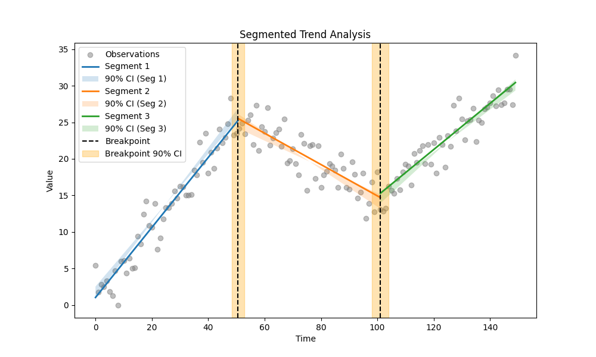
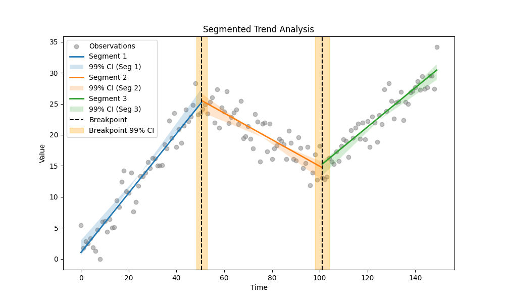

# Example 33: Varying Alpha in Segmented Trends

## Overview
This example demonstrates how the `alpha` parameter impacts the Segmented Trend Analysis. The `alpha` value controls the significance level for the Confidence Intervals (CI).

*   **Alpha = 0.10**: 90% Confidence Interval (Narrower)
*   **Alpha = 0.05**: 95% Confidence Interval (Standard)
*   **Alpha = 0.01**: 99% Confidence Interval (Wider)

Changing `alpha` allows you to adjust the trade-off between precision and certainty.

## The Data
We simulate a time series with **2 breakpoints** (3 segments) and moderate noise (std=3.0):
1.  **Rise** (Slope +0.5)
2.  **Fall** (Slope -0.2)
3.  **Rise** (Slope +0.3)

We use **Bagging (Bootstrap Aggregating)** (`use_bagging=True`) to robustly identify the breakpoints despite the increased noise.

## Code & Output

### Step 1: Python Code
```python
import os
import numpy as np
import pandas as pd
from MannKS.segmented_trend_test import segmented_trend_test
from MannKS.plotting import plot_segmented_trend

# 1. Generate Synthetic Data with Two Breakpoints
# Scenario: Complex trend with three distinct regimes.
np.random.seed(101)
n = 150
t = np.arange(n)

# Define True Trend
# Segment 1 (0-50): Rising
# Segment 2 (50-100): Falling
# Segment 3 (100-150): Rising again
trend = np.concatenate([
    0.5 * t[:50],
    0.5 * 50 - 0.2 * (t[50:100] - 50),
    0.5 * 50 - 0.2 * 50 + 0.3 * (t[100:] - 100)
])

# Add Moderate Noise
# Increased noise to test robustness with bagging
noise_std = 3.0
x = trend + np.random.normal(0, noise_std, n)

# 2. Run Analysis with Varying Alpha Levels
# varying alpha affects the width of the Confidence Intervals (CI).
# Lower alpha -> Higher Confidence -> Wider Intervals.
alphas = [0.10, 0.05, 0.01]

for alpha in alphas:
    print(f"\n--- Analysis with Alpha = {alpha} ({int((1-alpha)*100)}% Confidence) ---")

    # We fix n_breakpoints=2 since we know the structure
    # Use Bagging for robust breakpoint detection amidst higher noise
    result = segmented_trend_test(
        x, t,
        n_breakpoints=2,
        alpha=alpha,
        use_bagging=True,
        n_bootstrap=50
    )

    # Print Segment details
    # Focus on the slope Confidence Intervals
    print("Segment Results:")
    cols = ['slope', 'lower_ci', 'upper_ci']
    print(result.segments[cols].to_markdown(index=False, floatfmt=".4f"))

    # Visualize
    # The plot title/legend will automatically reflect the alpha used.
    fname = f'segmented_plot_alpha_{alpha}.png'
    save_path = os.path.join(os.path.dirname(__file__), fname)
    plot_segmented_trend(result, x, t, save_path=save_path)
    print(f"Plot saved to {fname}")
```

### Step 2: Text Output
Notice how the `lower_ci` and `upper_ci` values widen as we decrease alpha (increase confidence).

```text

--- Analysis with Alpha = 0.1 (90% Confidence) ---
Segment Results:
|   slope |   lower_ci |   upper_ci |
|--------:|-----------:|-----------:|
|  0.4651 |     0.4278 |     0.5092 |
| -0.2211 |    -0.2887 |    -0.1656 |
|  0.3335 |     0.2946 |     0.3884 |
Plot saved to segmented_plot_alpha_0.1.png

--- Analysis with Alpha = 0.05 (95% Confidence) ---
Segment Results:
|   slope |   lower_ci |   upper_ci |
|--------:|-----------:|-----------:|
|  0.4684 |     0.4252 |     0.5277 |
| -0.2184 |    -0.2926 |    -0.1533 |
|  0.3335 |     0.2849 |     0.3980 |
Plot saved to segmented_plot_alpha_0.05.png

--- Analysis with Alpha = 0.01 (99% Confidence) ---
Segment Results:
|   slope |   lower_ci |   upper_ci |
|--------:|-----------:|-----------:|
|  0.4634 |     0.4050 |     0.5365 |
| -0.2224 |    -0.3278 |    -0.1297 |
|  0.3335 |     0.2657 |     0.4169 |
Plot saved to segmented_plot_alpha_0.01.png

```

### Step 3: Visual Comparison

Observe the legend labels (e.g., "90% CI", "99% CI") and the width of the shaded regions.

#### Alpha = 0.10 (90% Confidence)


#### Alpha = 0.05 (95% Confidence)


#### Alpha = 0.01 (99% Confidence)

