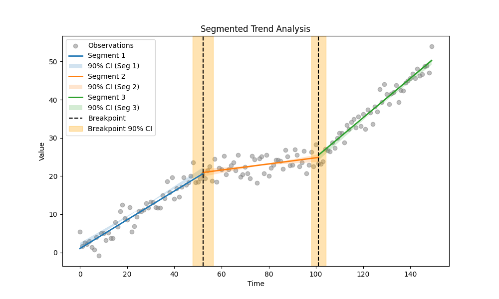
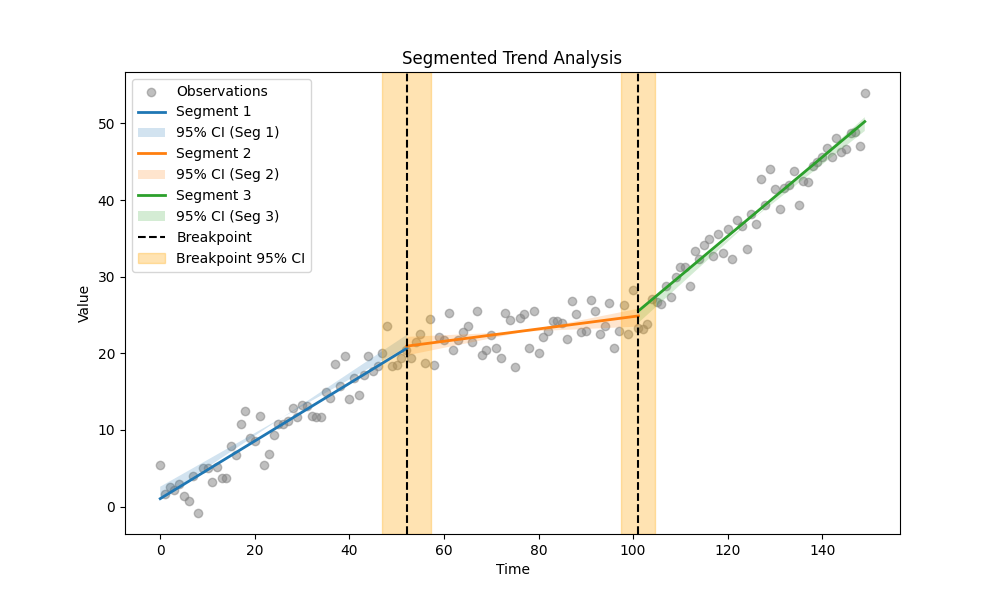
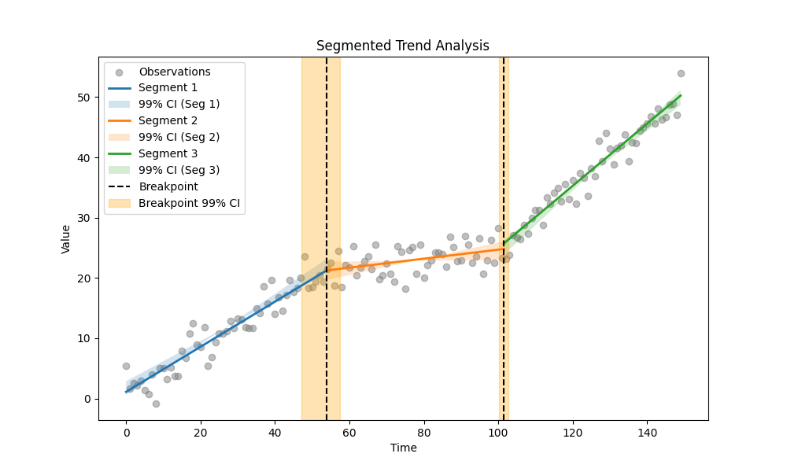
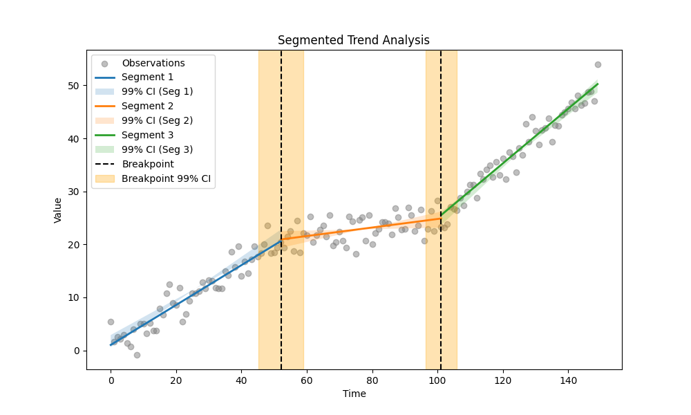

# Example 33: Varying Alpha and Method Comparison

## Overview
This example demonstrates how the `alpha` parameter impacts the Segmented Trend Analysis. The `alpha` value controls the significance level for the Confidence Intervals (CI).

*   **Alpha = 0.10**: 90% Confidence Interval (Narrower)
*   **Alpha = 0.05**: 95% Confidence Interval (Standard)
*   **Alpha = 0.01**: 99% Confidence Interval (Wider)

We also compare two methods for Breakpoint Detection:
1.  **Bagging (Bootstrap Aggregating):** Robust, creates non-parametric CIs for breakpoints.
2.  **Standard OLS:** Faster, assumes normally distributed errors for breakpoint CIs.

## The Data
We simulate a time series with **2 breakpoints** (3 segments) and moderate noise (std=2.0). The slopes are chosen to be relatively close (0.4, 0.1, 0.5) to make the exact breakpoint location uncertain.

## Part 1: Bagging Method

### Code
```python
import os
import numpy as np
import pandas as pd
from MannKS.segmented_trend_test import segmented_trend_test
from MannKS.plotting import plot_segmented_trend

def run_bagging():
    # 1. Generate Synthetic Data
    np.random.seed(101)
    n = 150
    t = np.arange(n)

    # Define True Trend (Closer slopes)
    trend = np.concatenate([
        0.4 * t[:50],
        0.4 * 50 + 0.1 * (t[50:100] - 50),
        0.4 * 50 + 0.1 * 50 + 0.5 * (t[100:] - 100)
    ])

    # Moderate Noise
    noise_std = 2.0
    x = trend + np.random.normal(0, noise_std, n)

    alphas = [0.10, 0.05, 0.01]

    for alpha in alphas:
        confidence_pct = int((1-alpha)*100)
        print(f"\n{'='*60}")
        print(f"Bagging Analysis with Alpha = {alpha} ({confidence_pct}% Confidence)")
        print(f"{'='*60}")

        # Use Bagging
        result = segmented_trend_test(
            x, t,
            n_breakpoints=2,
            alpha=alpha,
            use_bagging=True,
            n_bootstrap=10 # Reduced for timeout
        )

        # Print Breakpoint details
        print("Breakpoint Results:")
        if result.n_breakpoints > 0:
            bp_df = pd.DataFrame({
                'Breakpoint': result.breakpoints,
                'Lower CI': [ci[0] for ci in result.breakpoint_cis],
                'Upper CI': [ci[1] for ci in result.breakpoint_cis]
            })
            print(bp_df.to_markdown(index=False, floatfmt=".2f"))
        else:
            print("No breakpoints found.")

        # Print Segment details
        print("\nSegment Results:")
        cols = ['slope', 'lower_ci', 'upper_ci']
        print(result.segments[cols].to_markdown(index=False, floatfmt=".4f"))

        # Visualize
        fname = f'segmented_plot_alpha_{alpha}_bagging.png'
        save_path = os.path.join(os.path.dirname(__file__), fname)
        plot_segmented_trend(result, x, t, save_path=save_path)
        print(f"Plot saved to {fname}")

if __name__ == "__main__":
    run_bagging()
```

### Output
```text
============================================================
Bagging Analysis with Alpha = 0.1 (90% Confidence)
============================================================
Breakpoint Results:
|   Breakpoint |   Lower CI |   Upper CI |
|-------------:|-----------:|-----------:|
|        52.98 |      46.20 |      58.98 |
|       101.93 |      97.10 |     102.79 |

Segment Results:
|   slope |   lower_ci |   upper_ci |
|--------:|-----------:|-----------:|
|  0.3761 |     0.3537 |     0.4042 |
|  0.0804 |     0.0363 |     0.1189 |
|  0.5161 |     0.4905 |     0.5538 |
Plot saved to segmented_plot_alpha_0.1_bagging.png

============================================================
Bagging Analysis with Alpha = 0.05 (95% Confidence)
============================================================
Breakpoint Results:
|   Breakpoint |   Lower CI |   Upper CI |
|-------------:|-----------:|-----------:|
|        52.71 |      51.54 |      55.13 |
|       100.04 |      97.63 |     103.10 |

Segment Results:
|   slope |   lower_ci |   upper_ci |
|--------:|-----------:|-----------:|
|  0.3761 |     0.3499 |     0.4100 |
|  0.0850 |     0.0302 |     0.1286 |
|  0.5224 |     0.4899 |     0.5653 |
Plot saved to segmented_plot_alpha_0.05_bagging.png

============================================================
Bagging Analysis with Alpha = 0.01 (99% Confidence)
============================================================
Breakpoint Results:
|   Breakpoint |   Lower CI |   Upper CI |
|-------------:|-----------:|-----------:|
|        53.89 |      47.03 |      57.43 |
|       101.52 |     100.10 |     102.78 |

Segment Results:
|   slope |   lower_ci |   upper_ci |
|--------:|-----------:|-----------:|
|  0.3739 |     0.3337 |     0.4185 |
|  0.0748 |     0.0061 |     0.1353 |
|  0.5161 |     0.4706 |     0.5745 |
Plot saved to segmented_plot_alpha_0.01_bagging.png
```

## Part 2: Standard OLS Method

### Code
```python
import os
import numpy as np
import pandas as pd
from MannKS.segmented_trend_test import segmented_trend_test
from MannKS.plotting import plot_segmented_trend

def run_ols():
    # 1. Generate Synthetic Data (Same seed as bagging for comparison)
    np.random.seed(101)
    n = 150
    t = np.arange(n)

    # Define True Trend (Closer slopes)
    trend = np.concatenate([
        0.4 * t[:50],
        0.4 * 50 + 0.1 * (t[50:100] - 50),
        0.4 * 50 + 0.1 * 50 + 0.5 * (t[100:] - 100)
    ])

    # Moderate Noise
    noise_std = 2.0
    x = trend + np.random.normal(0, noise_std, n)

    alphas = [0.10, 0.05, 0.01]

    for alpha in alphas:
        confidence_pct = int((1-alpha)*100)
        print(f"\n{'='*60}")
        print(f"OLS Analysis with Alpha = {alpha} ({confidence_pct}% Confidence)")
        print(f"{'='*60}")

        # Standard OLS (No Bagging)
        result = segmented_trend_test(
            x, t,
            n_breakpoints=2,
            alpha=alpha,
            use_bagging=False
        )

        # Print Breakpoint details
        print("Breakpoint Results:")
        if result.n_breakpoints > 0:
            bp_df = pd.DataFrame({
                'Breakpoint': result.breakpoints,
                'Lower CI': [ci[0] for ci in result.breakpoint_cis],
                'Upper CI': [ci[1] for ci in result.breakpoint_cis]
            })
            print(bp_df.to_markdown(index=False, floatfmt=".2f"))
        else:
            print("No breakpoints found.")

        # Print Segment details
        print("\nSegment Results:")
        cols = ['slope', 'lower_ci', 'upper_ci']
        print(result.segments[cols].to_markdown(index=False, floatfmt=".4f"))

        # Visualize
        fname = f'segmented_plot_alpha_{alpha}_ols.png'
        save_path = os.path.join(os.path.dirname(__file__), fname)
        plot_segmented_trend(result, x, t, save_path=save_path)
        print(f"Plot saved to {fname}")

if __name__ == "__main__":
    run_ols()
```

### Output
```text
============================================================
OLS Analysis with Alpha = 0.1 (90% Confidence)
============================================================
Breakpoint Results:
|   Breakpoint |   Lower CI |   Upper CI |
|-------------:|-----------:|-----------:|
|        52.13 |      47.75 |      56.52 |
|       101.13 |      98.12 |     104.15 |

Segment Results:
|   slope |   lower_ci |   upper_ci |
|--------:|-----------:|-----------:|
|  0.3761 |     0.3537 |     0.4042 |
|  0.0804 |     0.0363 |     0.1189 |
|  0.5161 |     0.4905 |     0.5538 |
Plot saved to segmented_plot_alpha_0.1_ols.png

============================================================
OLS Analysis with Alpha = 0.05 (95% Confidence)
============================================================
Breakpoint Results:
|   Breakpoint |   Lower CI |   Upper CI |
|-------------:|-----------:|-----------:|
|        52.13 |      46.90 |      57.37 |
|       101.13 |      97.53 |     104.73 |

Segment Results:
|   slope |   lower_ci |   upper_ci |
|--------:|-----------:|-----------:|
|  0.3761 |     0.3499 |     0.4100 |
|  0.0804 |     0.0274 |     0.1245 |
|  0.5161 |     0.4855 |     0.5606 |
Plot saved to segmented_plot_alpha_0.05_ols.png

============================================================
OLS Analysis with Alpha = 0.01 (99% Confidence)
============================================================
Breakpoint Results:
|   Breakpoint |   Lower CI |   Upper CI |
|-------------:|-----------:|-----------:|
|        52.13 |      45.22 |      59.04 |
|       101.13 |      96.38 |     105.89 |

Segment Results:
|   slope |   lower_ci |   upper_ci |
|--------:|-----------:|-----------:|
|  0.3761 |     0.3382 |     0.4257 |
|  0.0804 |     0.0137 |     0.1397 |
|  0.5161 |     0.4706 |     0.5745 |
Plot saved to segmented_plot_alpha_0.01_ols.png
```

## Visual Comparison

#### Alpha = 0.10 (90% Confidence)

| **Bagging** | **Standard OLS** |
| :---: | :---: |
|  |  |

#### Alpha = 0.05 (95% Confidence)

| **Bagging** | **Standard OLS** |
| :---: | :---: |
|  |  |

#### Alpha = 0.01 (99% Confidence)

| **Bagging** | **Standard OLS** |
| :---: | :---: |
|  |  |

## Insights

1.  **Slope CIs:** As `alpha` decreases (from 0.10 to 0.01), the confidence intervals for the slopes (and the shaded regions in the plots) become wider. This represents the increased certainty required to capture the true value.
2.  **Breakpoint CIs:**
    *   **Standard OLS** usually provides symmetric, often narrower confidence intervals around the detected breakpoint. However, these assume well-behaved errors and can be overly optimistic or misleading in complex data.
    *   **Bagging** provides non-parametric intervals that may be wider and asymmetric. This reflects the true uncertainty and multimodality of the breakpoint location distribution, especially when noise is high or slope differences are subtle. In this example, the Bagging intervals often capture the uncertainty more realistically.
