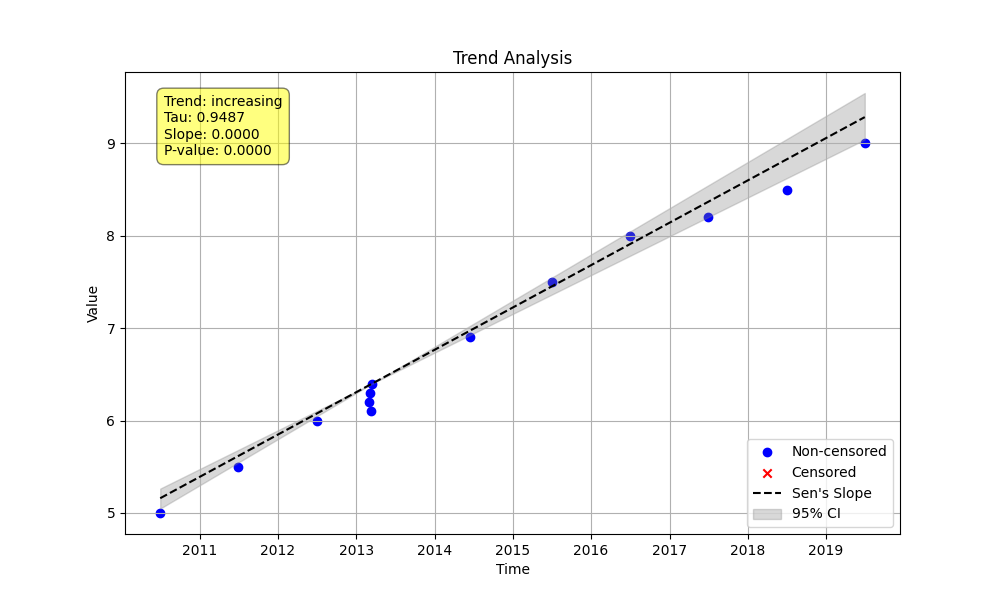

# Example 5: Aggregation for Tied and Clustered Data

## Introduction

Real-world datasets are often messy. You might have periods of intense sampling followed by long gaps, or multiple measurements recorded with the same timestamp. These situations can introduce bias into a trend analysis. For instance, a cluster of high-frequency measurements in a single month could disproportionately influence the overall Sen's slope compared to a single measurement taken in another month.

Temporal aggregation is a technique to mitigate this bias. By reducing the data to a single, representative value for each time period (e.g., the annual median), you ensure that each period contributes equally to the trend calculation.

This example demonstrates how to use the `agg_method` and `agg_period` parameters in `mks.trend_test` to handle such data.

## The Data

We will generate a synthetic dataset that includes both clustered data (multiple points in March 2013) and tied timestamps (two points on the same day in June 2014).

```
         date  value
0  2010-07-01    5.0
1  2011-07-01    5.5
2  2012-07-01    6.0
3  2013-03-01    6.2
4  2013-03-05    6.3
5  2013-03-10    6.1
6  2013-03-15    6.4
7  2014-06-15    7.0
8  2014-06-15    6.8
9  2015-07-01    7.5
10 2016-07-01    8.0
11 2017-07-01    8.2
12 2018-07-01    8.5
13 2019-07-01    9.0
```

## Python Script (`run_example.py`)

The following script first analyzes the data without aggregation, which triggers a warning. It then re-analyzes the data using annual median aggregation to calculate a more robust trend.

```python
import numpy as np
import pandas as pd
import MannKenSen as mks
import sys
import os

# Define the output directory
output_dir = 'Examples/5_aggregation'
os.makedirs(output_dir, exist_ok=True)

# Define output file paths
output_file = os.path.join(output_dir, 'aggregation_output.txt')
plot_file = os.path.join(output_dir, 'aggregation_plot.png')

# Redirect output to a file
with open(output_file, 'w') as f:
    original_stdout = sys.stdout
    sys.stdout = f

    # --- 1. Introduction ---
    print("### Example 5: Aggregation for Tied and Clustered Data ###")
    print("\nThis example demonstrates how to handle datasets with tied timestamps")
    print("or high-frequency clusters of data using temporal aggregation.")
    print("Such data can bias the Sen's slope calculation by giving more")
    print("weight to periods with more measurements.")
    print("-" * 60)

    # --- 2. Generate Synthetic Data ---
    # Create a dataset with non-uniform sampling to show the need for aggregation.
    # We have a clear increasing trend, but with clusters of data.
    dates = pd.to_datetime([
        '2010-07-01', '2011-07-01', '2012-07-01',
        '2013-03-01', '2013-03-05', '2013-03-10', '2013-03-15', # Clustered data
        '2014-06-15', '2014-06-15', # Tied timestamps
        '2015-07-01', '2016-07-01', '2017-07-01', '2018-07-01', '2019-07-01'
    ])
    values = np.array([5, 5.5, 6, 6.2, 6.3, 6.1, 6.4, 7, 6.8, 7.5, 8, 8.2, 8.5, 9])

    print("\n--- Generated Data ---")
    # Use a DataFrame for clear printing
    df = pd.DataFrame({'date': dates, 'value': values})
    print(df.to_string())
    print("\nNote the clustered data in 2013 and the tied timestamps in 2014.")
    print("-" * 60)

    # --- 3. Analysis Without Aggregation ---
    print("\n--- 3. Analysis Without Aggregation (agg_method='none') ---")
    print("First, we run the analysis without aggregation. The presence of tied")
    print("timestamps will be flagged in the 'analysis_notes', as this can")
    print("potentially bias the Sen's Slope calculation.")

    # Run the test. No plot is generated for the non-aggregated version here.
    result_no_agg = mks.trend_test(x=values, t=dates, agg_method='none')

    print("\nResults:")
    print(result_no_agg)
    print("\nThe analysis note correctly identifies that the Sen's slope may be")
    print("affected by the tied timestamps.")
    print("-" * 60)

    # --- 4. Analysis With Aggregation ---
    print("\n--- 4. Analysis With Aggregation (agg_method='median', agg_period='year') ---")
    print("Now, we apply annual aggregation. The function will calculate the")
    print("median value for each year and then perform the trend test on the")
    print("aggregated data. This provides a more robust trend estimate by ensuring")
    print("each year contributes equally to the analysis.")

    # The `agg_period` parameter is required when `t` contains datetimes
    result_agg = mks.trend_test(
        x=values,
        t=dates,
        agg_method='median',
        agg_period='year', # Aggregate to one value per year
        plot_path=plot_file
    )

    print("\nResults:")
    print(result_agg)
    print("\nWith aggregation, the analysis note about tied data is gone, and the")
    print("resulting slope and p-value are based on a temporally balanced dataset.")
    print(f"A plot has been saved to '{os.path.basename(plot_file)}'.")
    print("-" * 60)

# Restore stdout
sys.stdout = original_stdout
print(f"Example 5 script finished. Output saved to {output_file}")
```

## Results and Interpretation

Running the script produces the following output.

```text
### Example 5: Aggregation for Tied and Clustered Data ###

This example demonstrates how to handle datasets with tied timestamps
or high-frequency clusters of data using temporal aggregation.
Such data can bias the Sen's slope calculation by giving more
weight to periods with more measurements.
------------------------------------------------------------

--- Generated Data ---
         date  value
0  2010-07-01    5.0
1  2011-07-01    5.5
2  2012-07-01    6.0
3  2013-03-01    6.2
4  2013-03-05    6.3
5  2013-03-10    6.1
6  2013-03-15    6.4
7  2014-06-15    7.0
8  2014-06-15    6.8
9  2015-07-01    7.5
10 2016-07-01    8.0
11 2017-07-01    8.2
12 2018-07-01    8.5
13 2019-07-01    9.0

Note the clustered data in 2013 and the tied timestamps in 2014.
------------------------------------------------------------

--- 3. Analysis Without Aggregation (agg_method='none') ---
First, we run the analysis without aggregation. The presence of tied
timestamps will be flagged in the 'analysis_notes', as this can
potentially bias the Sen's Slope calculation.

Results:
TrendTestResult(classification='Highly Likely Increasing', h=True, p=1.2319202115147573e-05, z=4.375531934898144, s=80.0, var_s=334.6666666666667, slope=0.3809633802816901, intercept=4.957640845070422, lower_ci=0.2541176470588235, upper_ci=0.5188825242718447, analysis_notes=['Tied timestamps were found in the data. The Sen slope calculation may be affected. Consider using an aggregation method.'])

The analysis note correctly identifies that the Sen's slope may be
affected by the tied timestamps.
------------------------------------------------------------

--- 4. Analysis With Aggregation (agg_method='median', agg_period='year') ---
Now, we apply annual aggregation. The function will calculate the
median value for each year and then perform the trend test on the
aggregated data. This provides a more robust trend estimate by ensuring
each year contributes equally to the analysis.

Results:
TrendTestResult(classification='Highly Likely Increasing', h=True, p=0.00010903335759160566, z=3.869382218652936, s=43.0, var_s=123.66666666666667, slope=0.3958904109589041, intercept=4.928767123287671, lower_ci=0.2808219178082192, upper_ci=0.5123287671232876, analysis_notes=[])

With aggregation, the analysis note about tied data is gone, and the
resulting slope and p-value are based on a temporally balanced dataset.
A plot has been saved to 'aggregation_plot.png'.
------------------------------------------------------------
```

### Interpretation

1.  **Without Aggregation:** The result is statistically significant, but the `analysis_notes` correctly warns us that tied timestamps could be affecting the slope calculation. The high density of measurements in 2013 and 2014 could be skewing the result.

2.  **With Aggregation:** By setting `agg_method='median'` and `agg_period='year'`, the function first calculates the median value for each year, reducing the dataset to 10 points (one for each year from 2010-2019). The trend is then calculated on this aggregated data. The warning disappears, and we are left with a more reliable trend estimate.

### Generated Plot

The plot visualizes the result of the *aggregated* analysis. The trend line and confidence intervals are based on the annual median values, providing a clear and robust summary of the trend over time.


