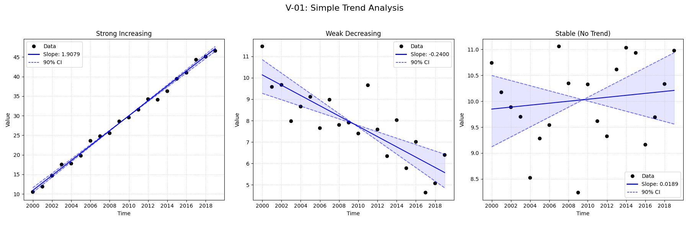
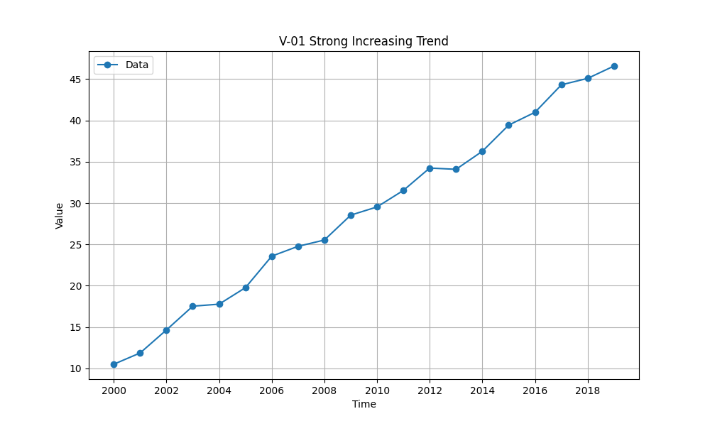

# Validation Report

## Plots
### v01_combined.png

### v01_strong.png

## Results
| Test ID                | Method            |      Slope |     P-Value |    Lower CI |     Upper CI |
|:-----------------------|:------------------|-----------:|------------:|------------:|-------------:|
| V-01_strong_increasing | MannKS (Standard) |  1.90795   | 1.30256e-09 |   1.83378   |   1.96745    |
| V-01_strong_increasing | MannKS (LWP Mode) |  1.90795   | 1.30256e-09 |   1.83223   |   1.96747    |
| V-01_strong_increasing | LWP-TRENDS (R)    |  1.90795   | 1.30256e-09 |   1.84038   |   1.96027    |
| V-01_strong_increasing | MannKS (ATS)      |  1.90795   | 1.30256e-09 |   1.83378   |   1.96745    |
| V-01_strong_increasing | NADA2 (R)         |  1.90753   | 1.30256e-09 | nan         | nan          |
| V-01_weak_decreasing   | MannKS (Standard) | -0.081601  | 0.0743529   |  -0.134719  |   0.00360835 |
| V-01_weak_decreasing   | MannKS (LWP Mode) | -0.081601  | 0.0743529   |  -0.135005  |   0.00398023 |
| V-01_weak_decreasing   | LWP-TRENDS (R)    | -0.081601  | 0.0743529   |  -0.125494  |  -0.0116764  |
| V-01_weak_decreasing   | MannKS (ATS)      | -0.081601  | 0.0743529   |  -0.134719  |   0.00360835 |
| V-01_weak_decreasing   | NADA2 (R)         | -0.0815266 | 0.0743529   | nan         | nan          |
| V-01_stable            | MannKS (Standard) |  0.0120479 | 0.974118    |  -0.112298  |   0.0834009  |
| V-01_stable            | MannKS (LWP Mode) |  0.0120479 | 0.974118    |  -0.114574  |   0.0834504  |
| V-01_stable            | LWP-TRENDS (R)    |  0.0120479 | 0.974118    |  -0.0884127 |   0.0714428  |
| V-01_stable            | MannKS (ATS)      |  0.0120479 | 0.974118    |  -0.112298  |   0.0834009  |
| V-01_stable            | NADA2 (R)         |  0.0123666 | 0.974118    | nan         | nan          |

## LWP Accuracy (Python vs R)
| Test ID                |   Slope Error |   Slope % Error |
|:-----------------------|--------------:|----------------:|
| V-01_strong_increasing |             0 |               0 |
| V-01_weak_decreasing   |             0 |              -0 |
| V-01_stable            |             0 |               0 |
