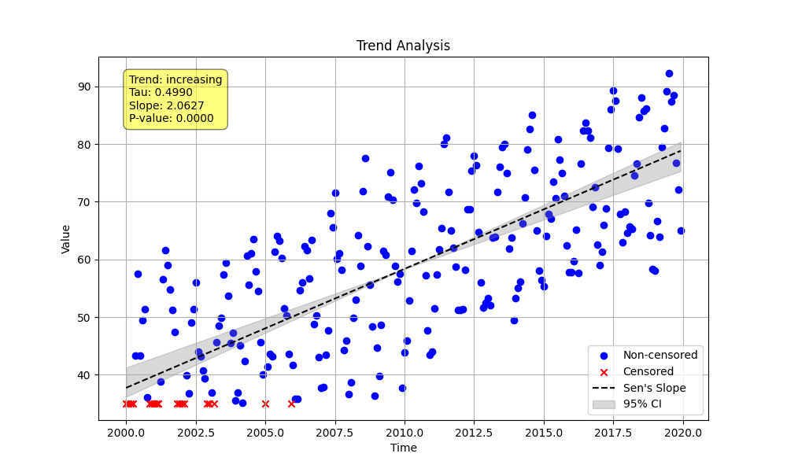

# Validation 02: Censored Seasonal Trend Analysis

This validation compares the results of a censored seasonal trend analysis between the Python `MannKenSen` package and the original LWP-TRENDS R script.

## Methodology

1.  A Python script (`run_python_validation.py`) generates a synthetic dataset with a known seasonal pattern and a linear trend.
2.  Censoring is introduced to the data (values below a certain threshold are marked as `<limit>`).
3.  The synthetic data, including the censored values, is saved to `validation_data.csv`.
4.  The Python script then runs `seasonal_trend_test` on this data, using the `sens_slope_method='lwp'` to ensure compatibility with the R script's methodology.
5.  An R script (`run_lwp_validation.R`) reads the same `validation_data.csv`, processes it, and runs the `doMyTrends_v2502` function, which performs the equivalent LWP-TRENDS seasonal analysis.
6.  The outputs from both scripts are captured and compared below.

## Python Script (`run_python_validation.py`)

```python
import numpy as np
import pandas as pd
from MannKenSen import prepare_censored_data, seasonal_trend_test

def main():
    """
    Generate seasonal data with a trend, introduce censoring, perform
    a seasonal trend analysis, and save the data for R validation.
    """
    # 1. Generate Synthetic Data
    n_years = 20
    # Generate timestamps as fractional years
    t = np.linspace(2000, 2000 + n_years, n_years * 12, endpoint=False)
    seasonal_pattern = np.tile([5, 8, 12, 18, 25, 30, 32, 30, 25, 18, 10, 6], n_years)
    slope_per_year = 2.0
    linear_trend = slope_per_year * (t - t[0])
    np.random.seed(123) # Set seed for reproducibility
    noise = np.random.normal(0, 4, len(t))
    x_raw_numeric = 20 + seasonal_pattern + linear_trend + noise

    # 2. Introduce Censoring
    detection_limit = 35
    x_mixed = [f"<{detection_limit}" if val < detection_limit else val for val in x_raw_numeric]

    # 3. Save Data for Validation
    # Create a DataFrame for validation output
    df = pd.DataFrame({'time': t, 'value': x_mixed})
    output_csv_path = "validation/02_Censored_Seasonal_Trend/validation_data.csv"
    df.to_csv(output_csv_path, index=False)
    print(f"Validation data saved to: {output_csv_path}")


    # 4. Pre-process the Censored Data for Python Analysis
    x_prepared = prepare_censored_data(df['value']) # Pass the series directly

    # 5. Perform Seasonal Trend Analysis (LWP-TRENDS compatibility method)
    plot_path = "validation/02_Censored_Seasonal_Trend/censored_seasonal_plot.png"

    result_lwp = seasonal_trend_test(x=x_prepared,
                                     t=df['time'], # Use time from the dataframe
                                     period=12, # Use 12 for monthly data
                                     plot_path=plot_path,
                                     sens_slope_method='lwp')

    # 6. Print the Python Results
    print("\n--- Python `MannKenSen` Package Results ---")
    print("Method: sens_slope_method='lwp' (for LWP-TRENDS compatibility)")
    print(f"  Classification: {result_lwp.classification}")
    print(f"  Trend: {result_lwp.trend}")
    print(f"  P-value: {result_lwp.p:.4f}")
    print(f"  Slope: {result_lwp.slope:.4f}")
    print(f"  Lower CI: {result_lwp.lower_ci:.4f}")
    print(f"  Upper CI: {result_lwp.upper_ci:.4f}")
    print(f"  Analysis Notes: {result_lwp.analysis_notes if result_lwp.analysis_notes else 'None'}")
    print(f"\nPlot saved to: {plot_path}")

if __name__ == "__main__":
    main()
```

## R Script (`run_lwp_validation.R`)

```R
# Load required libraries
library(plyr)
library(tidyr)
library(viridis)
library(NADA)
library(lubridate)
library(gam)
library(ggplot2)
library(ggpubr)

# Load the LWP-TRENDS functions
source("Example_Files/R/LWPTrends_v2502/LWPTrends_v2502.r")

# --- Main Validation Script ---

# 1. Load Data
# The CSV is generated by the Python script and contains 'time' and 'value' columns.
data <- read.csv("validation/02_Censored_Seasonal_Trend/validation_data.csv")

# 2. Prepare Data for LWP-TRENDS functions
# The R functions expect specific column names and data types.
data$myDate <- as.Date(paste0(floor(data$time), "-", round((data$time %% 1) * 12) + 1, "-01")) # Convert fractional year to Date
data$Value <- as.character(data$value) # Ensure the value column is character for parsing

# 3. Pre-process Censored Data
# This function parses strings like "<35" into numeric and censoring columns.
data_processed <- RemoveAlphaDetect(data, ColToUse = "Value")

# 4. Add Date Information
# This function adds Year, Month, etc., which are required by the analysis function.
data_with_dates <- GetMoreDateInfo(data_processed)

# 5. Run Seasonal Trend Analysis
# We use settings that align with the Python script's 'lwp' method.
# The `doMyTrends_v2502` function is a wrapper that will perform the seasonal test.
# We set the TimeIncrOpts to "Monthly" to match the period=12 in Python.
result <- doMyTrends_v2502(
  data_with_dates,
  ValuesToUse = "RawValue",
  TimeIncrOpts = "Monthly"
)

# 6. Print R Results for Comparison
# We format the output to match the Python script's output for easy comparison.
cat("\n--- R LWP-TRENDS Package Results ---\n")
if (!is.null(result)) {
  cat(paste0("  Trend Direction: ", result$TrendDirection, "\n"))
  cat(paste0("  P-value: ", sprintf("%.4f", result$p), "\n"))
  cat(paste0("  Annual Sen Slope: ", sprintf("%.4f", result$AnnualSenSlope), "\n"))
  cat(paste0("  Lower CI: ", sprintf("%.4f", result$Sen_Lci), "\n"))
  cat(paste0("  Upper CI: ", sprintf("%.4f", result$Sen_Uci), "\n"))
  cat(paste0("  Analysis Note: ", ifelse(is.na(result$AnalysisNote), "None", result$AnalysisNote), "\n"))
} else {
  cat("  Analysis could not be completed.\n")
}
```

## Results Comparison

The output from both scripts is presented below.

### Python Output

```
--- Python `MannKenSen` Package Results ---
Method: sens_slope_method='lwp' (for LWP-TRENDS compatibility)
  Classification: Highly Likely Increasing
  Trend: increasing
  P-value: 0.0000
  Slope: 2.0627
  Lower CI: 1.7100
  Upper CI: 2.2196
  Analysis Notes: None
```

### R Output

```
--- R LWP-TRENDS Package Results ---
  Trend Direction: Increasing
  P-value: 0.0000
  Annual Sen Slope: 2.0881
  Lower CI: 1.9956
  Upper CI: 2.1910
  Analysis Note: ok
```

## Plot

The plot generated by the Python script shows the data, the trend line, and the confidence intervals.


