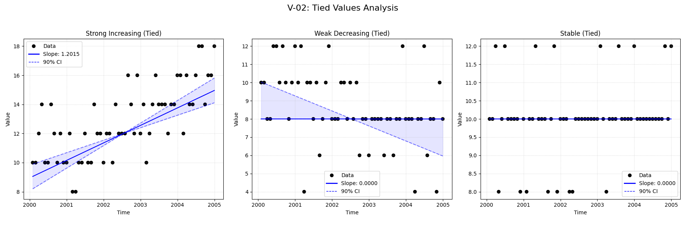
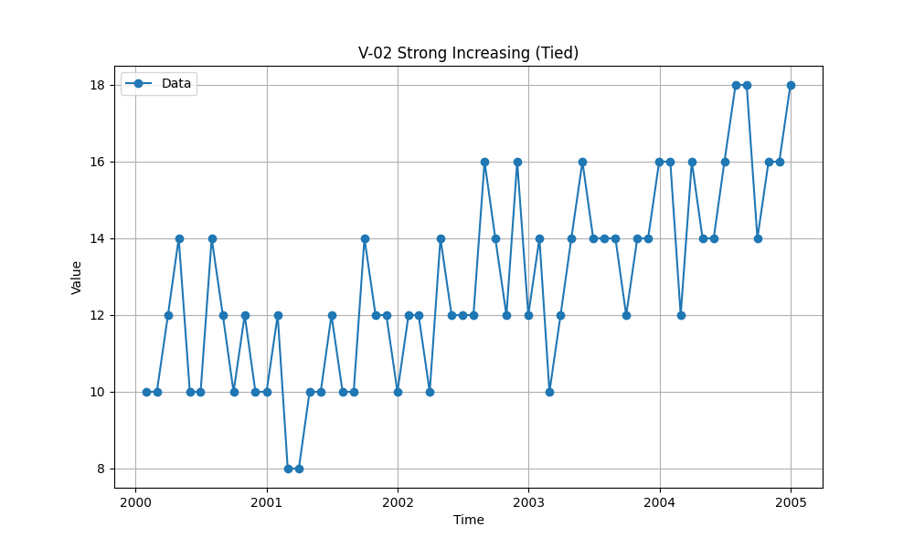

# Validation Report

## Plots
### v02_combined.png

### v02_strong.png

## Results
                    Test ID                Method        Slope      P-Value      Lower CI     Upper CI
V-02_strong_increasing_tied MannKenSen (Standard) 1.201480e+00 5.778385e-09  8.573944e-01 1.547669e+00
V-02_strong_increasing_tied MannKenSen (LWP Mode) 1.201480e+00 5.778385e-09  8.577449e-01 1.547669e+00
V-02_strong_increasing_tied        LWP-TRENDS (R) 1.201480e+00 1.974181e-09  9.407598e-01 1.496926e+00
V-02_strong_increasing_tied      MannKenSen (ATS) 3.807261e-08 5.778385e-09  2.716919e-08 4.904269e-08
V-02_strong_increasing_tied             NADA2 (R) 1.202469e+00 1.974181e-09           NaN          NaN
  V-02_weak_decreasing_tied MannKenSen (Standard) 0.000000e+00 1.044510e-03 -8.263575e-01 0.000000e+00
  V-02_weak_decreasing_tied MannKenSen (LWP Mode) 0.000000e+00 1.044510e-03 -8.178367e-01 0.000000e+00
  V-02_weak_decreasing_tied        LWP-TRENDS (R) 0.000000e+00 4.580253e-04 -7.275896e-01 0.000000e+00
  V-02_weak_decreasing_tied      MannKenSen (ATS) 0.000000e+00 1.044510e-03 -2.618569e-08 0.000000e+00
  V-02_weak_decreasing_tied             NADA2 (R) 3.618177e-08 4.580253e-04           NaN          NaN
           V-02_stable_tied MannKenSen (Standard) 0.000000e+00 2.726398e-01  0.000000e+00 0.000000e+00
           V-02_stable_tied MannKenSen (LWP Mode) 0.000000e+00 2.726398e-01  0.000000e+00 0.000000e+00
           V-02_stable_tied        LWP-TRENDS (R) 0.000000e+00 1.643059e-01  0.000000e+00 0.000000e+00
           V-02_stable_tied      MannKenSen (ATS) 0.000000e+00 2.726398e-01  0.000000e+00 0.000000e+00
           V-02_stable_tied             NADA2 (R) 2.751034e-08 1.643059e-01           NaN          NaN

## LWP Accuracy (Python vs R)
                    Test ID  Slope Error  Slope % Error
V-02_strong_increasing_tied          0.0            0.0
  V-02_weak_decreasing_tied          0.0           -0.0
           V-02_stable_tied          0.0            0.0
