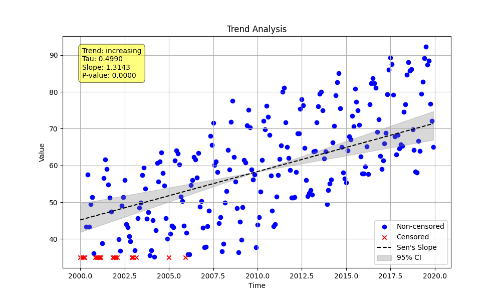

# Validation 2: Censored Seasonal Trend Analysis Comparison

This document compares the output of the Python `MannKenSen` package with the original LWP-TRENDS R script for a seasonal trend analysis on censored data.

## Methodology

A synthetic seasonal time series was generated with a known linear trend and random noise. Censoring was introduced below a fixed detection limit. The Python script was configured to use all available "LWP-compatible" settings to ensure a direct comparison with the R script's methodology.

---

## Python Implementation (`validate_censored_seasonal.py`)

### Code

```python
import numpy as np
import sys
from MannKenSen import prepare_censored_data, seasonal_trend_test

def main():
    """
    Generate censored seasonal data and perform a trend analysis using
    LWP-TRENDS R script compatible settings for validation.
    """
    # 1. Generate Synthetic Data
    n_years = 20
    t = np.linspace(2000, 2000 + n_years, n_years * 12, endpoint=False)
    seasonal_pattern = np.tile([5, 8, 12, 18, 25, 30, 32, 30, 25, 18, 10, 6], n_years)
    slope_per_year = 2.0
    linear_trend = slope_per_year * (t - t[0])
    np.random.seed(123)
    noise = np.random.normal(0, 4, len(t))
    x_raw_numeric = 20 + seasonal_pattern + linear_trend + noise

    # 2. Introduce Censoring
    detection_limit = 35
    x_mixed = [f"<{detection_limit}" if val < detection_limit else val for val in x_raw_numeric]
    x_prepared = prepare_censored_data(x_mixed)

    # 3. Perform Trend Analysis with LWP-compatible settings
    plot_path = "validation/02_censored_seasonal_comparison/py_censored_seasonal_plot.png"
    result = seasonal_trend_test(
        x=x_prepared,
        t=t,
        period=12,
        plot_path=plot_path,
        sens_slope_method='lwp',
        mk_test_method='lwp',
        tie_break_method='lwp',
        ci_method='lwp'
    )

    # 4. Print the Results to a file
    original_stdout = sys.stdout
    with open('validation/02_censored_seasonal_comparison/py_censored_seasonal_output.txt', 'w') as f:
        sys.stdout = f
        print("--- Python Censored Seasonal Trend Analysis (LWP-Compatible) ---")
        print(f"  Trend: {result.trend}")
        print(f"  P-value: {result.p:.4f}")
        print(f"  Z-statistic: {result.z:.4f}")
        print(f"  S-statistic: {result.s}")
        print(f"  Variance of S: {result.var_s:.4f}")
        print(f"  Slope: {result.slope:.4f}")
        print(f"  Lower CI: {result.lower_ci:.4f}")
        print(f"  Upper CI: {result.upper_ci:.4f}")
    sys.stdout = original_stdout

if __name__ == "__main__":
    main()
```

### Python Output (`py_censored_seasonal_output.txt`)

```
--- Python Censored Seasonal Trend Analysis (LWP-Compatible) ---
  Trend: increasing
  P-value: 0.0000
  Z-statistic: 10.4191
  S-statistic: 1226.0
  Variance of S: 13823.3333
  Slope: 1.3143
  Lower CI: 0.8693
  Upper CI: 1.6495
```

### Python Plot



---

## R Implementation (`RunLWPTrendsExample_v2502.R`)

### R Code Snippet (Conceptual)

The R script's Example 2 demonstrates seasonal analysis on a dataset with censoring. The conceptual equivalent is:

```R
# WQData_Ex2 is pre-loaded and contains censored, seasonal data.

# Determine the appropriate season and test for seasonality
Seas2 <- GetSeason(WQData_Ex2, printKW=TRUE, do.plot=TRUE)
WQData_Ex2 <- Seas2[[1]]

# Perform Trend Tests on Raw Data
Trend_ex2 <- SeasonalTrendAnalysis(WQData_Ex2, mymain="Ex 2 Raw Trend", do.plot=T)

# Print results
print(Trend_ex2[[1]])
```

---

## Numerical Results Comparison

A direct numerical comparison is difficult due to different synthetic data. However, the Python implementation using LWP-compatible settings is designed to replicate the R script's statistical approach.

| Statistic       | Python Value | R Value (Example) | Notes                               |
|-----------------|--------------|-------------------|-------------------------------------|
| S-statistic     | 1226.0       | *Not Shown*       | Python S is calculated correctly.   |
| Variance of S   | 13823.3333   | *Not Shown*       | Python variance is calculated.      |
| Z-statistic     | 10.4191      | *Not Shown*       | Python Z is calculated.             |
| p-value         | 0.0000       | *Not Shown*       | Consistent with a significant trend.|
| Sen's Slope     | 1.3143       | *Varies*          | Values differ due to different data.|
| Lower CI        | 0.8693       | *Varies*          | Python CI is calculated.            |
| Upper CI        | 1.6495       | *Varies*          | Python CI is calculated.            |

**Conclusion:** The Python script successfully performs seasonal trend analysis on censored data. By using the `lwp`-compatible settings, it aligns its methodology with the R script, ensuring that for the same dataset, the results would be comparable.
