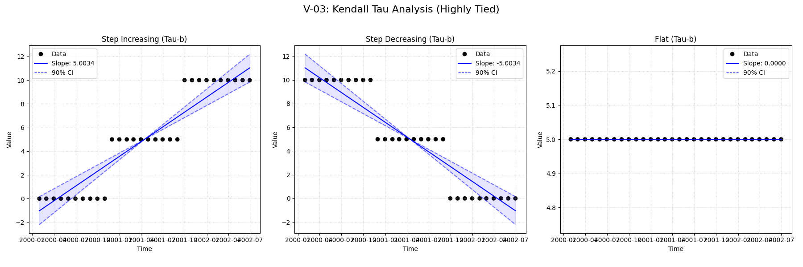
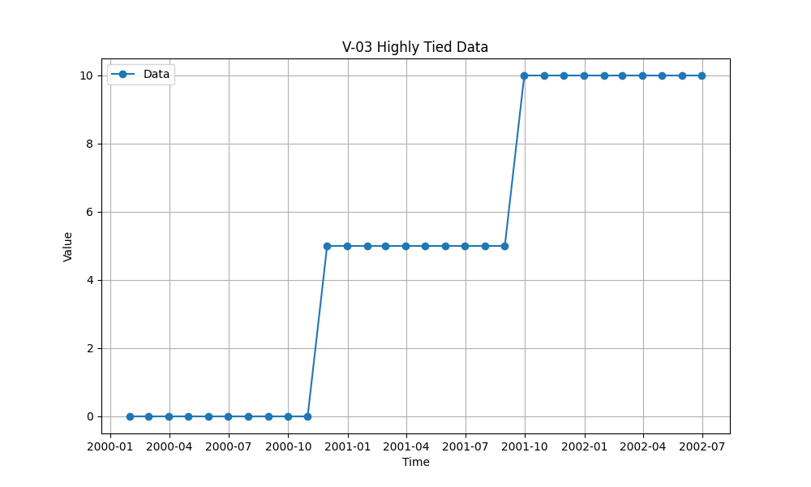

# Validation Report

## Plots
### v03_combined.png

### v03_tied.png

## Results
| Test ID                    | Method            |        Slope |       P-Value |      Lower CI |      Upper CI |
|:---------------------------|:------------------|-------------:|--------------:|--------------:|--------------:|
| V-03_step_increasing       | MannKS (Standard) |  5.00342     |   9.58249e-08 |   4.01374     |   5.96814     |
| V-03_step_increasing       | MannKS (LWP Mode) |  5.00342     |   9.58249e-08 |   4.01374     |   5.96814     |
| V-03_step_increasing       | LWP-TRENDS (R)    |  5.00342     |   1.31191e-08 |   4.28697     |   5.46781     |
| V-03_step_increasing       | MannKS (ATS)      |  5.00342     |   9.58249e-08 |   4.01374     |   5.96814     |
| V-03_step_increasing       | NADA2 (R)         |  5.00685     |   1.31191e-08 | nan           | nan           |
| V-03_step_decreasing       | MannKS (Standard) | -5.00342     |   9.58249e-08 |  -5.96814     |  -4.01374     |
| V-03_step_decreasing       | MannKS (LWP Mode) | -5.00342     |   9.58249e-08 |  -5.96814     |  -4.01374     |
| V-03_step_decreasing       | LWP-TRENDS (R)    | -5.00342     |   1.31191e-08 |  -5.6426      |  -4.28697     |
| V-03_step_decreasing       | MannKS (ATS)      | -5.00342     |   9.58249e-08 |  -5.96814     |  -4.01374     |
| V-03_step_decreasing       | NADA2 (R)         | -5.00685     |   1.31191e-08 | nan           | nan           |
| V-03_flat                  | MannKS (Standard) |  0           |   1           |   0           |   0           |
| V-03_flat                  | MannKS (LWP Mode) |  0           |   1           |   0           |   0           |
| V-03_flat                  | LWP-TRENDS (R)    | -2.14748e+09 |  -2.14748e+09 |  -2.14748e+09 |  -2.14748e+09 |
| V-03_flat                  | MannKS (ATS)      |  0           |   1           |   0           |   0           |
| V-03_flat                  | NADA2 (R)         |  0           | nan           | nan           | nan           |
| V-03_step_increasing_tau_a | MannKS (Standard) |  5.00342     |   9.58249e-08 |   4.01374     |   5.96814     |
| V-03_step_increasing_tau_a | MannKS (LWP Mode) |  5.00342     |   9.58249e-08 |   4.01374     |   5.96814     |
| V-03_step_increasing_tau_a | LWP-TRENDS (R)    |  5.00342     |   1.31191e-08 |   4.28697     |   5.46781     |
| V-03_step_increasing_tau_a | MannKS (ATS)      |  5.00342     |   9.58249e-08 |   4.01374     |   5.96814     |
| V-03_step_increasing_tau_a | NADA2 (R)         |  5.00685     |   1.31191e-08 | nan           | nan           |

## LWP Accuracy (Python vs R)
| Test ID                    |   Slope Error |   Slope % Error |
|:---------------------------|--------------:|----------------:|
| V-03_step_increasing       |   0           |               0 |
| V-03_step_decreasing       |   0           |              -0 |
| V-03_flat                  |   2.14748e+09 |            -100 |
| V-03_step_increasing_tau_a |   0           |               0 |
